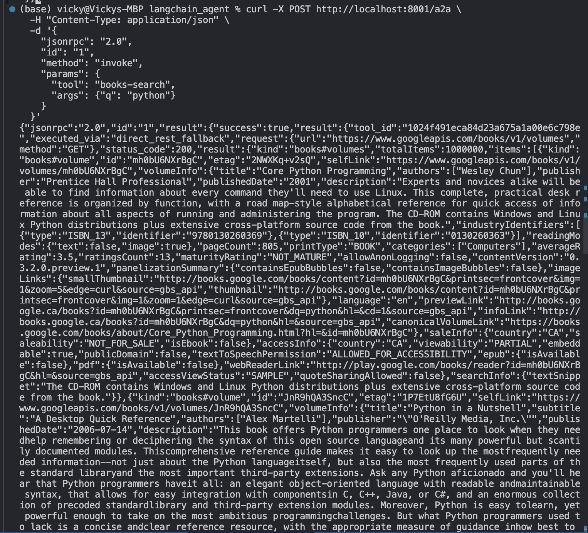

# MCP LangChain Agent

A production-ready LangChain agent that integrates with the MCP Gateway, providing both OpenAI-compatible chat completions and A2A JSON-RPC endpoints for seamless AI agent communication.

## 🚀 Features

- **🔧 Dynamic Tool Discovery**: Automatically discovers and integrates tools from MCP Gateway
- **🤖 OpenAI-Compatible API**: Standard `/v1/chat/completions` endpoint with streaming support
- **🔄 A2A Communication**: JSON-RPC endpoint for agent-to-agent communication
- **🛡️ Security**: Configurable tool allowlists and authentication
- **📊 Observability**: Health checks, readiness probes, and comprehensive logging
- **⚡ Performance**: Async operations with connection pooling and timeouts
- **🎛️ Configuration**: Environment-based configuration with validation

## 🏗️ Architecture

The agent consists of several key components:

- **FastAPI Application** (`app.py`): Web server with OpenAI and A2A endpoints
- **LangChain Agent** (`agent_langchain.py`): Core AI agent with tool integration
- **MCP Client** (`mcp_client.py`): Gateway communication and tool discovery
- **Configuration** (`config.py`): Environment-based settings management
- **Models** (`models.py`): Pydantic models for API validation

## 📋 API Endpoints

| Endpoint | Method | Description |
|----------|--------|-------------|
| `/health` | GET | Health check for monitoring |
| `/ready` | GET | Readiness check for Kubernetes |
| `/list_tools` | GET | Available tools from MCP Gateway |
| `/v1/chat/completions` | POST | OpenAI-compatible chat API |
| `/a2a` | POST | A2A JSON-RPC communication |

## ✅ User Stories Implemented

- [x] **Dynamic Tool Discovery** - Auto-discovers from gateway or uses allowlist
- [x] **Dual Endpoint Exposure** - OpenAI + A2A JSON-RPC endpoints
- [x] **Parameterized Tool Allow-List** - `TOOLS=` environment variable
- [x] **Tool Schema Introspection** - JSON schema parsing and validation
- [x] **Production Ready** - Comprehensive testing, linting, and deployment tools
- [x] **Modern Development** - pyproject.toml, Makefile, pre-commit hooks

Structure:
```
agent_runtimes/langchain_agent/
├── app.py                    # FastAPI application incl. /v1/chat/completions and /a2a
├── agent_langchain.py    # Core Langchain agent
├── mcp_client.py            # MCP Gateway client
├── models.py                # Pydantic models
├── config.py                # Configuration management
├── start_agent.py           # Startup script
├── requirements.txt         # Dependencies
└── README.md               # This file
```

### Configuration (env vars)
- OPENAI_API_KEY – required
- MCPGATEWAY_BEARER_TOKEN – JWT for the gateway


## 🚀 Quick Start

### Prerequisites
- Python 3.10 or higher
- OpenAI API key
- Running MCP Gateway instance

### Installation

**Option 1: Development Setup (Recommended)**
```bash
cd agent_runtimes/langchain_agent

# Install in development mode with all tools
make install-dev

# Setup environment from template
make setup-env

# Edit .env with your configuration
editor .env
```

**Option 2: Production Setup**
```bash
cd agent_runtimes/langchain_agent

# Install production dependencies only
pip install -e .

# Create environment file
cp .env.example .env
editor .env
```

### Configuration
1) Start the MCP Gateway (from project root):
```bash
make serve
```

### Development Workflow

**1. Start the MCP Gateway** (from project root):
```bash
make serve
```

**2. Start the LangChain Agent** (in another terminal):
```bash
cd agent_runtimes/langchain_agent

# Development mode with auto-reload
make dev

# Or production mode
make run
```

**3. Verify everything is working**:
```bash
# Check status
make status

# Health checks
make health ready tools
```

### Environment Configuration

Set your environment variables in `.env`:
```bash
# Required
OPENAI_API_KEY=your-openai-api-key-here
MCPGATEWAY_BEARER_TOKEN=$(python3 -m mcpgateway.utils.create_jwt_token -u admin --secret my-test-key)

# Optional
TOOLS=list-users,books-search  # Tool allowlist for production
DEFAULT_MODEL=gpt-4o-mini
TEMPERATURE=0.7
```

## 🧪 Testing & Validation

### Health Checks
```bash
# Quick health verification
make health ready tools

# Or manually:
curl http://localhost:8000/health
curl http://localhost:8000/ready
curl http://localhost:8000/list_tools
```

### OpenAI-Compatible API Testing
```bash
# Basic chat completion
curl -X POST http://localhost:8000/v1/chat/completions \
  -H "Content-Type: application/json" \
  -d '{
    "model": "gpt-4o-mini",
    "messages": [
      {"role": "user", "content": "What tools do you have available?"}
    ]
  }'

# Streaming chat completion
curl -X POST http://localhost:8000/v1/chat/completions \
  -H "Content-Type: application/json" \
  -d '{
    "model": "gpt-4o-mini",
    "messages": [
      {"role": "user", "content": "Hello!"}
    ],
    "stream": true
  }'

# Use Makefile shortcuts
make test-chat
```

### A2A JSON-RPC Testing
```bash
# List available tools via A2A
curl -X POST http://localhost:8000/a2a \
  -H "Content-Type: application/json" \
  -d '{
    "jsonrpc": "2.0",
    "id": "1",
    "method": "list_tools",
    "params": {}
  }'

# Invoke a specific tool via A2A
curl -X POST http://localhost:8000/a2a \
  -H "Content-Type: application/json" \
  -d '{
    "jsonrpc": "2.0",
    "id": "1",
    "method": "invoke",
    "params": {
      "tool": "your-tool-name",
      "args": {"param": "value"}
    }
  }'

# Use Makefile shortcut
make test-a2a
```

**Expected A2A Response**:
```json
{
  "jsonrpc": "2.0",
  "id": "1",
  "result": {
    "success": true,
    "output": "Tool execution result",
    "metadata": {
      "tool_id": "tool-id",
      "execution_time": 0.5
    }
  }
}
```

## 🛠️ Development

### Code Quality
```bash
# Run all quality checks
make lint

# Format code
make format

# Run tests
make test

# Full development workflow
make all
```

### Environment Validation
```bash
# Check configuration
make check-env

# Get example environment
make env-example
```

## 🐳 Docker Support

```bash
# Build Docker image
make docker-build

# Run with Docker
make docker-run
```

## 📊 Monitoring

The agent provides comprehensive monitoring endpoints:

- **Health Check**: `/health` - Basic service health
- **Readiness**: `/ready` - Kubernetes readiness probe
- **Tools**: `/list_tools` - Available tool inventory
- **Metrics**: Built-in request logging and performance tracking

