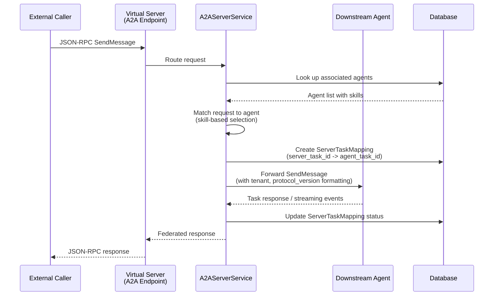
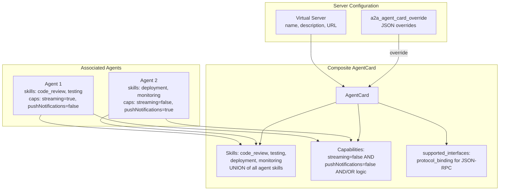
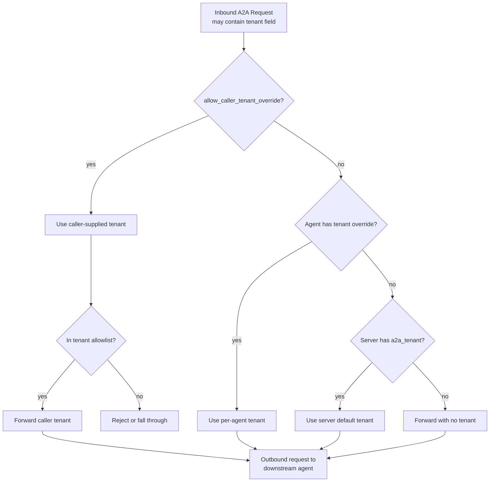
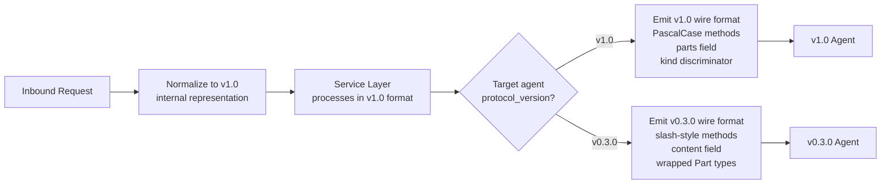
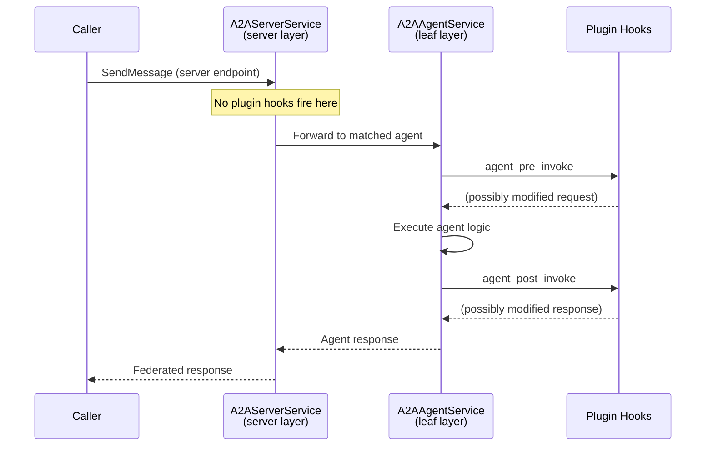

# A2A v1.0 Protocol Architecture

## Overview

ContextForge integrates A2A Protocol v1.0 RC1, enabling virtual servers to serve as A2A agents to external callers while proxying requests to downstream agents. This architecture federates agent-to-agent communication through ContextForge's governance layer, applying the same authentication, RBAC, team scoping, rate limiting, and observability that exist for MCP tool calls.

A single virtual server can expose both MCP and A2A protocol interfaces simultaneously. When `a2a_enabled=True` is set on a server, it auto-generates an `AgentCard` from its associated agents and begins accepting A2A JSON-RPC requests at its dedicated endpoint tree.

## Virtual Servers as A2A Agents

The `Server` model is the central entity for multi-protocol exposure. Rather than creating a separate A2A-specific model, the existing server is extended with A2A fields (see [ADR-0042](adr/042-virtual-server-multi-protocol.md)):

| Field | Type | Purpose |
|-------|------|---------|
| `a2a_enabled` | `bool` (default `false`) | Feature flag to activate A2A protocol endpoints |
| `a2a_tenant` | `str` (optional) | Default tenant label forwarded to downstream agents |
| `a2a_agent_card_override` | `JSON` (optional) | Manual overrides for the auto-generated AgentCard |
| `a2a_protocol_version` | `str` (default `v1.0`) | Protocol version for outbound wire format |

When `a2a_enabled=True`, the server exposes endpoints at:

```
/servers/{server_id}/a2a/            # JSON-RPC endpoint (SendMessage, GetTask, etc.)
/servers/{server_id}/a2a/agent-card  # AgentCard discovery
```

A server with no MCP gateways associated but `a2a_enabled=True` functions as an A2A-only server. A server with both MCP gateways and A2A agents associated serves both protocols.

## Request Routing

When a virtual server receives an A2A request (`SendMessage`, `GetTask`, `CancelTask`, etc.), the `A2AServerService` handles federation to an appropriate downstream agent.



The `ServerTaskMapping` table maintains the federation relationship between the server-level task ID (visible to external callers) and the downstream agent task ID (used internally). This allows:

- **GetTask**: Callers query by the server task ID; the service translates to the downstream agent task ID.
- **CancelTask**: Cancellation propagates through the mapping to the correct downstream agent.
- **ListTasks**: The server aggregates task state across all associated agents, translating IDs back to server-level task IDs.
- **Streaming**: Server-Sent Events from downstream agents are relayed to the caller with server-level task IDs.

## Agent Card Generation

When `a2a_enabled=True`, the server automatically generates a composite `AgentCard` by aggregating metadata from all associated A2A agents.



### Aggregation Rules

| AgentCard Field | Aggregation Strategy | Rationale |
|-----------------|---------------------|-----------|
| `skills` | Union of all agent skills | Server can handle any skill its agents support |
| `capabilities.streaming` | Logical AND (all must support) | Server can only promise streaming if all agents support it |
| `capabilities.pushNotifications` | Logical AND | Same restrictive logic for push notifications |
| `capabilities.stateTransitionHistory` | Logical OR | Server can provide history if any agent supports it |
| `supported_interfaces` | Generated from server URL | Points callers to the server's A2A endpoint |
| `name`, `description` | From server metadata | Server identity, not individual agent identity |

The `a2a_agent_card_override` JSON allows operators to manually override any field in the generated AgentCard, for example to add custom skills, override the description, or set specific capability flags regardless of agent declarations.

## Tenant Forwarding

A2A v1.0 introduces a `tenant` field on all request messages. This is a **routing label** forwarded to downstream agents, distinct from the gateway's `team_id` which controls access authorization. See [ADR-0043](adr/043-tenant-vs-team.md) for the full design rationale.



### Precedence

1. **Caller-supplied** -- accepted only if `allow_caller_tenant_override=true` and the value passes the optional tenant allowlist.
2. **Per-agent override** -- a tenant value configured on the specific agent registration.
3. **Server default** -- the `a2a_tenant` field on the virtual server.
4. **Empty** -- no tenant is set in the outbound request.

Key invariants:

- `team_id` is never sent in A2A protocol messages.
- `tenant` is never used for gateway access control.
- Multiple servers in different teams can share the same downstream tenant.

## Backward Compatibility

ContextForge maintains a compatibility layer for v0.3.0 agents during the transition to v1.0 (see [ADR-0041](adr/041-a2a-v1-migration.md)). The `protocol_version` field on each agent registration determines the outbound wire format.

### Compatibility Mechanisms

- **Dual method name acceptance**: Both slash-style (`tasks/send`) and PascalCase (`SendMessage`) method names are accepted on inbound JSON-RPC requests.
- **Part normalization**: Parts with and without the `kind` discriminator field are accepted and normalized internally to v1.0 format.
- **`content`/`parts` field compatibility**: Either field name is accepted on inbound messages. Outbound messages use the field name matching the target agent's `protocol_version`.
- **Protocol version per agent**: Each agent carries a `protocol_version` field. When forwarding to a v0.3.0 agent, the service converts the request to v0.3.0 wire format (e.g., `parts` back to `content`, PascalCase back to slash-style).
- **Feature flag**: `A2A_V1_COMPAT_MODE` (default `true`) controls whether v0.3.0 conventions are accepted. Setting to `false` enforces strict v1.0-only processing.
- **Deprecation signals**: Responses served through v0.3.0 compatibility paths include `Deprecation` and `Sunset` headers per RFC 8594.



## Protocol Changes Summary

Key changes from A2A v0.3.0 to v1.0 RC1:

| Area | v0.3.0 | v1.0 RC1 | Impact |
|------|--------|----------|--------|
| **Part structure** | `FilePart`, `DataPart` wrapper types | Inline parts with `kind` discriminator | Schema migration, normalization logic |
| **Message field** | `Message.content` | `Message.parts` | Field rename, compat layer |
| **AgentCard endpoints** | `url`, `preferred_transport`, `additional_interfaces` | `supported_interfaces` with `protocol_binding` | Card generation rewrite |
| **Method names** | Slash-style (`tasks/send`, `tasks/get`) | PascalCase (`SendMessage`, `GetTask`) | Dual dispatch, outbound formatting |
| **TaskState** | `CANCELLED` | `CANCELED` | Enum mapping |
| **AuthenticationInfo** | `schemes` (repeated) | `scheme` (singular) | Schema update |
| **Security model** | `Security` | `SecurityRequirement` | Type rename |
| **Tenant** | Not present | `tenant` field on request messages | New routing concept |
| **Blocking** | Not present | `blocking` flag on `SendMessageConfiguration` | New execution mode |
| **ListTasks** | Not present | Full query support with filters | New RPC method |
| **GetExtendedAgentCard** | Not present | New RPC method | Extended card discovery |
| **TaskStatusUpdateEvent.final** | Present | Removed | Event handling update |
| **Extended card auth** | `supports_authenticated_extended_card` on card | Moved to `capabilities` | Card schema change |

## Plugin Hooks

The `agent_pre_invoke` and `agent_post_invoke` plugin hooks fire in the leaf A2A service layer (`a2a_service.py`), not in the server federation layer (`A2AServerService`). This prevents duplicate execution when a server federates to a downstream agent:



Hooks fire once per agent invocation regardless of whether the request arrives directly at an agent endpoint or is federated through a virtual server. This guarantees consistent plugin behavior (logging, policy enforcement, transformation) without duplication.
