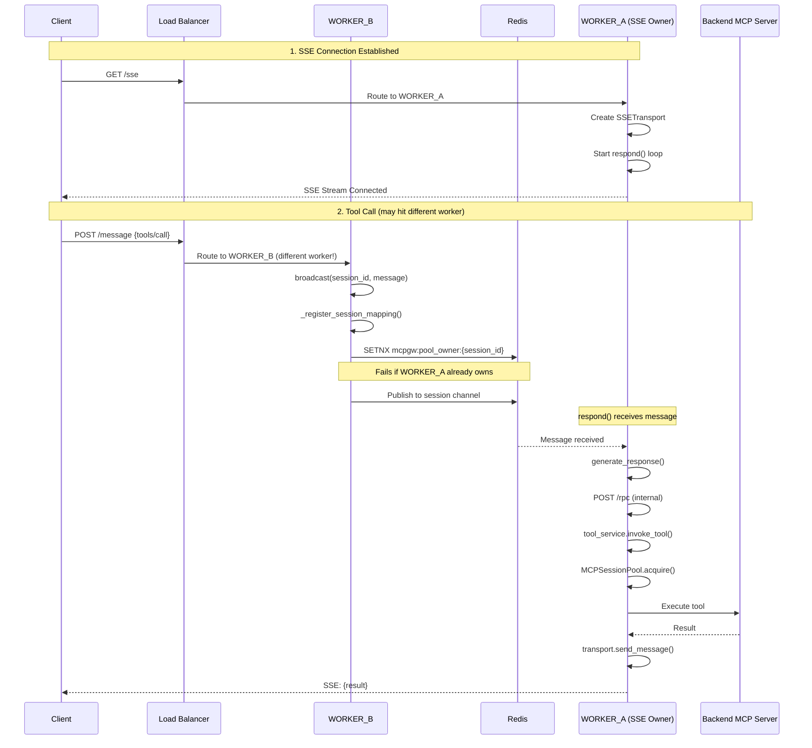
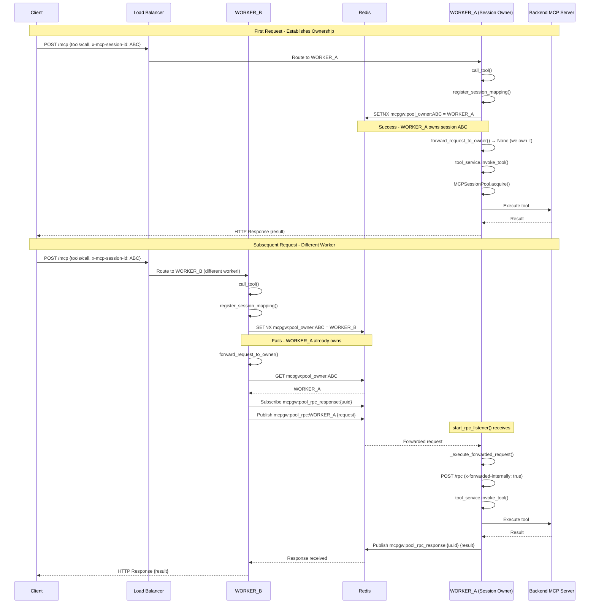

# ADR-038: Multi-Worker Session Affinity for SSE and Streamable HTTP

- *Status:* Accepted
- *Date:* 2025-01-31
- *Deciders:* Platform Team

## Context

MCP Gateway supports horizontal scaling with multiple worker processes (e.g., `gunicorn -w 4`). When clients connect via SSE or Streamable HTTP, the gateway maintains pooled sessions to backend MCP servers for efficiency (see ADR-032).

**The Problem:** In a multi-worker deployment, a client's requests may hit different workers. If each worker creates its own upstream MCP session, we lose:
1. **Connection efficiency** - Multiple sessions to the same backend instead of one
2. **Session state** - Some backends maintain state per session
3. **Resource waste** - Each session consumes memory and connections

**The Goal:** Route all requests from the same client to the same upstream MCP session, regardless of which worker receives the HTTP request.

## Decision

Implement **transport-specific session affinity** using Redis for cross-worker coordination:

1. **SSE Transport**: Uses message-based routing via `broadcast()` → `respond()` pattern
2. **Streamable HTTP Transport**: Uses direct RPC-style forwarding via `forward_request_to_owner()` pattern

Both transports share the core session pool (`MCPSessionPool`) and ownership registration (`register_session_mapping()`), but differ in how requests reach the session owner.

## Architecture Overview

```
┌─────────────────────────────────────────────────────────────────────────────────┐
│                     MULTI-WORKER SESSION AFFINITY                               │
├─────────────────────────────────────────────────────────────────────────────────┤
│                                                                                 │
│  ┌─────────────┐    ┌─────────────┐    ┌─────────────┐                         │
│  │  WORKER_A   │    │  WORKER_B   │    │  WORKER_C   │                         │
│  │             │    │             │    │             │                         │
│  │ ┌─────────┐ │    │ ┌─────────┐ │    │ ┌─────────┐ │                         │
│  │ │ Session │ │    │ │ Session │ │    │ │ Session │ │   MCPSessionPool        │
│  │ │  Pool   │ │    │ │  Pool   │ │    │ │  Pool   │ │   (per worker)          │
│  │ └─────────┘ │    │ └─────────┘ │    │ └─────────┘ │                         │
│  └──────┬──────┘    └──────┬──────┘    └──────┬──────┘                         │
│         │                  │                  │                                 │
│         └──────────────────┼──────────────────┘                                 │
│                            │                                                    │
│                     ┌──────▼──────┐                                             │
│                     │    Redis    │  Ownership Registry:                        │
│                     │             │  mcpgw:pool_owner:{session_id} → WORKER_ID  │
│                     │  - Pub/Sub  │  Session Mapping:                           │
│                     │  - Keys     │  mcpgw:session_mapping:{...} → pool_key     │
│                     └─────────────┘                                             │
│                                                                                 │
└─────────────────────────────────────────────────────────────────────────────────┘
```

## SSE Transport Flow

SSE uses a **persistent connection** from client to gateway. Only one worker owns the SSE stream, so all responses MUST go through that worker.

### Key Components

| Component | Location | Purpose |
|-----------|----------|---------|
| `SessionRegistry` | `mcpgateway/cache/session_registry.py` | Manages SSE sessions and message routing |
| `SSETransport` | `mcpgateway/transports/sse_transport.py` | Handles SSE stream I/O |
| `broadcast()` | `session_registry.py:961` | Routes messages to session owner via Redis/DB |
| `respond()` | `session_registry.py:1119` | Listens for messages and processes them |
| `generate_response()` | `session_registry.py:1863` | Executes requests via internal `/rpc` call |
| `_register_session_mapping()` | `session_registry.py:900` | Registers session ownership in pool |

### Sequence Diagram



### Detailed Flow

```
┌─────────────────────────────────────────────────────────────────────────────────┐
│                           SSE SESSION AFFINITY FLOW                             │
├─────────────────────────────────────────────────────────────────────────────────┤
│                                                                                 │
│  CLIENT                                                                         │
│    │                                                                            │
│    │ GET /sse                                                                   │
│    ▼                                                                            │
│  WORKER_A (receives SSE connection)                                             │
│    │                                                                            │
│    ├─► session_registry.add_session(session_id, transport)                      │
│    │                                                                            │
│    └─► asyncio.create_task(session_registry.respond(...))                       │
│          │                                                                      │
│          └─► Listens on Redis channel: {session_id}                             │
│                                                                                 │
│  ─────────────────────────────────────────────────────────────────────────────  │
│                                                                                 │
│  CLIENT                                                                         │
│    │                                                                            │
│    │ POST /message {"method": "tools/call", "params": {"name": "my_tool"}}      │
│    ▼                                                                            │
│  WORKER_B (receives HTTP request - different worker!)                           │
│    │                                                                            │
│    ├─► session_registry.broadcast(session_id, message)                          │
│    │     │                                                                      │
│    │     ├─► _register_session_mapping(session_id, message, user_email)         │
│    │     │     │                                                                │
│    │     │     ├─► tool_lookup_cache.get(tool_name)                             │
│    │     │     │     └─► Returns: {gateway: {url, id, transport}}               │
│    │     │     │                                                                │
│    │     │     └─► pool.register_session_mapping(session_id, url, ...)          │
│    │     │           │                                                          │
│    │     │           ├─► Redis SETNX mcpgw:pool_owner:{session_id} = WORKER_B   │
│    │     │           │     └─► Returns False (WORKER_A already owns)            │
│    │     │           │                                                          │
│    │     │           └─► Ownership NOT changed (atomic SETNX)                   │
│    │     │                                                                      │
│    │     └─► Redis PUBLISH {session_id} {message}                               │
│    │                                                                            │
│    └─► Return HTTP 202 Accepted                                                 │
│                                                                                 │
│  ─────────────────────────────────────────────────────────────────────────────  │
│                                                                                 │
│  WORKER_A (respond() loop receives message)                                     │
│    │                                                                            │
│    ├─► pubsub.get_message() returns the broadcast message                       │
│    │                                                                            │
│    └─► generate_response(message, transport, ...)                               │
│          │                                                                      │
│          ├─► POST http://127.0.0.1:{port}/rpc (internal call)                   │
│          │     │                                                                │
│          │     └─► /rpc handler                                                 │
│          │           │                                                          │
│          │           ├─► Check x-forwarded-internally header                    │
│          │           │                                                          │
│          │           └─► tool_service.invoke_tool()                             │
│          │                 │                                                    │
│          │                 └─► MCPSessionPool.acquire()                         │
│          │                       │                                              │
│          │                       └─► Use pooled session to backend              │
│          │                                                                      │
│          └─► transport.send_message(response)                                   │
│                │                                                                │
│                └─► SSE Stream ──────────────────────────────────────► CLIENT    │
│                                                                                 │
└─────────────────────────────────────────────────────────────────────────────────┘
```

## Streamable HTTP Transport Flow

Streamable HTTP uses **independent HTTP request/response cycles**. Any worker can respond to the client, so we use direct RPC-style forwarding.

### Key Components

| Component | Location | Purpose |
|-----------|----------|---------|
| `StreamableHTTPSessionManager` | MCP SDK | Manages Streamable HTTP protocol |
| `call_tool()` | `mcpgateway/transports/streamablehttp_transport.py:442` | Handles tool invocation |
| `register_session_mapping()` | `mcpgateway/services/mcp_session_pool.py:543` | Registers session ownership |
| `forward_request_to_owner()` | `mcp_session_pool.py:1346` | Forwards request to owner worker |
| `start_rpc_listener()` | `mcp_session_pool.py:1436` | Listens for forwarded requests |
| `_execute_forwarded_request()` | `mcp_session_pool.py:1484` | Executes forwarded request locally |

### Sequence Diagram



### Detailed Flow

```
┌─────────────────────────────────────────────────────────────────────────────────┐
│                     STREAMABLE HTTP SESSION AFFINITY FLOW                       │
├─────────────────────────────────────────────────────────────────────────────────┤
│                                                                                 │
│  CLIENT                                                                         │
│    │                                                                            │
│    │ POST /mcp                                                                  │
│    │ Headers: x-mcp-session-id: ABC123                                          │
│    │ Body: {"method": "tools/call", "params": {"name": "my_tool"}}              │
│    ▼                                                                            │
│  WORKER_B (receives HTTP request)                                               │
│    │                                                                            │
│    ├─► StreamableHTTPSessionManager.handle_streamable_http()                    │
│    │     │                                                                      │
│    │     └─► @mcp_app.call_tool() decorator invokes call_tool()                 │
│    │                                                                            │
│    └─► call_tool(name, arguments)                                               │
│          │                                                                      │
│          ├─► mcp_session_id = request_headers.get("x-mcp-session-id")           │
│          │                                                                      │
│          ├─► pool = get_mcp_session_pool()                                      │
│          │                                                                      │
│          ├─► Register session mapping (before forwarding check)                 │
│          │     │                                                                │
│          │     ├─► tool_lookup_cache.get(name)                                  │
│          │     │     └─► Returns: {gateway: {url, id, transport}}               │
│          │     │                                                                │
│          │     └─► pool.register_session_mapping(session_id, url, ...)          │
│          │           │                                                          │
│          │           ├─► Redis SETNX mcpgw:pool_owner:{session_id} = WORKER_B   │
│          │           │     └─► Returns False (WORKER_A already owns)            │
│          │           │                                                          │
│          │           └─► Log: "Session ownership already claimed by WORKER_A"   │
│          │                                                                      │
│          ├─► forward_request_to_owner(mcp_session_id, request_data)             │
│          │     │                                                                │
│          │     ├─► Redis GET mcpgw:pool_owner:{session_id}                      │
│          │     │     └─► Returns: "WORKER_A"                                    │
│          │     │                                                                │
│          │     ├─► owner_id != WORKER_ID → Need to forward                      │
│          │     │                                                                │
│          │     ├─► response_channel = mcpgw:pool_rpc_response:{uuid}            │
│          │     │                                                                │
│          │     ├─► Redis SUBSCRIBE response_channel                             │
│          │     │                                                                │
│          │     ├─► Redis PUBLISH mcpgw:pool_rpc:{WORKER_A}                      │
│          │     │     {method, params, response_channel, mcp_session_id}         │
│          │     │                                                                │
│          │     └─► WAIT for response on response_channel (with timeout)         │
│          │           │                                                          │
│          │           :                                                          │
│          │           : (see WORKER_A processing below)                          │
│          │           :                                                          │
│          │           ▼                                                          │
│          │         Response received via Redis pub/sub                          │
│          │           │                                                          │
│          │           └─► return response                                        │
│          │                                                                      │
│          ├─► forwarded_response is not None                                     │
│          │                                                                      │
│          ├─► Convert response to MCP content types                              │
│          │     └─► TextContent, ImageContent, etc.                              │
│          │                                                                      │
│          └─► return content                                                     │
│                │                                                                │
│                └─► MCP SDK sends HTTP response ─────────────────────► CLIENT    │
│                                                                                 │
│  ─────────────────────────────────────────────────────────────────────────────  │
│                                                                                 │
│  WORKER_A (start_rpc_listener() running since startup)                          │
│    │                                                                            │
│    ├─► Subscribed to: mcpgw:pool_rpc:{WORKER_A}                                 │
│    │                                                                            │
│    ├─► Receives forwarded request from WORKER_B                                 │
│    │                                                                            │
│    └─► _execute_forwarded_request(request)                                      │
│          │                                                                      │
│          ├─► Extract: method, params, response_channel                          │
│          │                                                                      │
│          ├─► POST http://127.0.0.1:{port}/rpc                                   │
│          │     Headers: x-forwarded-internally: true (prevents loops)           │
│          │     Body: {jsonrpc, method, params, id}                              │
│          │     │                                                                │
│          │     └─► /rpc handler in main.py                                      │
│          │           │                                                          │
│          │           ├─► Sees x-forwarded-internally: true                      │
│          │           │     └─► Skip session affinity check (no infinite loop)   │
│          │           │                                                          │
│          │           └─► tool_service.invoke_tool()                             │
│          │                 │                                                    │
│          │                 └─► MCPSessionPool.acquire()                         │
│          │                       │                                              │
│          │                       ├─► Pool key includes session_id               │
│          │                       │                                              │
│          │                       └─► Reuse pooled connection to backend         │
│          │                                                                      │
│          ├─► Get response from /rpc                                             │
│          │                                                                      │
│          └─► Redis PUBLISH {response_channel} {response}                        │
│                │                                                                │
│                └─► WORKER_B receives response (see above)                       │
│                                                                                 │
└─────────────────────────────────────────────────────────────────────────────────┘
```

## Comparison: SSE vs Streamable HTTP

| Aspect | SSE | Streamable HTTP |
|--------|-----|-----------------|
| **Client Connection** | Persistent SSE stream | Independent HTTP requests |
| **Response Path** | Via SSE stream on owner worker | Via HTTP on request worker |
| **Routing Mechanism** | `broadcast()` → Redis → `respond()` | `forward_request_to_owner()` → Redis pub/sub |
| **Message Storage** | Redis/DB (persistent until consumed) | Redis pub/sub only (ephemeral) |
| **Latency** | Higher (message queue + polling) | Lower (direct RPC) |
| **Why Different?** | SSE stream constraint | No such constraint |

### Why Two Implementations?

**SSE is constrained by the SSE stream:**
- The SSE stream is a persistent connection on ONE worker
- Only that worker can send responses to the client
- Messages MUST route to the SSE owner for sending
- The `broadcast()` → `respond()` pattern is **required**

**Streamable HTTP has no such constraint:**
- Each HTTP request/response is independent
- Any worker CAN respond (via HTTP response)
- We only need session affinity for upstream pool efficiency
- Direct RPC-style forwarding is **sufficient and faster**

## Redis Keys

| Key Pattern | Purpose | TTL |
|-------------|---------|-----|
| `mcpgw:pool_owner:{session_id}` | Worker that owns the session | Configurable (default 5min) |
| `mcpgw:session_mapping:{session_id}:{url}:{transport}:{gateway_id}` | Pool key for session | Configurable |
| `mcpgw:pool_rpc:{worker_id}` | Pub/sub channel for forwarded requests | N/A (pub/sub) |
| `mcpgw:pool_rpc_response:{uuid}` | Pub/sub channel for responses | N/A (pub/sub) |

## Configuration

```bash
# Enable session affinity (required for multi-worker)
MCPGATEWAY_SESSION_AFFINITY_ENABLED=true

# Session ownership TTL (seconds)
MCPGATEWAY_SESSION_AFFINITY_TTL=300

# Forwarded request timeout (seconds)
MCPGATEWAY_POOL_RPC_FORWARD_TIMEOUT=30
```

## Atomic Ownership with SETNX

Ownership is registered atomically using Redis `SETNX` (SET if Not eXists):

```python
# In register_session_mapping()
owner_key = f"mcpgw:pool_owner:{mcp_session_id}"
was_set = await redis.setnx(owner_key, WORKER_ID)

if was_set:
    # We claimed it - set TTL
    await redis.expire(owner_key, ttl)
else:
    # Another worker already owns it
    existing_owner = await redis.get(owner_key)
```

This ensures:
1. **First worker wins** - Only one worker can claim ownership
2. **No race conditions** - SETNX is atomic
3. **Subsequent calls respect ownership** - SETNX fails, existing owner returned

## Loop Prevention

When forwarding requests, we prevent infinite loops with the `x-forwarded-internally` header:

```python
# In _execute_forwarded_request()
internal_headers["x-forwarded-internally"] = "true"
response = await client.post(f"http://127.0.0.1:{port}/rpc", headers=internal_headers, ...)

# In /rpc handler (main.py)
is_internally_forwarded = headers.get("x-forwarded-internally") == "true"
if ... and not is_internally_forwarded:
    # Try to forward
elif is_internally_forwarded:
    # Execute locally - don't forward again
```

## Startup Initialization

The RPC listener must be started during application startup:

```python
# In main.py lifespan
if settings.mcpgateway_session_affinity_enabled:
    pool = get_mcp_session_pool()
    pool._rpc_listener_task = asyncio.create_task(pool.start_rpc_listener())
```

## Consequences

### Positive
- Enables horizontal scaling with session affinity
- Reuses upstream MCP sessions efficiently
- Works transparently for both SSE and Streamable HTTP
- Atomic ownership prevents race conditions

### Negative
- Requires Redis for multi-worker deployments
- Adds latency for cross-worker requests
- More complex debugging (requests may span workers)

### Neutral
- Two different implementations for historical and architectural reasons
- Could potentially unify in the future, but current design is fit-for-purpose

## References

- [ADR-032: MCP Session Pool](./032-mcp-session-pool.md)
- [Redis SETNX Documentation](https://redis.io/commands/setnx/)
- [MCP Protocol Specification](https://modelcontextprotocol.io/)
