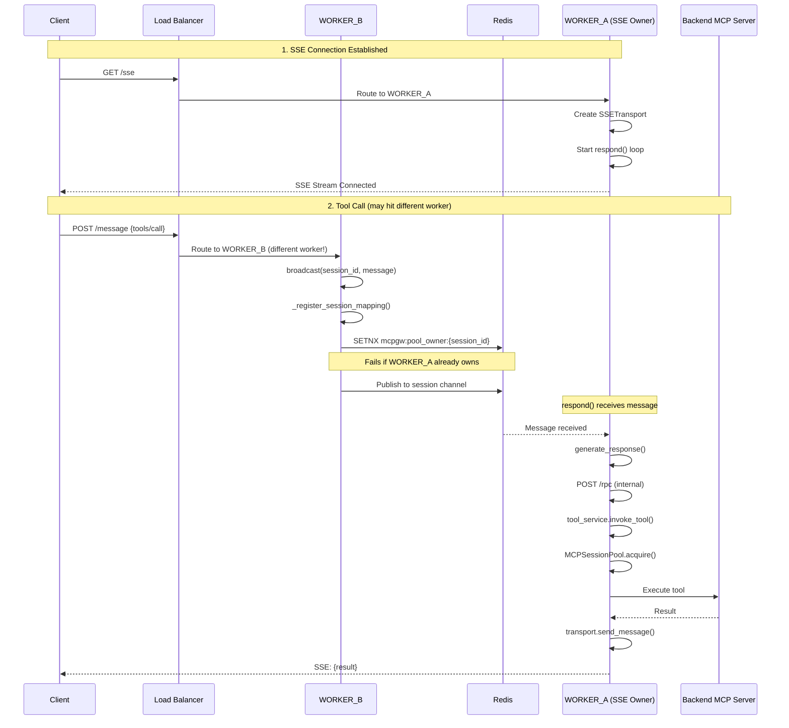
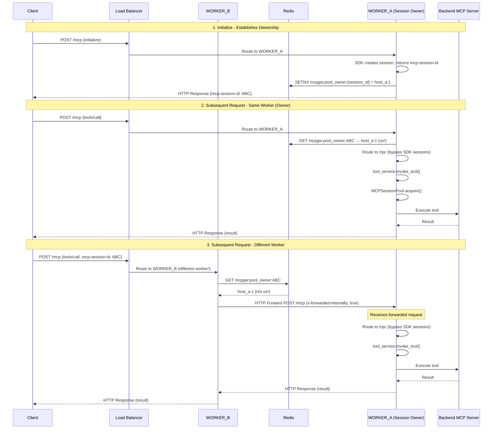

# ADR-038: Multi-Worker Session Affinity for SSE and Streamable HTTP

- *Status:* Accepted
- *Date:* 2025-01-31
- *Deciders:* Platform Team

## Context

MCP Gateway supports horizontal scaling with multiple worker processes (e.g., `gunicorn -w 4`). When clients connect via SSE or Streamable HTTP, the gateway maintains pooled sessions to backend MCP servers for efficiency (see ADR-032).

**The Problem:** In a multi-worker deployment, a client's requests may hit different workers. If each worker creates its own upstream MCP session, we lose:
1. **Connection efficiency** - Multiple sessions to the same backend instead of one
2. **Session state** - Some backends maintain state per session
3. **Resource waste** - Each session consumes memory and connections

**The Goal:** Route all requests from the same client to the same upstream MCP session, regardless of which worker receives the HTTP request.

## Decision

Implement **transport-specific session affinity** using Redis for cross-worker coordination:

1. **SSE Transport**: Uses message-based routing via `broadcast()` → `respond()` pattern
2. **Streamable HTTP Transport**: Uses direct RPC-style forwarding via `forward_request_to_owner()` pattern

Both transports share the core session pool (`MCPSessionPool`) and ownership registration (`register_session_mapping()`), but differ in how requests reach the session owner.

## Architecture Overview

```
┌─────────────────────────────────────────────────────────────────────────────────┐
│                     MULTI-WORKER SESSION AFFINITY                               │
├─────────────────────────────────────────────────────────────────────────────────┤
│                                                                                 │
│  ┌─────────────┐    ┌─────────────┐    ┌─────────────┐                         │
│  │  WORKER_A   │    │  WORKER_B   │    │  WORKER_C   │                         │
│  │             │    │             │    │             │                         │
│  │ ┌─────────┐ │    │ ┌─────────┐ │    │ ┌─────────┐ │                         │
│  │ │ Session │ │    │ │ Session │ │    │ │ Session │ │   MCPSessionPool        │
│  │ │  Pool   │ │    │ │  Pool   │ │    │ │  Pool   │ │   (per worker)          │
│  │ └─────────┘ │    │ └─────────┘ │    │ └─────────┘ │                         │
│  └──────┬──────┘    └──────┬──────┘    └──────┬──────┘                         │
│         │                  │                  │                                 │
│         └──────────────────┼──────────────────┘                                 │
│                            │                                                    │
│                     ┌──────▼──────┐                                             │
│                     │    Redis    │  Ownership Registry:                        │
│                     │             │  mcpgw:pool_owner:{session_id} → WORKER_ID  │
│                     │  - Pub/Sub  │  Session Mapping:                           │
│                     │  - Keys     │  mcpgw:session_mapping:{...} → pool_key     │
│                     └─────────────┘                                             │
│                                                                                 │
└─────────────────────────────────────────────────────────────────────────────────┘
```

## SSE Transport Flow

SSE uses a **persistent connection** from client to gateway. Only one worker owns the SSE stream, so all responses MUST go through that worker.

### Key Components

| Component | Location | Purpose |
|-----------|----------|---------|
| `SessionRegistry` | `mcpgateway/cache/session_registry.py` | Manages SSE sessions and message routing |
| `SSETransport` | `mcpgateway/transports/sse_transport.py` | Handles SSE stream I/O |
| `broadcast()` | `session_registry.py:961` | Routes messages to session owner via Redis/DB |
| `respond()` | `session_registry.py:1119` | Listens for messages and processes them |
| `generate_response()` | `session_registry.py:1863` | Executes requests via internal `/rpc` call |
| `_register_session_mapping()` | `session_registry.py:900` | Registers session ownership in pool |

### Sequence Diagram



### Detailed Flow

```
┌─────────────────────────────────────────────────────────────────────────────────┐
│                           SSE SESSION AFFINITY FLOW                             │
├─────────────────────────────────────────────────────────────────────────────────┤
│                                                                                 │
│  CLIENT                                                                         │
│    │                                                                            │
│    │ GET /sse                                                                   │
│    ▼                                                                            │
│  WORKER_A (receives SSE connection)                                             │
│    │                                                                            │
│    ├─► session_registry.add_session(session_id, transport)                      │
│    │                                                                            │
│    └─► asyncio.create_task(session_registry.respond(...))                       │
│          │                                                                      │
│          └─► Listens on Redis channel: {session_id}                             │
│                                                                                 │
│  ─────────────────────────────────────────────────────────────────────────────  │
│                                                                                 │
│  CLIENT                                                                         │
│    │                                                                            │
│    │ POST /message {"method": "tools/call", "params": {"name": "my_tool"}}      │
│    ▼                                                                            │
│  WORKER_B (receives HTTP request - different worker!)                           │
│    │                                                                            │
│    ├─► session_registry.broadcast(session_id, message)                          │
│    │     │                                                                      │
│    │     ├─► _register_session_mapping(session_id, message, user_email)         │
│    │     │     │                                                                │
│    │     │     ├─► tool_lookup_cache.get(tool_name)                             │
│    │     │     │     └─► Returns: {gateway: {url, id, transport}}               │
│    │     │     │                                                                │
│    │     │     └─► pool.register_session_mapping(session_id, url, ...)          │
│    │     │           │                                                          │
│    │     │           ├─► Redis SETNX mcpgw:pool_owner:{session_id} = WORKER_B   │
│    │     │           │     └─► Returns False (WORKER_A already owns)            │
│    │     │           │                                                          │
│    │     │           └─► Ownership NOT changed (atomic SETNX)                   │
│    │     │                                                                      │
│    │     └─► Redis PUBLISH {session_id} {message}                               │
│    │                                                                            │
│    └─► Return HTTP 202 Accepted                                                 │
│                                                                                 │
│  ─────────────────────────────────────────────────────────────────────────────  │
│                                                                                 │
│  WORKER_A (respond() loop receives message)                                     │
│    │                                                                            │
│    ├─► pubsub.get_message() returns the broadcast message                       │
│    │                                                                            │
│    └─► generate_response(message, transport, ...)                               │
│          │                                                                      │
│          ├─► POST http://127.0.0.1:{port}/rpc (internal call)                   │
│          │     │                                                                │
│          │     └─► /rpc handler                                                 │
│          │           │                                                          │
│          │           ├─► Check x-forwarded-internally header                    │
│          │           │                                                          │
│          │           └─► tool_service.invoke_tool()                             │
│          │                 │                                                    │
│          │                 └─► MCPSessionPool.acquire()                         │
│          │                       │                                              │
│          │                       └─► Use pooled session to backend              │
│          │                                                                      │
│          └─► transport.send_message(response)                                   │
│                │                                                                │
│                └─► SSE Stream ──────────────────────────────────────► CLIENT    │
│                                                                                 │
└─────────────────────────────────────────────────────────────────────────────────┘
```

## Streamable HTTP Transport Flow

Streamable HTTP uses **independent HTTP request/response cycles**. Any worker can respond to the client, so we use HTTP-level forwarding combined with internal `/rpc` routing.

### Why Not Use SDK's Session Manager?

The MCP SDK's `StreamableHTTPSessionManager` stores sessions in an in-memory `_server_instances` dictionary. This is problematic because:

1. **Sessions are per-worker** - Not shared across workers
2. **Sessions get cleaned up** - SDK clears `_server_instances` between requests
3. **RedisEventStore only handles events** - It stores events for resumability, not session routing

Our solution: **bypass the SDK for request routing** and use `/rpc` endpoint directly, which leverages `MCPSessionPool` for upstream connections.

### Key Components

| Component | Location | Purpose |
|-----------|----------|---------|
| `handle_streamable_http()` | `streamablehttp_transport.py:1252` | ASGI handler with affinity routing |
| `forward_streamable_http_to_owner()` | `mcp_session_pool.py:1559` | HTTP-level forwarding to owner worker |
| `get_streamable_http_session_owner()` | `mcp_session_pool.py:1545` | Checks Redis for session ownership |
| `/rpc` endpoint | `main.py:5259` | Unified request handler for all methods |
| `register_session_mapping()` | `mcp_session_pool.py:545` | Registers session ownership atomically |
| `WORKER_ID` | `mcp_session_pool.py` | Unique identifier: `{hostname}:{pid}` |

### Sequence Diagram



### Detailed Flow

```
┌─────────────────────────────────────────────────────────────────────────────────┐
│                     STREAMABLE HTTP SESSION AFFINITY FLOW                       │
├─────────────────────────────────────────────────────────────────────────────────┤
│                                                                                 │
│  CLIENT                                                                         │
│    │                                                                            │
│    │ POST /mcp                                                                  │
│    │ Headers: mcp-session-id: ABC123                                            │
│    │ Body: {"method": "tools/call", "params": {"name": "my_tool"}}              │
│    ▼                                                                            │
│  WORKER_B (receives HTTP request) - hostname:pid = "host_b:1"                   │
│    │                                                                            │
│    └─► handle_streamable_http(scope, receive, send)                             │
│          │                                                                      │
│          ├─► Extract mcp_session_id from headers                                │
│          │     (checks both "mcp-session-id" and "x-mcp-session-id")            │
│          │                                                                      │
│          ├─► pool.get_streamable_http_session_owner(mcp_session_id)             │
│          │     │                                                                │
│          │     └─► Redis GET mcpgw:pool_owner:{session_id}                      │
│          │           └─► Returns: "host_a:1" (WORKER_A owns it)                 │
│          │                                                                      │
│          ├─► owner != WORKER_ID → Forward HTTP request                          │
│          │                                                                      │
│          └─► pool.forward_streamable_http_to_owner(...)                         │
│                │                                                                │
│                ├─► Extract hostname from owner: "host_a"                        │
│                │                                                                │
│                ├─► HTTP POST http://host_a:4444/mcp/                            │
│                │     Headers:                                                   │
│                │       x-forwarded-internally: true                             │
│                │       x-original-worker: host_b:1                              │
│                │       mcp-session-id: ABC123                                   │
│                │     Body: (original request body)                              │
│                │                                                                │
│                :     (see WORKER_A processing below)                            │
│                :                                                                │
│                ▼                                                                │
│              Response received from WORKER_A                                    │
│                │                                                                │
│                └─► Forward response to client ──────────────────────► CLIENT    │
│                                                                                 │
│  ─────────────────────────────────────────────────────────────────────────────  │
│                                                                                 │
│  WORKER_A (receives forwarded HTTP request) - hostname:pid = "host_a:1"         │
│    │                                                                            │
│    └─► handle_streamable_http(scope, receive, send)                             │
│          │                                                                      │
│          ├─► is_internally_forwarded = True (x-forwarded-internally header)     │
│          │                                                                      │
│          ├─► Read request body, parse JSON-RPC                                  │
│          │                                                                      │
│          └─► Route to /rpc (bypass SDK's broken session manager)                │
│                │                                                                │
│                ├─► HTTP POST http://127.0.0.1:4444/rpc                          │
│                │     Headers:                                                   │
│                │       content-type: application/json                           │
│                │       x-mcp-session-id: ABC123                                 │
│                │       x-forwarded-internally: true                             │
│                │       authorization: Bearer ...                                │
│                │                                                                │
│                └─► /rpc handler (main.py)                                       │
│                      │                                                          │
│                      ├─► Sees x-forwarded-internally: true                      │
│                      │     └─► Skip session affinity check (no loops)           │
│                      │                                                          │
│                      └─► tool_service.invoke_tool()                             │
│                            │                                                    │
│                            ├─► Normalize session ID from headers                │
│                            │     (both mcp-session-id and x-mcp-session-id)     │
│                            │                                                    │
│                            └─► MCPSessionPool.acquire()                         │
│                                  │                                              │
│                                  └─► Reuse pooled connection to backend         │
│                                        │                                        │
│                                        └─► Execute tool on upstream server      │
│                                                                                 │
│  ─────────────────────────────────────────────────────────────────────────────  │
│                                                                                 │
│  ALTERNATE: WORKER_A is the owner AND receives request directly                 │
│    │                                                                            │
│    └─► handle_streamable_http(scope, receive, send)                             │
│          │                                                                      │
│          ├─► is_internally_forwarded = False                                    │
│          │                                                                      │
│          ├─► pool.get_streamable_http_session_owner(mcp_session_id)             │
│          │     └─► Returns: "host_a:1" (that's us!)                             │
│          │                                                                      │
│          ├─► owner == WORKER_ID → We own it, but DON'T use SDK                  │
│          │     (SDK's _server_instances is empty between requests)              │
│          │                                                                      │
│          └─► Route to /rpc (same path as forwarded requests)                    │
│                │                                                                │
│                └─► tool_service.invoke_tool() → MCPSessionPool → Backend        │
│                                                                                 │
└─────────────────────────────────────────────────────────────────────────────────┘
```

### Why Route to /rpc Instead of SDK?

The MCP SDK's `StreamableHTTPSessionManager` has a fundamental issue:

```python
# SDK stores sessions in memory
self._server_instances: dict[str, ServerInstance] = {}
```

**Problem:** This dictionary is cleared between requests, causing "Session not found" errors.

**Solution:** Route ALL requests with session IDs to `/rpc`, which:
1. Uses `MCPSessionPool` for upstream connections (Redis-backed)
2. Doesn't depend on SDK's in-memory session storage
3. Works identically for forwarded and local requests

## Comparison: SSE vs Streamable HTTP

| Aspect | SSE | Streamable HTTP |
|--------|-----|-----------------|
| **Client Connection** | Persistent SSE stream | Independent HTTP requests |
| **Response Path** | Via SSE stream on owner worker | Via HTTP on any worker (forwarded if needed) |
| **Routing Mechanism** | `broadcast()` → Redis → `respond()` | HTTP forward → `/rpc` endpoint |
| **Message Storage** | Redis/DB (persistent until consumed) | HTTP only (synchronous) |
| **Latency** | Higher (message queue + polling) | Lower (direct HTTP) |
| **SDK Dependency** | Uses SDK for SSE streaming | Bypasses SDK for session routing |
| **Why Different?** | SSE stream constraint | SDK session issues require bypass |

### Why Two Implementations?

**SSE is constrained by the SSE stream:**
- The SSE stream is a persistent connection on ONE worker
- Only that worker can send responses to the client
- Messages MUST route to the SSE owner for sending
- The `broadcast()` → `respond()` pattern is **required**

**Streamable HTTP has no such constraint:**
- Each HTTP request/response is independent
- Any worker CAN respond (via HTTP response)
- We only need session affinity for upstream pool efficiency
- Direct RPC-style forwarding is **sufficient and faster**

## Redis Keys

| Key Pattern | Purpose | TTL |
|-------------|---------|-----|
| `mcpgw:pool_owner:{session_id}` | Worker ID that owns the session (e.g., `host_a:1`) | Configurable (default 5min) |
| `mcpgw:session_mapping:{session_id}:{url}:{transport}:{gateway_id}` | Pool key for session | Configurable |
| `mcpgw:pool_rpc:{worker_id}` | Pub/sub channel for SSE forwarded requests | N/A (pub/sub) |
| `mcpgw:pool_rpc_response:{uuid}` | Pub/sub channel for SSE responses | N/A (pub/sub) |
| `mcpgw:eventstore:{stream_id}:events` | Sorted set for event storage (resumability) | Configurable |
| `mcpgw:eventstore:{stream_id}:meta` | Hash for stream metadata | Configurable |
| `mcpgw:eventstore:event_index` | Hash mapping event_id to stream | Configurable |

**Note:** Streamable HTTP uses direct HTTP forwarding, not Redis pub/sub for request routing. The `pool_rpc` channels are primarily for SSE transport.

## Configuration

```bash
# Enable session affinity (required for multi-worker)
MCPGATEWAY_SESSION_AFFINITY_ENABLED=true

# Session ownership TTL (seconds)
MCPGATEWAY_SESSION_AFFINITY_TTL=300

# Forwarded request timeout (seconds)
MCPGATEWAY_POOL_RPC_FORWARD_TIMEOUT=30
```

## Atomic Ownership with SETNX

Ownership is registered atomically using Redis `SETNX` (SET if Not eXists):

```python
# In register_session_mapping()
owner_key = f"mcpgw:pool_owner:{mcp_session_id}"
was_set = await redis.setnx(owner_key, WORKER_ID)

if was_set:
    # We claimed it - set TTL
    await redis.expire(owner_key, ttl)
else:
    # Another worker already owns it
    existing_owner = await redis.get(owner_key)
```

This ensures:
1. **First worker wins** - Only one worker can claim ownership
2. **No race conditions** - SETNX is atomic
3. **Subsequent calls respect ownership** - SETNX fails, existing owner returned

## Worker Identification

Each worker has a unique `WORKER_ID` using the format `{hostname}:{pid}`:

```python
# In mcp_session_pool.py
import socket
import os
WORKER_ID = f"{socket.gethostname()}:{os.getpid()}"
# Example: "gateway-container-abc:1"
```

**Why hostname:pid?**
- In Docker, each container has PID 1 for the main process
- Using PID alone would cause collisions (`1` vs `1`)
- Hostname is unique per container (container ID or configured hostname)
- Combined format ensures uniqueness across containers and processes

## Loop Prevention

When forwarding requests, we prevent infinite loops with the `x-forwarded-internally` header:

```python
# In handle_streamable_http() when forwarding
forward_headers["x-forwarded-internally"] = "true"
forward_headers["x-original-worker"] = WORKER_ID

# In handle_streamable_http() when receiving
is_internally_forwarded = headers.get("x-forwarded-internally") == "true"
if is_internally_forwarded:
    # Route to /rpc, don't check affinity again

# In /rpc handler (main.py)
if is_internally_forwarded and mcp_session_id:
    # Execute locally - don't forward again
```

## Startup Initialization

The RPC listener must be started during application startup:

```python
# In main.py lifespan
if settings.mcpgateway_session_affinity_enabled:
    pool = get_mcp_session_pool()
    pool._rpc_listener_task = asyncio.create_task(pool.start_rpc_listener())
```

## Consequences

### Positive
- Enables horizontal scaling with session affinity
- Reuses upstream MCP sessions efficiently via `MCPSessionPool`
- Works transparently for both SSE and Streamable HTTP
- Atomic ownership prevents race conditions (SETNX)
- Bypasses SDK session issues for reliable operation

### Negative
- Requires Redis for multi-worker deployments
- Adds latency for cross-worker requests (HTTP forwarding)
- More complex debugging (requests may span workers)
- SDK is partially bypassed, requiring maintenance of parallel path

### Neutral
- Two different implementations (SSE uses message queue, Streamable HTTP uses HTTP forwarding)
- Streamable HTTP routing could be simplified further by eliminating SDK dependency entirely

## Future Improvements

The current implementation works around SDK limitations. A cleaner approach would be:

1. **Remove SDK session manager** for Streamable HTTP entirely
2. **Parse JSON-RPC directly** in `handle_streamable_http()`
3. **Route all requests to `/rpc`** from the start
4. **Handle SSE streaming** separately without SDK session state

This would eliminate the SDK dependency for session routing while keeping it only for protocol compliance (JSON-RPC formatting, SSE streaming).

## References

- [ADR-032: MCP Session Pool](./032-mcp-session-pool.md)
- [Redis SETNX Documentation](https://redis.io/commands/setnx/)
- [MCP Protocol Specification](https://modelcontextprotocol.io/)
