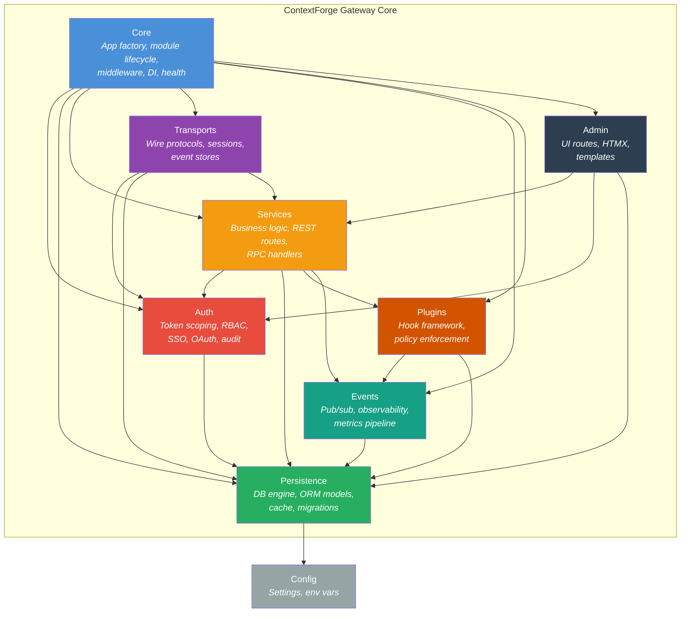
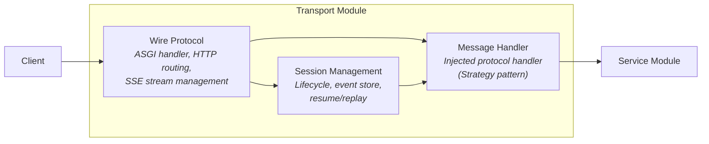
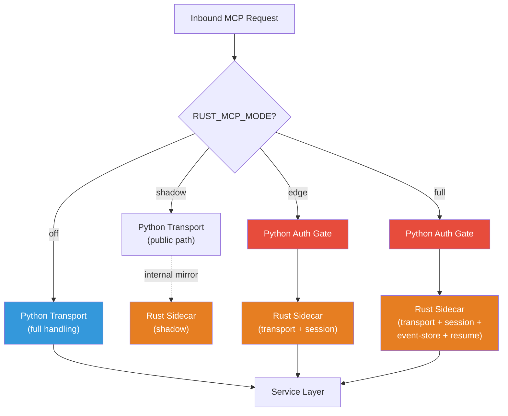
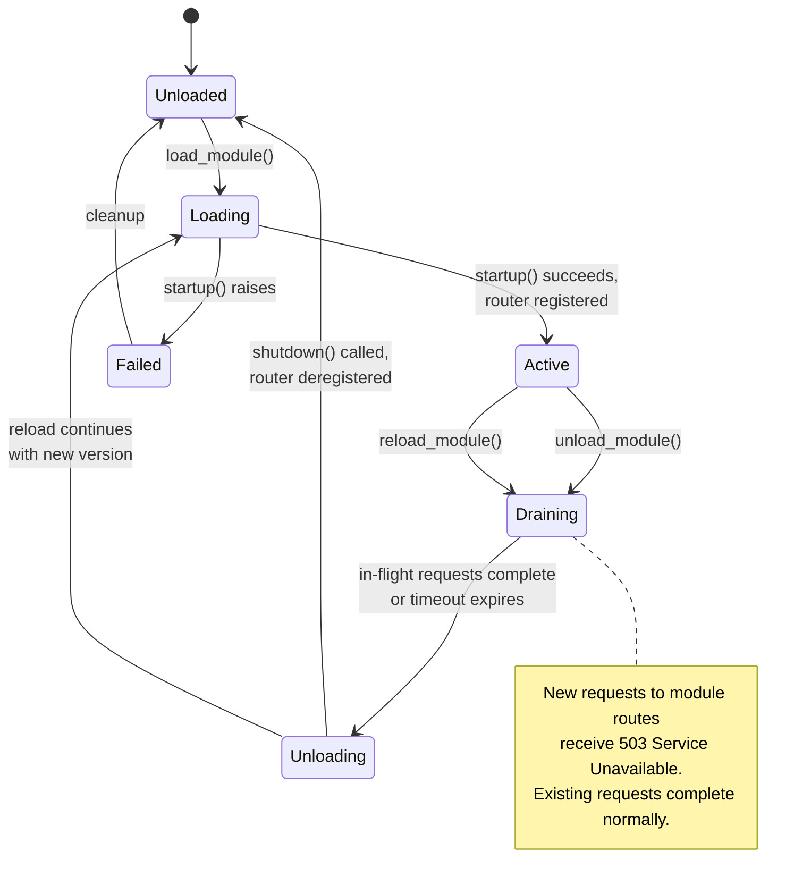
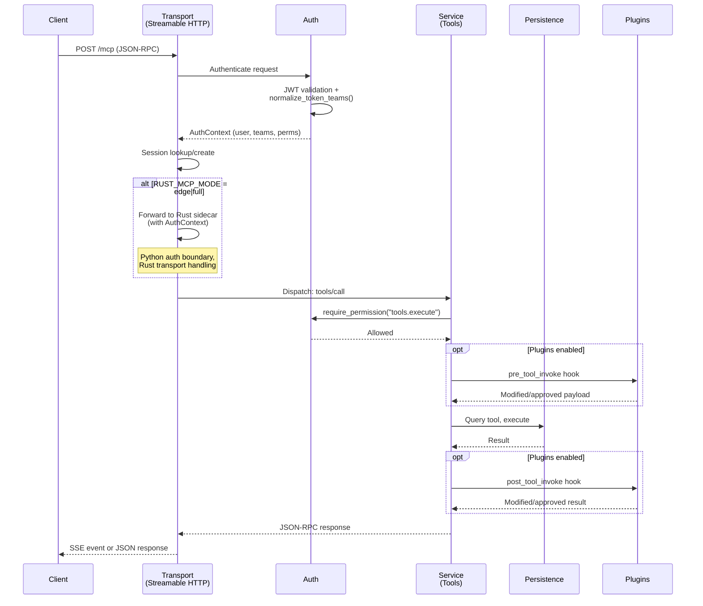
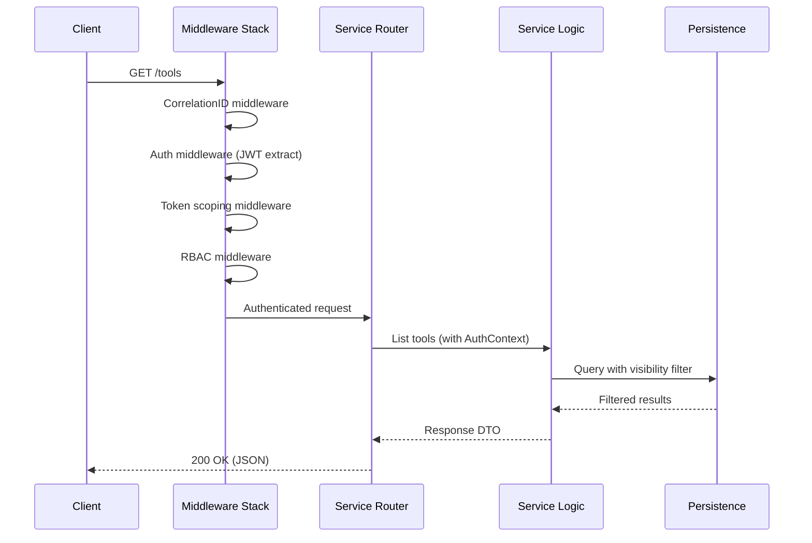
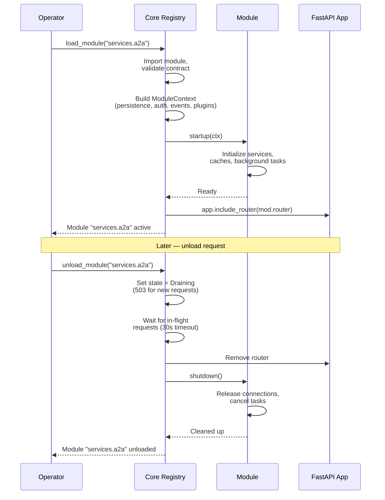
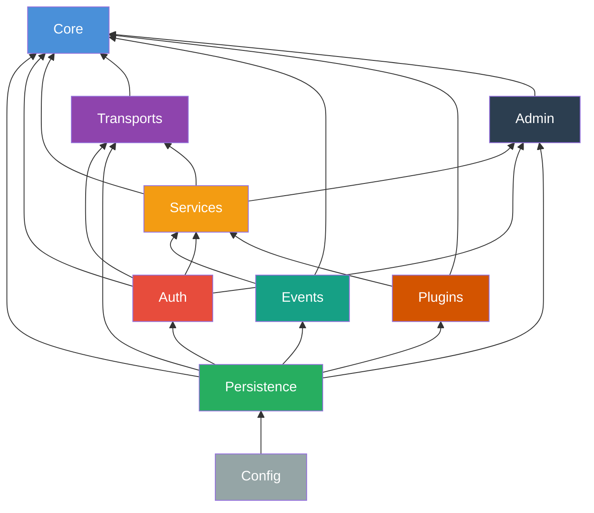
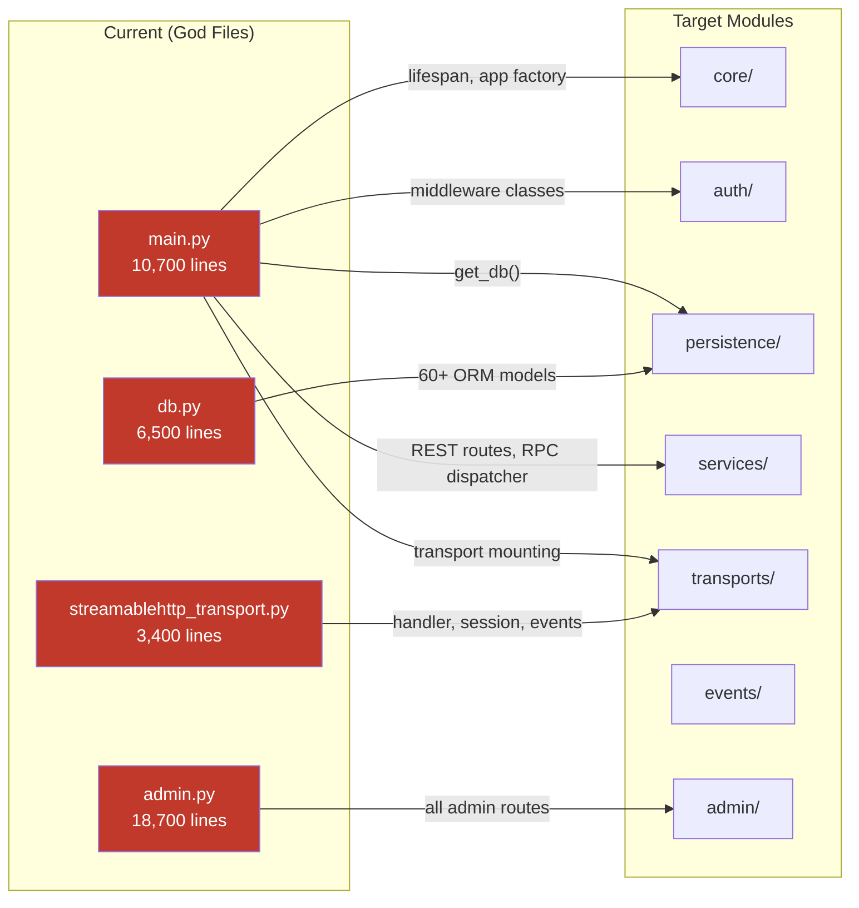

# ADR-044: Internal Modular Architecture for Gateway Core

- *Status:* Proposed
- *Date:* 2026-03-15
- *Deciders:* Core Engineering Team
- *Complements:* ADR-019 (repository-level split), ADR-043 (Rust sidecar model)

## Context

ContextForge's gateway-core has grown organically into several oversized files that
concentrate too many responsibilities:

| File | Lines | Responsibilities |
|------|------:|-----------------|
| `main.py` | ~10,700 | App bootstrap, all REST routes, 600-line RPC dispatcher, inline middleware classes, lifespan management, transport mounting |
| `admin.py` | ~18,700 | All admin UI routes, HTMX template rendering |
| `db.py` | ~6,500 | 60+ ORM models, engine/session factory, connection pooling, encrypted types |
| `streamablehttp_transport.py` | ~3,400 | ASGI handler, event store, session management, auth context, OAuth enforcement |

These god files create concrete problems:

- **Testability** — unit testing a single service requires importing the entire
  application and all its dependencies.
- **Cognitive load** — contributors must understand thousands of lines of unrelated
  code to modify a single feature.
- **Deployment rigidity** — every feature must be present even when unused; feature
  flags control enablement but not loading.
- **Coupling** — services import each other directly; the RPC dispatcher is a
  monolithic if/elif chain that couples every MCP method to a central function.
- **Evolution** — adding new protocols (A2A, future specs) means extending the same
  god files rather than composing independent modules.

ADR-019 addressed **repository-level** decomposition — splitting the ecosystem into
14 independently deployable modules. This ADR addresses the **internal architecture**
of module #1 (`mcp-contextforge-gateway-core`): how its ~150K lines should be
organized into clean, hot-loadable, loosely coupled components with proper dependency
injection and separation of concerns.

### Design Goals

1. **Runtime modularity** — modules can be loaded, unloaded, and reloaded while the
   server is running, enabling zero-downtime feature toggling and graceful upgrades.
2. **Encapsulation** — each module owns its routes, business logic, and RPC handlers
   behind a standard contract.
3. **Dependency injection** — modules declare dependencies rather than importing
   globals; Core provides them.
4. **No circular dependencies** — the module dependency graph is a DAG.
5. **Incremental migration** — the current monolith can be decomposed one module at a
   time without big-bang rewrites.

## Decision

We decompose the gateway-core into **8 component modules**, each with a standard
lifecycle contract and clear dependency boundaries.

### Component Overview



### Module Contract

Every module implements a standard protocol that Core uses for lifecycle management:

```python
class Module(Protocol):
    """Standard contract for all gateway modules."""

    router: APIRouter
    """FastAPI router encapsulating the module's HTTP endpoints."""

    async def startup(self, ctx: ModuleContext) -> None:
        """Initialize module resources. Called by Core during load."""

    async def shutdown(self) -> None:
        """Release module resources. Called by Core during unload."""

    def health(self) -> HealthStatus:
        """Report module health for aggregation by Core."""
```

`ModuleContext` carries injected dependencies:

```python
@dataclass
class ModuleContext:
    """Dependencies injected by Core into each module at load time."""

    persistence: PersistenceProvider   # DB sessions, cache access
    auth: AuthProvider                 # Token validation, permission checks
    event_bus: EventBus                # Infrastructure event pub/sub
    plugin_manager: PluginManager | None  # Plugin hooks (if enabled)
    settings: Settings                 # Configuration
```

---

### Component 1: Core

**Role**: Thin orchestrator. Creates the FastAPI application, manages module
lifecycle (load/unload/reload), registers middleware, aggregates health, and
provides dependency injection. Contains no business logic, no routes, and no
protocol handling.

**Key responsibilities**:

| Responsibility | Description |
|---------------|-------------|
| App factory | `create_app() -> FastAPI` — creates the application and middleware stack |
| Module registry | Tracks loaded modules, their routers, and lifecycle state |
| `load_module()` | Validates contract, injects dependencies, calls `startup()`, registers router |
| `unload_module()` | Drains connections, deregisters router, calls `shutdown()`, cleans state |
| `reload_module()` | Atomic unload + load with connection draining |
| Middleware ordering | Applies the middleware stack in the correct order |
| Health aggregation | Collects `health()` from all active modules into `/health` endpoint |
| DI providers | FastAPI `Depends()` functions: `get_persistence()`, `get_auth()`, `get_event_bus()` |

**What Core does NOT do**: define application routes, handle business logic, or
implement wire protocols.

**Source decomposition**:

| Current location | Target |
|-----------------|--------|
| `main.py` lifespan (lines ~1367-1718) | `core/lifecycle.py` |
| `main.py` middleware registration (lines ~2667-2794) | `core/middleware.py` |
| `main.py` router inclusion (lines ~10265-10467) | `core/registry.py` |
| `main.py` app creation | `core/app.py` |
| `main.py` DI functions (`get_db`, etc.) | `core/providers.py` |

---

### Component 2: Services

**Role**: Business logic and REST/RPC endpoints. Each service domain is a
self-contained module that exports a `fastapi.APIRouter` at a standard property.
Core registers and deregisters these routers dynamically.

**Domain modules** (each independently loadable):

| Module | Responsibilities | Current source |
|--------|-----------------|----------------|
| `services/tools/` | Tool CRUD, `tools/list`, `tools/call` RPC | `services/tool_service.py` + inline routes in `main.py` |
| `services/resources/` | Resource CRUD, `resources/list`, `resources/read` RPC | `services/resource_service.py` + inline routes |
| `services/prompts/` | Prompt CRUD, `prompts/list`, `prompts/get` RPC | `services/prompt_service.py` + inline routes |
| `services/gateways/` | Gateway federation, discovery, sync | `services/gateway_service.py` + inline routes |
| `services/servers/` | Virtual server management | `services/server_service.py` + inline routes |
| `services/roots/` | Roots listing RPC | `services/root_service.py` + inline routes |
| `services/protocol/` | MCP initialize, ping, notifications, completion, sampling, elicitation | Dispatcher in `main.py` |
| `services/a2a/` | A2A agent management (conditionally loaded) | `services/a2a_service.py` + `routers/a2a.py` |
| `services/import_export/` | Bulk import/export | `services/export_service.py`, `import_service.py` |
| `services/tags/` | Tag management | `services/tag_service.py` |

**RPC dispatch**: Each service module registers its RPC method handlers as
endpoints on its router. The current 600-line `_handle_rpc_authenticated`
if/elif chain in `main.py` is replaced by router-based dispatch where each
service's router owns its RPC method endpoints. Core assembles the full route
table by including all active module routers.

**DI pattern**: Services accept dependencies through `ModuleContext` at startup
rather than importing singletons directly:

```python
# Before (current pattern — direct imports, tight coupling):
from mcpgateway.db import SessionLocal, fresh_db_session
from mcpgateway.plugins.framework import get_plugin_manager
from mcpgateway.services.event_service import EventService

class ToolService(BaseService):
    def __init__(self):
        self._event_service = EventService()
        # ... direct instantiation

# After (proposed pattern — injected dependencies):
class ToolsModule:
    router = APIRouter(prefix="/tools", tags=["Tools"])

    async def startup(self, ctx: ModuleContext) -> None:
        self._persistence = ctx.persistence
        self._plugins = ctx.plugin_manager
        self._events = ctx.event_bus
        self._service = ToolService(
            persistence=ctx.persistence,
            plugin_manager=ctx.plugin_manager,
        )
        # Register route handlers that close over self._service
        self._register_routes()
```

---

### Component 3: Transports

**Role**: Wire protocol layer, independent of business logic. Handles connection
lifecycle, message framing, session management, and event stores. Delegates
message handling to protocol-specific handlers using the Strategy pattern.

**Architecture layers**:



**Transport implementations**:

| Transport | Protocol | Current source | Target |
|-----------|----------|---------------|--------|
| Streamable HTTP | MCP 2025 spec | `streamablehttp_transport.py` (3,400 lines) | `transports/streamable_http/` (handler, session_mgr, event_store, auth) |
| SSE | Legacy MCP | `sse_transport.py` (913 lines) | `transports/sse/` |
| WebSocket | Real-time relay | `websocket_transport.py` | `transports/websocket/` |
| Stdio | Subprocess I/O | `stdio_transport.py` | `transports/stdio/` |
| Rust Proxy | Performance delegation | `rust_mcp_runtime_proxy.py` | `transports/rust_proxy/` |

**Session registry**: The `SessionRegistry` (currently in `cache/session_registry.py`)
moves to `transports/session_registry.py` as it is fundamentally transport
infrastructure — it brokers messages between inbound client transports and the
RPC/service layer.

#### Multi-language transport selection

Python transport components serve as thin wrappers that can delegate to Rust
sidecars. The mode model from ADR-043 controls delegation:



**Example — Streamable HTTP with language selection**:

```python
class StreamableHTTPTransport:
    """Thin wrapper that delegates to Python or Rust based on mode."""

    def __init__(self, rust_mode: str, auth: AuthProvider):
        self._rust_mode = rust_mode
        self._auth = auth
        self._python_handler = PythonStreamableHTTPHandler()
        self._rust_proxy = RustMCPRuntimeProxy() if rust_mode != "off" else None

    async def handle(self, request: Request) -> Response:
        if self._rust_mode in ("edge", "full"):
            # Python owns the auth boundary; Rust owns the transport
            auth_ctx = await self._auth.authenticate(request)
            return await self._rust_proxy.forward(request, auth_ctx)
        else:
            # Full Python handling (off or shadow mode)
            return await self._python_handler.handle(request)
```

In all modes, **Python remains authoritative** for JWT validation, token scoping,
and RBAC enforcement. The Rust sidecar receives pre-authenticated context via
the internal `POST /_internal/mcp/authenticate` endpoint (see ADR-043).

---

### Component 4: Persistence

**Role**: Database engine and sessions, ORM models (split by domain), migrations,
and cache abstraction. Provides a unified `PersistenceProvider` for dependency
injection.

**Key design decisions**:

- **No Repository pattern** — SQLAlchemy IS the persistence abstraction. Adding a
  Repository layer over 60+ models would be over-engineering with no clear benefit.
- **Domain-split models** — the 6,500-line `db.py` is split into focused model
  modules while preserving a single `Base` declarative base.
- **Consolidated session management** — the three copies of `get_db()` (in
  `main.py`, `routers/auth.py`, and `db.py`) are consolidated into a single
  canonical dependency.

**Model domain split**:

```
persistence/
  __init__.py              # PersistenceProvider, get_db()
  engine.py                # Engine creation, connection pooling
  session.py               # SessionLocal, fresh_db_session()
  encrypted.py             # EncryptedText type decorator
  models/
    __init__.py             # Re-exports Base and all models
    base.py                 # Declarative Base, common mixins
    mcp.py                  # Tool, Resource, Prompt, Server, Gateway, Root, GrpcService
    auth.py                 # EmailUser, Role, UserRole, EmailTeam, EmailTeamMember, ...
    metrics.py              # ToolMetric, ResourceMetric, hourly rollups, performance
    observability.py        # ObservabilityTrace, Span, Event, Metric
    sessions.py             # SessionRecord, SessionMessageRecord
    security.py             # OAuthToken, OAuthState, TokenRevocation, SecurityEvent
    config.py               # GlobalConfig, StructuredLogEntry
    a2a.py                  # DbA2AAgent, A2AAgentMetric
  cache/
    __init__.py             # Lazy imports (existing pattern from cache/__init__.py)
    base.py                 # Cache base class (formalize existing common pattern)
    auth_cache.py           # AuthCache (L1 in-memory + L2 Redis)
    registry_cache.py       # RegistryCache
    resource_cache.py       # ResourceCache
    tool_lookup_cache.py    # ToolLookupCache
    global_config_cache.py  # GlobalConfigCache
    metrics_cache.py        # MetricsCache
    admin_stats_cache.py    # AdminStatsCache
    a2a_stats_cache.py      # A2AStatsCache
  alembic/                  # Database migrations
```

**Dynamic provision for plugins**: Untrusted providers (plugins) that need
persistence access receive sandboxed resources — either a separate schema
(PostgreSQL) or a separate database file (SQLite) — provisioned by the
`PersistenceProvider` and revoked on plugin unload.

---

### Component 5: Event Streaming

**Role**: Infrastructure event pub/sub and the observability/metrics pipeline.
Independent of persistence for the streaming mechanism itself, but uses
persistence for durable storage of traces and metrics.

**Two distinct event domains** (intentionally kept separate):

| Domain | Purpose | Transport | Delivery guarantee |
|--------|---------|-----------|-------------------|
| Infrastructure events | Cache invalidation, change notifications, module lifecycle | Redis Pub/Sub (upgrade path: Redis Streams) with asyncio.Queue fallback | At-most-once (pub/sub) |
| Observability pipeline | Traces, spans, metrics, audit events | Direct database writes via buffer services | Durable (batched writes) |

**Protocol events** (MCP session resume/replay) are explicitly NOT part of this
component — they belong to the Transport component's event store, as they have
MCP-specific delivery semantics tied to the Streamable HTTP spec.

**Source decomposition**:

| Current location | Target |
|-----------------|--------|
| `services/event_service.py` | `events/event_bus.py` |
| `services/observability_service.py` | `events/observability.py` |
| `middleware/observability_middleware.py` | `events/middleware.py` |
| `services/metrics_buffer_service.py` | `events/metrics/buffer.py` |
| `services/metrics_rollup_service.py` | `events/metrics/rollup.py` |
| `services/metrics_cleanup_service.py` | `events/metrics/cleanup.py` |
| `services/logging_service.py` | `events/logging.py` |

---

### Component 6: Security/Auth

**Role**: The two-layer security model — token scoping (Layer 1, what users can
see) and RBAC (Layer 2, what users can do). Also owns SSO, OAuth token
delegation, and audit trail.

**Security invariants** (non-negotiable, preserved from current architecture):

1. `normalize_token_teams()` is the **single source of truth** for token team
   interpretation — never re-implemented elsewhere.
2. Layer 1 (token scoping) controls resource visibility; Layer 2 (RBAC) controls
   permitted actions. Both layers apply on every path.
3. Default-deny for unmapped protected paths.
4. Never trust client-provided ownership fields (`owner_email`, `team_id`,
   session owner) — derive from authenticated identity.
5. No inbound client auth tokens via URL query parameters.

**Source decomposition**:

| Current location | Target |
|-----------------|--------|
| `auth.py` (1,489 lines) | `auth/token.py`, `auth/jwt.py` |
| `middleware/token_scoping.py` (1,366 lines) | `auth/middleware/token_scoping.py` |
| `middleware/rbac.py` (1,073 lines) | `auth/middleware/rbac.py` |
| `middleware/auth_middleware.py` | `auth/middleware/context.py` |
| `middleware/http_auth_middleware.py` | `auth/middleware/plugin_hooks.py` |
| `services/permission_service.py` | `auth/permissions.py` |
| `services/sso_service.py` | `auth/sso.py` |
| `services/oauth_manager.py` | `auth/oauth.py` |
| `services/audit_trail_service.py` | `auth/audit.py` |
| `services/token_catalog_service.py` | `auth/catalog.py` |
| `main.py` `DocsAuthMiddleware` | `auth/middleware/docs.py` |
| `main.py` `AdminAuthMiddleware` | `auth/middleware/admin.py` |

---

### Component 7: Plugins

**Role**: Plugin framework, hook system, lifecycle management, and policy
enforcement. A peer component whose **internals are being refactored
independently** and are out of scope for this ADR.

This ADR defines only the **interfaces between Plugins and the other 7 components**:

| Interface | Consumer | Description |
|-----------|----------|-------------|
| `PluginManager.initialize()` / `shutdown()` | Core | Lifecycle management during module load/unload |
| `get_plugin_manager()` | Services | Access to hook invocation (pre/post tool, resource, prompt, agent) |
| `http_auth_resolve_user` hook | Auth | Plugin-provided auth resolution |
| `http_auth_check_permission` hook | Auth | Plugin-provided permission checks (e.g., OPA delegation) |
| Observability adapter | Events | Trace/span data from plugin execution |
| `HOOK_PAYLOAD_POLICIES` | Core | Policy enforcement for hook payloads |

---

### Component 8: Admin

**Role**: Admin UI routes, HTMX + Alpine.js templates, and static files. A
self-contained module that can be loaded and unloaded independently via Core's
module lifecycle.

The current `admin.py` (18,700 lines) is the single largest file in the codebase.
Its internal decomposition into sub-modules is recommended but out of scope for
this ADR — the key architectural decision is that Admin is a **peer module** with
the same lifecycle contract as any other component, not embedded in Core or
Services.

**Feature flag**: `MCPGATEWAY_UI_ENABLED` — when `false`, the Admin module is
simply not loaded by Core.

---

### Module Lifecycle: Runtime Hot-Loading

Modules support runtime load, unload, and reload operations. This goes beyond
the current feature-flag pattern (which requires a server restart) to enable
zero-downtime feature toggling and graceful upgrades.

#### State Machine



#### Load Sequence

1. Core imports the module and validates its contract (`router`, `startup`,
   `shutdown`, `health` attributes).
2. Core constructs a `ModuleContext` with injected dependencies (persistence,
   auth, event bus, plugin manager).
3. Core calls `module.startup(ctx)` — the module initializes its internal
   services, caches, and background tasks.
4. Core registers `module.router` with the FastAPI app via
   `app.include_router()`.
5. Module transitions to **Active** — its routes now accept traffic.

#### Unload Sequence

1. Core transitions the module to **Draining** — a middleware intercepts
   requests to the module's route prefix and returns `503 Service Unavailable`.
2. Core waits for in-flight requests to complete (configurable drain timeout,
   default 30 seconds).
3. Core deregisters `module.router` from the FastAPI app.
4. Core calls `module.shutdown()` — the module releases database connections,
   cancels background tasks, and cleans up state.
5. Module transitions to **Unloaded**.

#### Reload

Reload is an atomic unload-then-load of a potentially updated module version.
The drain timeout ensures in-flight requests complete against the old version
before the new version's routes are registered.

---

### Request Flow: MCP Streamable HTTP



### Request Flow: REST API



### Module Hot-Load Sequence



---

### Dependency Graph

The module dependency graph is a strict DAG — no circular dependencies. Dependencies
flow inward toward Persistence and Config:



*Read bottom-up: arrows point from dependency to dependent. Persistence depends on
Config. Auth depends on Persistence. Services depend on Auth, Persistence, Plugins,
and Events. Core depends on everything (it assembles the application).*

---

### Source Decomposition Map

The following diagram shows how the current god files map to the new module
structure:



---

## Migration Path

The decomposition is incremental. Each phase is independently shippable, produces
a working system, and can be validated before proceeding:

| Phase | Change | Risk | Behavior change |
|-------|--------|------|-----------------|
| 1 | Split `db.py` models into `persistence/models/` domain modules | Low | None — re-exports preserve all imports |
| 2 | Consolidate the 3 copies of `get_db()` into single canonical import | Low | None |
| 3 | Extract inline middleware classes from `main.py` into `auth/` and `events/` | Low | None |
| 4 | Move REST route definitions from `main.py` into service domain modules (each with `APIRouter`) | Medium | None — same routes, same paths |
| 5 | Distribute RPC method handlers from the if/elif dispatcher to service modules | Medium | None — same dispatch, table-based |
| 6 | Split `streamablehttp_transport.py` into sub-modules | Medium | None |
| 7 | Create Core app factory — reduce `main.py` to `app = create_app()` | Medium | None |
| 8 | Extract `admin.py` into Admin module | Low | None |
| 9 | Implement module lifecycle (load/unload/reload) in Core registry | High | New capability — runtime module management |
| 10 | Add connection draining for graceful module transitions | High | New capability — zero-downtime transitions |

Phases 1-8 are **pure refactoring** with no behavior change. Phases 9-10 add
the runtime hot-loading capability.

## Consequences

### Positive

- **Testability** — each module can be tested in isolation with injected mocks
  for its dependencies, without importing the entire application.
- **Cognitive load** — contributors work within focused modules (~1-3K lines)
  instead of navigating 10-18K line god files.
- **Runtime flexibility** — modules can be loaded/unloaded/reloaded without
  server restart, enabling zero-downtime feature toggling.
- **Independent evolution** — new protocols (beyond MCP and A2A) can be added
  as new Service + Transport modules without modifying existing code.
- **Clear ownership** — each module has a defined scope and contract, enabling
  parallel development by different contributors.
- **Deployment optimization** — only load modules needed for a specific
  deployment profile (e.g., skip Admin in headless deployments).

### Negative

- **Migration effort** — decomposing 4 god files across 10 phases requires
  careful re-export management to avoid breaking imports.
- **Indirection** — DI and module contracts add a layer of indirection; new
  contributors must understand the `Module` protocol and `ModuleContext`.
- **Hot-loading complexity** — runtime module management (phases 9-10) introduces
  state machine complexity, connection draining, and potential race conditions
  during transitions.
- **FastAPI router dynamism** — FastAPI's `include_router()` is not designed for
  runtime deregistration; implementing `unload_module()` may require patching the
  app's route table or using ASGI middleware for route interception.

### Neutral

- **No new dependencies** — uses FastAPI's built-in `Depends()` for DI rather
  than a third-party container.
- **Backward compatible** — re-exports in each module's `__init__.py` preserve
  existing import paths during migration.

## Alternatives Considered

| Alternative | Why not chosen |
|-------------|---------------|
| Keep monolithic `main.py` with better internal organization | Still too large for effective testing and contribution; does not enable runtime hot-loading |
| Microservices decomposition | Too heavyweight operationally; ADR-019 already considered and rejected full microservices |
| Third-party DI container (e.g., `dependency-injector`, `lagom`) | Adds unnecessary dependency; FastAPI's `Depends()` is sufficient for the injection patterns needed |
| Repository pattern for persistence | Over-engineering for 60+ models; SQLAlchemy already provides the abstraction layer |
| Static feature flags only (no hot-loading) | Requires server restart for every feature toggle; insufficient for production zero-downtime requirements |

## References

- [ADR-019: Modular Architecture Split (14 Independent Modules)](019-modular-architecture-split.md) —
  repository-level decomposition (complementary to this ADR)
- [ADR-043: Rust MCP Runtime Sidecar with Mode-Based Rollout](043-rust-mcp-runtime-sidecar-mode-model.md) —
  multi-language transport model referenced by the Transport component
- [ADR-016: Plugin Framework & AI Middleware](016-plugin-framework-ai-middleware.md) —
  plugin architecture (internals being refactored independently)
- `mcpgateway/services/base_service.py` — current `BaseService` abstract class
- `mcpgateway/transports/base.py` — current `Transport` abstract base class
- `mcpgateway/cache/__init__.py` — lazy import pattern reusable during migration
