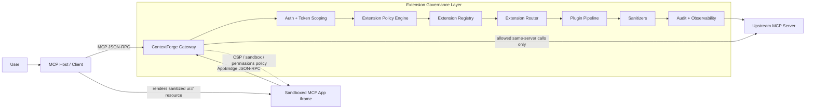

# ADR-053: Governed MCP Extension Framework

- *Status:* Proposed
- *Date:* 2026-05-29
- *Deciders:* Platform Team
- *Related:*
  - [Issue #2527: Governed Extension Framework for MCP Apps and Future Extensions](https://github.com/IBM/mcp-context-forge/issues/2527)
  - [Issue #4957: ADR for generic MCP extension framework](https://github.com/IBM/mcp-context-forge/issues/4957)
  - [PR #5079: Add MCP Apps support](https://github.com/IBM/mcp-context-forge/pull/5079)
  - [Issue #4974: Generic extension foundation](https://github.com/IBM/mcp-context-forge/issues/4974)
  - [Issue #4975: Auth-scoped aggregation and generic routing](https://github.com/IBM/mcp-context-forge/issues/4975)
  - [Issue #4978: MCP Apps integration with the governance layer](https://github.com/IBM/mcp-context-forge/issues/4978)
  - [MCP Extensions overview](https://modelcontextprotocol.io/docs/extensions/overview)
  - [MCP Apps extension](https://modelcontextprotocol.io/docs/extensions/apps)

## Context

ContextForge federates MCP servers and exposes governed tools, resources, prompts, transports,
RBAC, observability, and admin controls. The current MCP request path is intentionally explicit:
core protocol methods such as `tools/list`, `tools/call`, `resources/read`, `prompts/get`,
`completion/complete`, `elicitation/create`, logging, sampling, and transport/session methods are
handled by known gateway paths. Unknown methods eventually fall through to legacy direct-tool
invocation or `-32601 Method not found`.

That explicit model is appropriate for the core protocol, but it does not scale to optional MCP
extensions. MCP extensions let clients and servers advertise optional protocol modules through
`capabilities.extensions`. Examples include UI-oriented extensions such as MCP Apps and future
simple method families such as Tasks-style extensions.

MCP Apps support is already being introduced separately in
[PR #5079](https://github.com/IBM/mcp-context-forge/pull/5079). This ADR is therefore not a
prerequisite for MCP Apps and does not use MCP Apps as the first-implementation criterion. Instead,
this ADR defines the security and governance substrate that MCP Apps and future extensions must
follow.

The core problem is not only protocol compatibility. ContextForge is a security gateway, so an
upstream server advertising an extension must not automatically cause the gateway to expose,
route, render, or trust that extension. Discovery is inventory. Exposure and execution require
policy.

## Decision

Build a security-first, generic MCP extension governance framework.

The framework will allow ContextForge to discover, register, enable, advertise, route, execute,
sanitize, return, and audit MCP extension behavior through common policy-controlled stages.
Extensions are treated as untrusted optional protocol modules until gateway policy, RBAC, token
scoping, server scope, client capability negotiation, plugin checks, and sanitizer checks allow
them.

The framework has nine primary responsibilities:

1. **Represent official extensions using `capabilities.extensions`.**
   ContextForge will add `extensions` to MCP client and server capability models and use it as the
   canonical path for official MCP extensions. Existing `capabilities.experimental` payloads may be
   preserved for compatibility and incubation, but official extensions should not be modeled as
   `experimental` features.

2. **Persist a generic extension registry.**
   ContextForge will store extension definitions and per-gateway extension capability records
   using a schema independent of any specific extension. Registry metadata includes extension
   identifier, source, status, risk level, explicit method ownership patterns, required
   permissions, routing mode, source gateways, plugin policy, sanitizer policy, audit policy, and
   optional handler class.

3. **Discover upstream extensions without automatically exposing them.**
   Gateway initialization and refresh will inspect upstream `capabilities.extensions`, persist
   discovered extension capability payloads per gateway, and associate them with generic extension
   definitions. Discovery records are inventory and must not be advertised or executable until
   policy enables them.

4. **Aggregate capabilities with caller scope.**
   Initialize responses will advertise only extensions that the caller, token scope, team scope,
   target virtual server, enabled-state policy, RBAC permissions, and client capabilities allow.
   Extension aggregation must not leak private or team-only upstream capabilities to unauthorized
   clients.

5. **Route extension methods through explicit method ownership.**
   The request dispatcher will route non-core methods through registry-owned method patterns.
   The dispatcher must not gain a new branch for every future simple extension. Method ownership is
   explicit registry metadata, not inferred from an extension name.

6. **Provide safe generic auto-proxy for simple extensions.**
   Simple extensions can use declarative proxying only when the extension explicitly owns the
   method pattern and policy allows the caller and upstream provider. Auto-proxy must never mean
   proxy all unknown extension methods.

7. **Provide a safe custom handler model for complex extensions.**
   Complex extensions use approved handlers when they need gateway-side sessions, state,
   security mediation, protocol adaptation, content transformation, or browser-facing controls.
   MCP Apps is such a complex extension after #5079.

8. **Run plugin and sanitizer hooks around extension behavior.**
   Extension discovery, capability advertisement, method routing, upstream requests, upstream
   responses, resource reads, UI resource serving, AppBridge calls, and external link decisions
   must be interceptable where policy configures hooks.

9. **Audit and observe extension decisions.**
   Extension allow/deny decisions must be visible to operators without logging secrets or
   sensitive payloads.

## Core Security Model

The extension lifecycle is default-deny at every stage:

```text
Discovered -> Registered -> Enabled -> Advertised -> Routed -> Executed -> Sanitized -> Returned -> Audited
```

Any stage may deny. A denial must not fall through to a legacy tool path or blind upstream proxy.

Required invariants:

- Discovery is not exposure.
- Exposure is not execution.
- Execution is not raw pass-through.
- Returned resources and responses are not trusted until policy, plugins, and sanitizers allow
  them.
- Unknown extension methods are denied unless an enabled extension explicitly owns the method
  pattern.
- Auto-proxy is allowed only for explicitly configured method patterns and only after auth, token
  scoping, RBAC, server scope, plugin, sanitizer, and audit checks.
- Capability aggregation is auth-, team-, token-, client-, and virtual-server-scope aware.
- Extension behavior must not leak hidden upstream gateways, hidden teams, hidden tools, hidden
  resources, or disabled extension capabilities.
- App-originated calls are a distinct security surface and must not be treated as normal
  model/user tool calls.
- Every allow/deny decision that affects extension exposure, routing, resources, AppBridge calls,
  external navigation, or sanitization must be auditable.

The framework must preserve ContextForge's two-layer security model:

- Layer 1: token scoping controls what the caller can see.
- Layer 2: RBAC controls what the caller can do.

Implementation must reuse existing token-team interpretation points, including
`normalize_token_teams()` and `resolve_session_teams()`, instead of reimplementing token scoping
logic.

## Extension Capability Model

Official MCP extensions are advertised under `capabilities.extensions` using stable extension
identifiers:

```json
{
  "capabilities": {
    "extensions": {
      "com.example/tasks": {
        "version": "1.0.0"
      }
    }
  }
}
```

MCP Apps uses the official UI extension identifier:

```json
{
  "capabilities": {
    "extensions": {
      "io.modelcontextprotocol/ui": {
        "mimeTypes": ["text/html;profile=mcp-app"]
      }
    }
  }
}
```

ContextForge may still ingest legacy or incubating payloads such as:

```json
{
  "capabilities": {
    "experimental": {
      "apps": {}
    }
  }
}
```

Those entries are compatibility metadata. They do not automatically mean official MCP Apps support
unless an operator or compatibility policy maps them to a real extension definition.

## Registry Model

The extension registry is the control-plane source of truth.

An extension definition includes:

- `identifier`: stable extension identifier, for example `com.example/tasks`.
- `display_name`: human-readable name.
- `source`: `built-in`, `discovered`, `admin-configured`, or `legacy-experimental`.
- `status`: enabled, disabled, deprecated, blocked, or quarantined.
- `risk_level`: operator-visible risk classification.
- `method_patterns`: explicit method names or prefixes owned by the extension.
- `required_permissions`: RBAC permissions required to see or invoke the extension.
- `auto_proxy`: whether matching methods can be proxied generically.
- `routing_policy`: upstream selection behavior for multi-gateway providers.
- `handler_class`: optional approved handler for complex extensions.
- `plugin_policy`: configured pre/post hooks for extension operations.
- `sanitizer_policy`: configured sanitizers for requests, responses, metadata, and resources.
- `audit_policy`: audit requirements and sensitivity classification.
- `external_capabilities`: browser/network surfaces such as UI rendering, external navigation, or
  AppBridge.

A gateway-extension record includes:

- gateway id.
- extension identifier.
- upstream capability payload.
- enabled state.
- discovery source.
- last seen timestamp.
- visibility scope.

This shape is intentionally extension-agnostic. Adding a simple Tasks-style extension should not
require new tables or new dispatcher branches.

## Capability Aggregation

When a client calls `initialize`, ContextForge computes the effective extension capability set.
It must not simply forward upstream capabilities.

An extension may be advertised only when:

- the client supports the extension if client support is required.
- at least one visible upstream gateway or built-in handler provides it.
- the extension is enabled by policy.
- the caller is authorized for the relevant server/team scope.
- advertising the extension does not leak hidden upstream state.

Public-only, wrong-team, hidden-gateway, disabled-extension, and unsupported-client cases must not
show the extension in the initialize result.

## Routing Model

Extension routing is default-deny.

For every non-core method, the gateway asks the registry whether an enabled extension explicitly
owns the method for the current caller and server scope. If no enabled extension owns it, the
request continues only to the existing legacy direct-tool fallback where that fallback already
applies, and then to method-not-found behavior. An extension denial must not be converted into a
legacy tool call.

If an extension owns the method:

1. The gateway enforces authentication, token scoping, server scoping, and RBAC.
2. The gateway checks the extension's enabled state, risk policy, and method ownership.
3. The gateway runs configured plugin pre-call hooks.
4. If `handler_class` is configured, the request is passed to the approved handler.
5. Else if `auto_proxy=true`, the request is proxied to an authorized upstream provider.
6. The gateway runs configured response sanitizer and plugin post-call hooks.
7. The gateway emits audit/observability events.
8. Else the request is denied as unsupported for that extension.

Method ownership must be explicit. The gateway must not infer that `com.example/tasks` owns
`tasks/*` unless that method pattern is configured or discovered through an approved extension
definition.

## No-Code Simple Extension Onboarding

Simple extensions should be onboarded declaratively.

For example, an operator should be able to configure:

```yaml
identifier: com.example/tasks
method_patterns:
  - tasks/list
  - tasks/create
required_permissions:
  - tools.execute
auto_proxy: true
routing_policy:
  strategy: first_authorized_gateway
plugin_policy:
  pre_call:
    - extension.request.guard
sanitizer_policy:
  response:
    - extension.json.safe_response
audit_policy:
  mode: allow_and_deny
```

With that metadata, ContextForge can:

- discover upstream `com.example/tasks` capability payloads.
- keep discovery hidden until policy enables it.
- advertise the extension to authorized clients during initialize.
- route `tasks/list` and `tasks/create` to an authorized upstream.
- run plugin and sanitizer hooks.
- audit and trace the extension call.
- deny hidden, disabled, unauthorized, or unowned methods.

No core dispatcher, database schema, or Admin UI structural change should be required for this
simple extension.

## Custom Handler Model

Custom handlers are an escape hatch for complex extensions, not the default onboarding path.

Handlers are appropriate when an extension needs gateway-side behavior such as:

- stateful sessions.
- security mediation beyond normal RBAC.
- content transformation.
- protocol adaptation.
- resource lifecycle management.
- browser-facing policy enforcement.
- background cleanup.
- custom capability contribution.

Handlers must be loaded only from approved locations, such as built-in modules or explicitly
allowlisted plugin packages. A database row must not be able to load arbitrary Python code. Invalid
or unapproved handlers fail closed and produce admin-visible diagnostics.

The handler interface should provide:

- `on_initialize`.
- `on_method_call`.
- `on_resource_read`.
- `on_capability_query`.
- `on_cleanup`.

Handlers receive caller identity, token teams, server scope, session id, client capabilities, and
only the services they are allowed to use.

Handlers must not bypass generic extension policy, RBAC/token scoping, plugin hooks, sanitizer
hooks, or audit.

## MCP Apps Under the Framework

MCP Apps should not remain a separate special-case island after the framework exists. The MCP Apps
work from #5079 should be integrated as a complex extension under the generic governance layer.

MCP Apps is registered as:

```text
identifier: io.modelcontextprotocol/ui
mode: custom handler
risk: high
external navigation: disabled by default
resource sanitization: enabled
AppBridge same-server binding: required
```

The generic framework owns:

- extension registry and gateway-extension records.
- auth-scoped capability advertisement.
- explicit method/resource ownership checks.
- RBAC, token scoping, and server-scope enforcement.
- plugin hook invocation.
- sanitizer invocation.
- audit and observability.

The MCP Apps handler owns:

- `ui://` resource semantics.
- tool `_meta.ui.resourceUri` association.
- model-visible vs app-visible tool policy.
- UI view sessions.
- AppBridge JSON-RPC handling.
- same-server AppBridge authorization.
- CSP, sandbox, permissions policy, and allowed-origin behavior.
- external navigation and governed linkout handling.

The MCP Apps network flow under this framework is:



The iframe must not directly bypass ContextForge for governed AppBridge calls.

## External Network and Navigation Policy

MCP Apps may contain external links, images, scripts, API calls, frames, or navigation attempts.
Browser traffic from an iframe does not automatically pass through ContextForge, so ContextForge
must control these surfaces before rendering.

Required behavior:

- External navigation is blocked by default.
- External `connect-src`, `script-src`, `img-src`, `frame-src`, and related browser capabilities
  are blocked unless policy explicitly allows domains.
- Gateway-enforced CSP, sandbox, permissions policy, and AppBridge policy must intersect with, not
  blindly trust, upstream-declared policy.
- If external links are allowed, they should be allowlisted and either host-mediated through
  AppBridge or rewritten through a ContextForge linkout endpoint for policy enforcement and audit.
- Raw external links must not be treated as governed unless the host/rendering path enforces the
  policy.

## Plugin and Sanitization Pipeline

Extensions must be plugin-interceptable and sanitizer-aware.

Required hook surfaces include:

- extension discovery.
- capability advertisement.
- method request before routing.
- upstream request before proxy.
- upstream response before return.
- resource read before return.
- UI resource registration and serving.
- AppBridge request before execution.
- external navigation/linkout decision.
- audit event emission.

Sanitizers should support JSON, structured content, metadata, resource content, HTML/UI resource
metadata, URLs, and external domain declarations.

## Admin and Operations

ContextForge will expose extension governance through both API and Admin UI:

- list registered extensions.
- inspect source gateways and capability payloads.
- enable or disable extensions globally or per gateway.
- configure method patterns, permissions, routing policy, plugin policy, sanitizer policy, audit
  policy, and risk metadata for admin-configured extensions.
- show whether an extension is built-in, discovered, admin-configured, or legacy-experimental.
- show high-risk surfaces such as UI rendering, AppBridge, external navigation, auto-proxy, and
  custom handler use.
- surface handler load failures, sanitizer blocks, plugin blocks, and blocked-risk decisions.

Operational telemetry includes:

- discovery events.
- initialize aggregation decisions.
- capability advertisement denials.
- extension method route decisions.
- proxy target and outcome.
- handler outcome.
- plugin and sanitizer decisions.
- denial reason.
- external navigation and linkout decisions.
- latency and error metrics.

Logs, metrics, traces, and audit events must not expose secrets from capability payloads, request
headers, upstream authentication configuration, UI resources, or tool responses.

## Consequences

### Positive

- Future simple extensions can be onboarded through metadata rather than core code changes.
- MCP Apps from #5079 gains a path into common extension governance instead of remaining a
  special-case implementation.
- Capability exposure becomes explicitly auth-scoped, reducing visibility leaks.
- Operators gain governance over discovered and configured extensions.
- Method routing remains default-deny and auditable.
- Plugin and sanitizer hooks become common extension controls instead of extension-specific
  inventions.
- The framework creates a natural boundary between simple proxyable extensions and complex handler
  extensions.

### Negative

- The MCP request path gains a new registry lookup for non-core methods.
- Extension records add new control-plane state that must be migrated, tested, exported, and
  imported over time.
- Explicit method ownership requires operators or extension definitions to provide correct method
  patterns.
- Custom handler loading introduces a safety surface that must remain allowlisted and fail closed.
- Browser-facing extensions such as MCP Apps require host/rendering cooperation for CSP, sandbox,
  permissions, and linkout controls.

### Neutral

- Existing core MCP method handling remains explicit.
- Existing `capabilities.experimental` behavior is preserved as compatibility metadata.
- The legacy direct-tool fallback remains after extension routing where it already applies, to
  preserve backward compatibility.
- MCP Apps-specific UI, CSP, AppBridge, and linkout behavior is intentionally outside the simple
  auto-proxy path.

## Alternatives Considered

### Keep MCP Apps as a special-case implementation

Rejected. MCP Apps support can land independently through #5079, but keeping it as a permanent
special case would duplicate discovery, routing, policy, audit, plugin, and sanitizer logic for
future extensions.

### Implement only protocol compatibility

Rejected. ContextForge is a security gateway. Simply projecting upstream extension metadata or
blindly forwarding extension behavior would weaken the product's security posture.

### Proxy all unknown methods blindly

Rejected. Blind proxying can leak capability existence, bypass policy, route to the wrong upstream,
or execute unsafe extension behavior without explicit ownership.

### Continue using only `capabilities.experimental`

Rejected for official extensions. MCP extensions have a formal `capabilities.extensions`
negotiation path. `experimental` remains useful for compatibility and incubation only.

### Require custom handler code for every extension

Rejected. That would turn every future extension into a code deployment and defeat the purpose of a
generic extension framework. Handlers are reserved for complex extensions.

### Trust upstream CSP and link declarations directly

Rejected. Browser traffic and UI rendering create a separate security surface. ContextForge must
compute and enforce an effective policy rather than blindly projecting upstream declarations.

## Migration and Rollout

Delivery is split into six demoable stories:

1. ADR approval ([#4957](https://github.com/IBM/mcp-context-forge/issues/4957)).
2. Generic extension foundation ([#4974](https://github.com/IBM/mcp-context-forge/issues/4974)).
3. Auth-scoped aggregation and generic routing ([#4975](https://github.com/IBM/mcp-context-forge/issues/4975)).
4. Extension governance and operations ([#4976](https://github.com/IBM/mcp-context-forge/issues/4976)).
5. Custom extension handler framework ([#4977](https://github.com/IBM/mcp-context-forge/issues/4977)).
6. MCP Apps integration with the governance layer ([#4978](https://github.com/IBM/mcp-context-forge/issues/4978)).

Rollout rules:

- Ship the framework behind explicit extension enablement.
- Keep high-risk discovered extensions disabled until operator approval.
- Preserve existing core MCP behavior and legacy tool fallback.
- Add deny-path regression tests before enabling extension routing by default.
- Validate the no-code path with a Tasks-style fixture.
- Integrate MCP Apps from #5079 into the generic governance layer once the common registry,
  policy, routing, plugin, sanitizer, and audit layers exist.

## Approval Checklist

- [ ] Maintainers agree that `capabilities.extensions` is the canonical path for official
      extensions.
- [ ] Maintainers agree that `capabilities.experimental` remains compatibility/incubation metadata.
- [ ] Maintainers agree that simple extensions must be onboardable without core dispatcher changes.
- [ ] Security review accepts the default-deny lifecycle and auth-scoped aggregation model.
- [ ] Security review accepts plugin, sanitizer, audit, and external navigation controls.
- [ ] Platform review accepts the registry, admin, and observability model.
- [ ] MCP Apps implementers agree to integrate #5079 behavior with the generic framework rather
      than bypassing it.

## References

- [MCP Extensions overview](https://modelcontextprotocol.io/docs/extensions/overview)
- [MCP Apps extension](https://modelcontextprotocol.io/docs/extensions/apps)
- [MCP Apps specification](https://github.com/modelcontextprotocol/ext-apps/blob/main/specification/2026-01-26/apps.mdx)
- [Issue #2527: Governed Extension Framework for MCP Apps and Future Extensions](https://github.com/IBM/mcp-context-forge/issues/2527)
- [Issue #4957: ADR for generic MCP extension framework](https://github.com/IBM/mcp-context-forge/issues/4957)
- [PR #5079: Add MCP Apps support](https://github.com/IBM/mcp-context-forge/pull/5079)
- Prior related ADRs:
  - [ADR-014: Security Headers and Environment-Aware CORS Middleware](014-security-headers-cors-middleware.md)
  - [ADR-016: Plugin Framework & AI Middleware](016-plugin-framework-ai-middleware.md)
  - [ADR-045: Authentication and Authorization Remain in Core](045-auth-remains-in-core.md)
  - [ADR-049: Multi-Protocol Virtual Servers](049-multi-protocol-virtual-servers.md)
