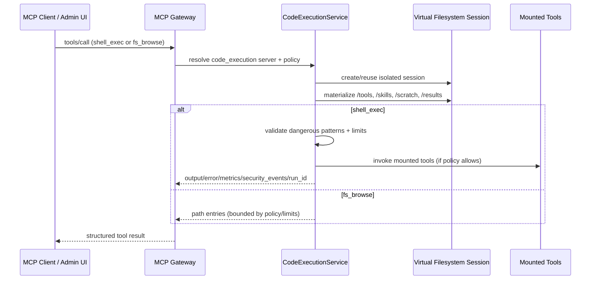

# Secure Code Execution and Virtual Tool Filesystem

This page describes the architecture of **MCP Code Mode**: secure code execution through `code_execution` virtual servers.

## Overview

MCP Code Mode adds a first-class server type (`type=code_execution`) that exposes two synthetic tools:

- `shell_exec` for sandboxed code/command execution
- `fs_browse` for safe virtual filesystem inspection

Execution sessions are isolated and built around a **virtual tool filesystem** with policy controls for runtime limits, filesystem access, tool-calling, tokenization, and skills visibility.

## Design Goals

- Execute dynamic/model-generated code without broad host access
- Keep mounted capabilities explicit and policy-controlled
- Support both Python and TypeScript execution flows
- Provide auditable run/session/security metadata for operations
- Integrate with existing auth/RBAC/token-scoping/plugin controls

## High-Level Flow



## Virtual Filesystem Model

Each active session uses isolated directories rooted under `CODE_EXECUTION_BASE_DIR`:

- `/tools`: generated stubs for mounted tools and catalog metadata (`_catalog.json`)
- `/skills`: approved reusable skills for the server/runtime
- `/scratch`: writable temporary work area
- `/results`: writable output area

Typical shape:

```text
/tools
  /<server-slug>
    _meta.json
    <tool_stub>.py | <tool_stub>.ts
  _catalog.json
  _search_index.txt
/skills
  <skill files>
/scratch
/results
```

## Policy Model

Code mode behavior is controlled by server-level policy (with config-backed defaults).

### Mount Rules

`mount_rules` filters which tools are projected into `/tools`.

| Field | Purpose |
| --- | --- |
| `include_tags` / `exclude_tags` | Include/exclude tools by tag |
| `include_servers` / `exclude_servers` | Include/exclude tools by server slug/name |
| `include_tools` / `exclude_tools` | Include/exclude explicit tool names |

### Sandbox Policy

`sandbox_policy` controls runtime, limits, and permissions.

| Category | Fields |
| --- | --- |
| Runtime | `runtime` (`deno` or `python`) |
| Compute | `max_execution_time_ms`, `max_memory_mb`, `max_cpu_percent` |
| IO Limits | `max_file_size_mb`, `max_total_disk_mb`, `max_runs_per_minute` |
| Network | `max_network_connections`, `allow_raw_http` |
| Filesystem | read/write/deny glob policies |
| Tool calls | allow/deny patterns + enable/disable tool-calling |

### Tokenization Policy

`tokenization` supports bidirectional tokenization for configured PII types.

| Field | Purpose |
| --- | --- |
| `enabled` | Enable tokenization |
| `types` | PII types to tokenize |
| `strategy` | Currently `bidirectional` |

### Skills Scope and Approval

- `skills_scope` constrains skill visibility (for example `team:<team-id>`, `user:<email>`)
- `skills_require_approval` enables approval workflow before skills become active

## API Surface

### Server Configuration

- Create/update server with `type=code_execution`
- Attach optional `mount_rules`, `sandbox_policy`, `tokenization`, `skills_scope`, `skills_require_approval`

### Runtime and Audit Endpoints

- `GET /servers/{server_id}/code/runs`
- `GET /servers/{server_id}/code/sessions`
- `GET /servers/{server_id}/code/security-events`
- `POST /servers/{server_id}/code/runs/{run_id}/replay`

### Skills Endpoints

- `GET /servers/{server_id}/skills`
- `POST /servers/{server_id}/skills`
- `GET /servers/{server_id}/skills/approvals`
- `POST /servers/{server_id}/skills/approvals/{approval_id}/approve`
- `POST /servers/{server_id}/skills/approvals/{approval_id}/reject`
- `POST /servers/{server_id}/skills/{skill_id}/revoke`

## Feature Flags and Defaults

Core feature flags:

- `CODE_EXECUTION_ENABLED`
- `CODE_EXECUTION_SHELL_EXEC_ENABLED`
- `CODE_EXECUTION_FS_BROWSE_ENABLED`
- `CODE_EXECUTION_REPLAY_ENABLED`
- `CODE_EXECUTION_RUST_ACCELERATION_ENABLED`
- `CODE_EXECUTION_PYTHON_INPROCESS_FALLBACK_ENABLED`

Default limits and policies are configured through `CODE_EXECUTION_DEFAULT_*` and related JSON-array settings.

See full configuration reference:

- [Code Execution (MCP Code Mode) configuration](../manage/configuration.md#code-execution-mcp-code-mode)
- [Config schema](../config.schema.json)

## Security Notes

- `allow_raw_http` defaults to `false`
- filesystem access is constrained to allowlisted virtual paths with deny globs
- dangerous-pattern detection blocks high-risk execution signatures
- rate limits and runtime limits are enforced per policy
- security events are captured per run for audit/forensics

## Related Documentation

- ADR: [ADR-0041 Secure Code Execution and Virtual Tool Filesystem](adr/041-secure-code-execution-virtual-tool-filesystem.md)
- Usage guide: [Using Code Execution Virtual Servers](../using/code-execution-virtual-server.md)
- Security features: [MCP Gateway Security Features](security-features.md)
