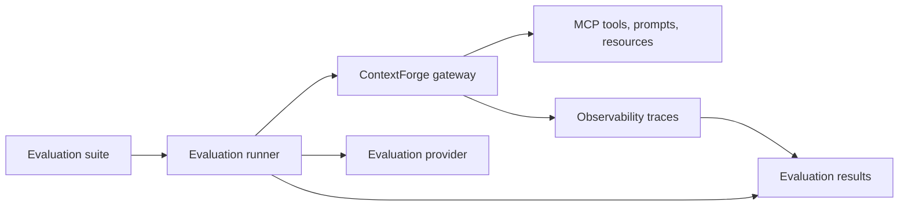

# MCP Evaluation Requirements and Architecture Analysis

This note summarizes the requirements and architectural implications for MCP evaluation
work in ContextForge. It is intended to keep MCP-EVAL planning aligned with the
gateway's registry, proxy, observability, and governance responsibilities while leaving
implementation details small enough to evolve incrementally.

ContextForge already includes an unsupported sample
[MCP evaluation server](../using/servers/python/eval-server.md) that exposes evaluation
tools over MCP and REST. The analysis below treats that server as a useful evaluation
provider, not as the only architecture. The gateway should be able to register,
route, secure, observe, and compare evaluation providers in the same way it manages
other MCP servers.

## Goals

- Evaluate MCP servers, tools, prompts, resources, and agent workflows with repeatable
  scenarios.
- Support both rule-based checks and LLM-as-a-judge checks without making external
  model access mandatory for every run.
- Produce machine-readable results that can be compared across gateway versions,
  server versions, model providers, and configuration changes.
- Preserve ContextForge security boundaries: authentication, RBAC, team visibility,
  token scoping, auditability, and plugin policy enforcement.
- Make failures diagnosable by recording which scenario, provider, input, tool call,
  matcher, and environment assumption produced the result.

## Primary Use Cases

- **Pre-merge regression checks:** Run small, deterministic suites before code or
  configuration changes merge. This requires stable fixtures, short timeouts, and
  CI-friendly defaults.
- **Provider comparison:** Compare behavior across local models, hosted models, or
  judge providers. Results need metadata for provider, model, version, and latency.
- **Gateway conformance:** Verify that registered tools, prompts, resources, and
  transports behave consistently through the gateway. This reuses registry, virtual
  server, and transport paths.
- **Safety and policy checks:** Validate prompt injection handling, content filtering,
  RBAC boundaries, and plugin effects. These checks must preserve deny-path coverage
  and never bypass gateway auth paths.
- **Operational drift detection:** Re-run suites against production-like deployments
  to detect behavior changes over time. This requires observability links, retention
  policy, and scoped access to results.

## Functional Requirements

### Scenario Definition

An evaluation scenario should include:

- A stable identifier and human-readable description.
- Target type, such as gateway, virtual server, MCP server, tool, prompt, resource, or
  agent workflow.
- Inputs, expected outputs, matchers, and pass/fail thresholds.
- Optional setup and teardown steps for test data, tools, or virtual servers.
- Tags for scope, risk, owner, feature, and whether the scenario needs an external
  judge model.

Scenario IDs must be unique within a suite so results can be compared over time.
Suites should support both full runs and small smoke subsets.

### Execution

Evaluation execution should:

- Run scenarios independently so one hang or failure does not block the whole suite.
- Apply per-scenario and per-tool-call timeouts.
- Capture raw gateway responses, normalized assertions, logs, and trace identifiers.
- Mark external dependency problems as unavailable or skipped when appropriate, rather
  than reporting them as product regressions.
- Support deterministic mode for CI by preferring fixed fixtures, rule-based matchers,
  mock providers, or local providers that do not require network access.

### Results

Each result should record:

- Suite ID, scenario ID, run ID, start time, duration, and status.
- Gateway version, evaluation provider version, target server version, and relevant
  configuration hash.
- Caller identity and team scope when the run is initiated through authenticated
  gateway APIs.
- Judge provider, model, prompt template version, rubric version, and retry count when
  an LLM judge is used.
- Assertion details, score, threshold, error category, and links to traces or logs.

Results should be stored in a format that supports comparison, trend analysis, and
export without requiring access to private runtime secrets.

## Non-Functional Requirements

- **Determinism:** CI suites should be stable without live external model calls.
- **Timeout safety:** Every external call and scenario should have bounded execution.
- **Isolation:** Test data and generated virtual servers should not leak into normal
  gateway state after a run.
- **Least privilege:** Evaluation runs should use explicit credentials and team scopes.
- **Auditability:** Evaluation activity should be visible in logs and observability
  traces without exposing secrets or sensitive prompt content.
- **Extensibility:** New matchers, providers, rubrics, and result sinks should be added
  without changing gateway transport semantics.

## Architecture Fit

The lowest-risk architecture is to keep evaluation providers outside the gateway core
and connect them through existing ContextForge surfaces:

1. Register evaluation providers as MCP servers or REST-backed tools.
2. Compose them into virtual servers when a team wants a curated evaluation surface.
3. Invoke target tools through the gateway so authentication, RBAC, plugins, rate
   limits, tracing, and audit logging stay on the normal request path.
4. Store or export results through a dedicated evaluation result sink, rather than
   overloading operational traces as the durable system of record.

This keeps the gateway responsible for governance and routing while the evaluation
runner owns scenario orchestration, retries, matchers, and result normalization.

## Security Considerations

MCP-EVAL work should follow the same security invariants as normal gateway traffic:

- Do not bypass authentication or RBAC to make evaluation easier.
- Do not accept bearer tokens or client credentials in URL query parameters.
- Derive ownership and team scope from authenticated identity and server-side state.
- Treat public scope as platform-public visibility, not anonymous internet access.
- Include deny-path scenarios for unauthenticated callers, wrong-team callers,
  insufficient permissions, disabled features, and policy-blocked tool calls.
- Redact prompts, tool arguments, responses, and judge traces before exporting results
  outside the trusted environment.

## Impact on ContextForge

MCP-EVAL primarily adds pressure to existing platform capabilities rather than requiring
a new gateway subsystem immediately:

- **Registry and virtual servers:** Evaluation providers should be registered and
  composed like other MCP servers.
- **Observability:** Traces need enough metadata to correlate gateway activity with an
  evaluation run and scenario.
- **RBAC and teams:** Results and runs need scoped visibility, especially when suites
  contain tenant-specific tools or prompts.
- **Plugins:** Security and policy plugins become part of the evaluated behavior, so
  suites should record plugin configuration versions.
- **CI and release management:** Small deterministic suites can become release gates,
  while live-model suites should remain opt-in or scheduled.

## Recommended Next Steps

1. Define a minimal scenario/result schema that can represent rule-based and
   LLM-judged checks.
2. Add a small smoke suite for gateway-mediated tool invocation that runs without
   external model credentials.
3. Add result metadata that links each scenario to gateway traces and target versions.
4. Treat live provider and LLM judge suites as opt-in until timeout, skip, and
   unavailable states are consistently represented.
5. Revisit whether durable result storage belongs in the gateway after the external
   runner pattern has proven the required data model.
