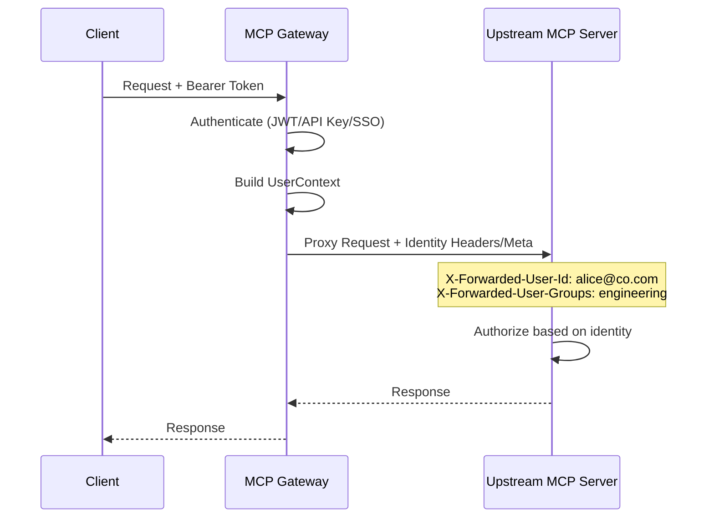

# Identity Propagation

Forward end-user identity from the gateway to upstream MCP servers.

## Overview

MCP Gateway authenticates inbound requests and extracts user identity (email, teams, roles, admin status). With identity propagation enabled, this identity is securely forwarded to upstream MCP servers when the gateway proxies tool calls, resource reads, and other MCP operations.

This enables upstream services to:

- Make **authorization decisions** based on the original caller's identity
- Produce **audit trails** that trace actions back to the real end user
- Implement **per-user rate limiting** or data filtering at the upstream level
- Support **on-behalf-of flows** (RFC 8693 token exchange)

## Architecture



## Configuration

### Global Settings

| Variable | Default | Description |
|----------|---------|-------------|
| `IDENTITY_PROPAGATION_ENABLED` | `false` | Master switch for identity propagation |
| `IDENTITY_PROPAGATION_MODE` | `both` | Propagation method: `headers`, `meta`, or `both` |
| `IDENTITY_PROPAGATION_HEADERS_PREFIX` | `X-Forwarded-User` | Prefix for HTTP identity headers |
| `IDENTITY_SENSITIVE_ATTRIBUTES` | `["password_hash","internal_id","ssn"]` | Attributes stripped before propagation |
| `IDENTITY_SIGN_CLAIMS` | `false` | HMAC-sign claims for upstream verification |
| `IDENTITY_CLAIMS_SECRET` | (none) | Signing secret (falls back to `JWT_SECRET_KEY`) |

### Enabling Identity Propagation

```bash
# .env
IDENTITY_PROPAGATION_ENABLED=true
IDENTITY_PROPAGATION_MODE=both
```

## Propagation Modes

### HTTP Headers (`headers`)

The gateway injects HTTP headers into upstream requests:

| Header | Example | Description |
|--------|---------|-------------|
| `X-Forwarded-User-Id` | `alice@company.com` | Authenticated user ID |
| `X-Forwarded-User-Email` | `alice@company.com` | User email |
| `X-Forwarded-User-Admin` | `true` | Whether user is admin |
| `X-Forwarded-User-Groups` | `engineering,platform` | Comma-separated groups |
| `X-Forwarded-User-Teams` | `team-alpha,team-beta` | Comma-separated teams |
| `X-Forwarded-User-Roles` | `developer` | Comma-separated roles |
| `X-Forwarded-User-Auth-Method` | `bearer` | Authentication method used |
| `X-Forwarded-User-Team-Id` | `team-alpha` | Active team context |
| `X-Forwarded-User-Service-Account` | `ci-bot` | Service account (if acting on behalf) |
| `X-Forwarded-User-Delegation-Chain` | `ci-bot>alice` | Delegation chain |
| `X-Forwarded-User-Claims-Signature` | `<hmac>` | HMAC signature (when signing enabled) |

The header prefix is configurable via `IDENTITY_PROPAGATION_HEADERS_PREFIX`.

### MCP Meta (`meta`)

The gateway injects user identity into the MCP `_meta` field:

```json
{
  "_meta": {
    "user": {
      "id": "alice@company.com",
      "email": "alice@company.com",
      "is_admin": false,
      "groups": ["engineering", "platform"],
      "teams": ["team-alpha"],
      "roles": ["developer"],
      "auth_method": "bearer"
    }
  }
}
```

### Both (`both`)

Default mode. Sends identity via both HTTP headers and MCP `_meta` for maximum compatibility.

## Per-Gateway Configuration

Each gateway registration can override the global identity propagation settings via the `identity_propagation` JSON field:

```json
{
  "name": "sensitive-upstream",
  "url": "https://internal-mcp.example.com",
  "identity_propagation": {
    "enabled": true,
    "mode": "headers",
    "headers_prefix": "X-Auth-User",
    "sign_claims": true,
    "allowed_attributes": ["email", "groups", "team_id"]
  }
}
```

Per-gateway settings take precedence over global defaults. If a gateway sets `"enabled": false`, identity will not be propagated to that upstream regardless of the global setting.

## Claim Signing

When `IDENTITY_SIGN_CLAIMS=true`, the gateway appends an HMAC-SHA256 signature to the propagated claims:

- **Headers mode**: Adds `X-Forwarded-User-Claims-Signature` header
- **Meta mode**: Adds `claims_signature` field to the `_meta.user` object

The signature covers the canonical JSON representation of the identity payload. Upstream servers can verify the signature using the shared secret to confirm the claims originated from the gateway.

```bash
# Enable claim signing
IDENTITY_SIGN_CLAIMS=true
IDENTITY_CLAIMS_SECRET=my-shared-secret  # or uses JWT_SECRET_KEY
```

## Sensitive Attribute Filtering

Before propagating identity, the gateway strips attributes listed in `IDENTITY_SENSITIVE_ATTRIBUTES`. This prevents internal-only fields (password hashes, internal IDs) from leaking to upstream services.

```bash
IDENTITY_SENSITIVE_ATTRIBUTES=["password_hash","internal_id","ssn","employee_number"]
```

## Session Pool Identity Isolation

The MCP session pool uses identity headers for session isolation. When identity propagation is enabled, the following headers participate in session key hashing:

- `x-forwarded-user-id`
- `x-forwarded-user-email`

This ensures different users get isolated upstream sessions even when connecting to the same gateway.

## Audit Trail Integration

When identity propagation is active, audit trail entries are enriched with:

- **`auth_method`**: The authentication method used (`bearer`, `api_key`, `basic`, `sso`, `proxy`)
- **`acting_as`**: The service account identity when acting on behalf of a user
- **`delegation_chain`**: The full chain of delegated identities

## Plugin Access

Plugins can access the authenticated user's identity through the `PluginContext`:

```python
class MyPlugin(PluginBase):
    async def process(self, context: PluginContext) -> PluginResult:
        user = context.user_context  # Full UserContext object
        email = context.user_email   # Shorthand for user email
        groups = context.user_groups # Shorthand for user groups

        if user and user.is_admin:
            # Admin-specific logic
            pass
```

## Related

- [Configuration Reference](configuration.md#identity-propagation)
- [Proxy Authentication](proxy.md)
- [RBAC](rbac.md)
- [Teams](teams.md)
- [ADR-041: Identity Propagation](../architecture/adr/041-identity-propagation.md)
