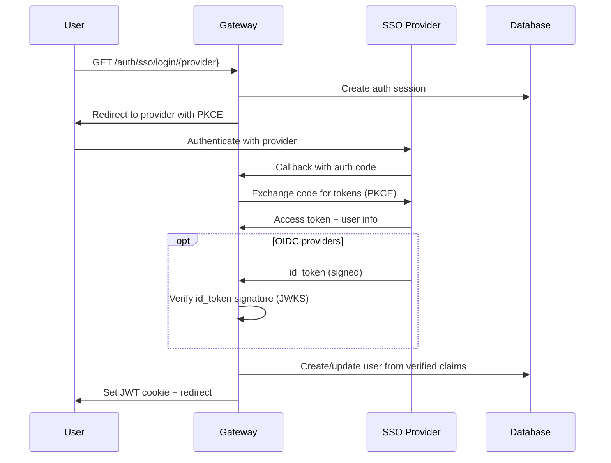

# Single Sign-On (SSO) Authentication

!!! note "Multi‑Tenancy (introduced in v0.7.0)"
    Multi‑tenancy (email authentication, teams, RBAC, resource visibility) was introduced in v0.7.0. If you're upgrading from 0.6.0, review the [Changelog](https://github.com/IBM/mcp-context-forge/blob/main/CHANGELOG.md).

    For SSO deployments, configure group‑to‑team mappings to auto‑assign users on first login. See [Team Management](teams.md) and the provider tutorials for examples.

ContextForge supports enterprise Single Sign-On authentication through OAuth2 and OpenID Connect (OIDC) providers. This enables seamless integration with existing identity providers while maintaining backward compatibility with local authentication.

## Overview

The SSO system provides:

- **Multi-Provider Support**: GitHub, Google, IBM Security Verify, Microsoft Entra ID, Keycloak, Okta, and generic OIDC
- **Hybrid Authentication**: SSO alongside preserved local admin authentication
- **Automatic User Provisioning**: Creates users on first SSO login
- **Security Best Practices**: PKCE, CSRF protection, encrypted secrets
- **Team Integration**: Automatic team assignment and inheritance
- **Admin Management**: Full CRUD API for provider configuration

## Architecture

### Authentication Flows



!!! info "ID Token Verification"
    For OIDC providers (Keycloak, Entra ID, Okta, generic OIDC), ContextForge cryptographically verifies the `id_token` signature using the provider's JWKS (JSON Web Key Set) endpoint. OAuth-only providers (GitHub, Google) use the access token to fetch user info from the provider's userinfo endpoint instead. This prevents token tampering attacks by validating:

    - **Signature** - verified against the provider's public keys (RS256, ES256, EdDSA, etc.)
    - **Expiration** - expired tokens are rejected
    - **Audience** - must match the configured `client_id`
    - **Issuer** - must match the provider's issuer URL
    - **Nonce** - must match the value stored in the auth session (replay protection)

    The JWKS URI is automatically discovered from the provider's `.well-known/openid-configuration` endpoint and cached for 5 minutes. Use `SSO_GENERIC_JWKS_URI` to override automatic discovery if needed.

### Database Schema

**SSOProvider Table**:

- Provider configuration (OAuth endpoints, client credentials)
- Encrypted client secrets using Fernet encryption
- Trusted domains and team mapping rules

**SSOAuthSession Table**:

- Temporary session tracking during OAuth flow
- CSRF state parameters and PKCE verifiers
- 10-minute expiration for security

## Supported Providers

### GitHub OAuth

Perfect for developer-focused organizations with GitHub repositories.

**Features**:

- GitHub organization mapping to teams
- Repository access integration
- Developer-friendly onboarding

**Tutorial**: [GitHub SSO Setup Guide](sso-github-tutorial.md)

### Google OAuth/OIDC

Ideal for Google Workspace organizations.

**Features**:

- Google Workspace domain verification
- GSuite organization mapping
- Professional email verification

**Tutorial**: [Google SSO Setup Guide](sso-google-tutorial.md)

### IBM Security Verify

Enterprise-grade identity provider with advanced security features.

**Features**:

- Enterprise SSO compliance
- Advanced user attributes
- Corporate directory integration

**Tutorial**: [IBM Security Verify Setup Guide](sso-ibm-tutorial.md)

### Microsoft Entra ID

Microsoft's cloud-based identity and access management service (formerly Azure AD).

**Features**:

- Azure Active Directory integration
- Enterprise application authentication
- Conditional access policies support

**Tutorial**: [Microsoft Entra ID Setup Guide](sso-microsoft-entra-id-tutorial.md)

### Keycloak

Open-source identity and access management solution with enterprise features.

**Features**:

- Auto-discovery of OIDC endpoints (40% less configuration)
- User federation with LDAP/Active Directory
- Identity brokering for external providers
- Realm and client role mapping
- Multi-factor authentication support
- Self-hosted and cost-effective

**Tutorial**: [Keycloak SSO Setup Guide](sso-keycloak-tutorial.md)

### Okta

Popular enterprise identity provider with extensive integrations.

**Features**:

- Enterprise directory synchronization
- Multi-factor authentication support
- Custom user attributes

**Tutorial**: [Okta SSO Setup Guide](sso-okta-tutorial.md)

### Generic OIDC Provider

Support for any OpenID Connect compatible identity provider including Auth0, Authentik, and others.

**Features**:

- Standards-based OIDC integration
- Flexible endpoint configuration
- Custom provider branding
- Works with any OIDC-compliant provider

**Tutorial**: [Generic OIDC Setup Guide](sso-generic-oidc-tutorial.md)

**Note**: For Keycloak, use the dedicated [Keycloak SSO Setup Guide](sso-keycloak-tutorial.md) which leverages auto-discovery for simpler configuration.

## Local Compose SSO (Keycloak)

For local end-to-end SSO testing, use the preconfigured compose profile:

```bash
make compose-sso
make sso-test-login
```

This starts Keycloak on `http://localhost:8180` and enables SSO bootstrap in the gateway automatically.

## Quick Start

### 1. Enable SSO

Set the master SSO switch in your environment:

```bash
# Enable SSO system
SSO_ENABLED=true

# Optional: Keep local admin authentication (recommended)
SSO_PRESERVE_ADMIN_AUTH=true
```

### 2. Configure GitHub OAuth (Example)

#### Register OAuth App

1. Go to GitHub → Settings → Developer settings → OAuth Apps
2. Click "New OAuth App"
3. Set **Authorization callback URL**: `https://your-gateway.com/auth/sso/callback/github`
4. Note the **Client ID** and **Client Secret**

#### Environment Configuration

```bash
# GitHub OAuth Configuration
SSO_GITHUB_ENABLED=true
SSO_GITHUB_CLIENT_ID=your-github-client-id
SSO_GITHUB_CLIENT_SECRET=your-github-client-secret

# Optional: Auto-create users and trusted domains
SSO_AUTO_CREATE_USERS=true
SSO_TRUSTED_DOMAINS=["yourcompany.com", "github.com"]
```

#### Start Gateway

```bash
# Restart gateway to load SSO configuration
make dev
# or
docker-compose restart gateway
```

### 3. Test SSO Flow

#### List Available Providers

```bash
curl -X GET http://localhost:8000/auth/sso/providers
```

Response:
```json
[
  {
    "id": "github",
    "name": "github",
    "display_name": "GitHub"
  }
]
```

#### Initiate SSO Login

```bash
curl -X GET "http://localhost:8000/auth/sso/login/github?redirect_uri=https://yourapp.com/callback"
```

Response:
```json
{
  "authorization_url": "https://github.com/login/oauth/authorize?client_id=...",
  "state": "csrf-protection-token"
}
```

!!! important "Login State and Scope Enforcement"
    - The SSO login endpoint sets an HTTP-only `sso_session_id` cookie and binds OAuth `state` to that browser session. The callback must present the same cookie or authentication is rejected.
    - Optional `scopes` supplied to `/auth/sso/login/{provider}` must be a subset of the provider's configured scope policy. Out-of-policy scopes are rejected with HTTP `400`.

!!! important "One Email, One Provider"
    A verified email is bound to the SSO provider it first signed in through. Signing in again with the same email from a *different* provider is refused by default (`SSO_ALLOW_PROVIDER_LINKING=false`) to stop account takeover via an unvetted provider. Set `SSO_ALLOW_PROVIDER_LINKING=true` to allow relinking — this is a global switch across all configured providers, not scoped to a specific pair, and admin status is always re-vetted against the new provider on relink (see [Configuration Reference](configuration.md)).

## Provider Configuration

### GitHub OAuth Setup

#### 1. Create OAuth App

1. **GitHub Settings** → **Developer settings** → **OAuth Apps**
2. **New OAuth App**:

   - **Application name**: `ContextForge - YourOrg`
   - **Homepage URL**: `https://your-gateway.com`
   - **Authorization callback URL**: `https://your-gateway.com/auth/sso/callback/github`

#### 2. Environment Variables

```bash
# GitHub OAuth Configuration
SSO_GITHUB_ENABLED=true
SSO_GITHUB_CLIENT_ID=Iv1.a1b2c3d4e5f6g7h8
SSO_GITHUB_CLIENT_SECRET=1234567890abcdef1234567890abcdef12345678

# Organization-based team mapping (optional)
GITHUB_ORG_TEAM_MAPPING={"your-github-org": "developers-team-id"}
```

#### 3. Team Mapping (Advanced)

Map GitHub organizations to Gateway teams:

```json
{
  "team_mapping": {
    "your-github-org": {
      "team_id": "dev-team-uuid",
      "role": "member"
    },
    "admin-github-org": {
      "team_id": "admin-team-uuid",
      "role": "owner"
    }
  }
}
```

### Google OAuth Setup

#### 1. Google Cloud Console Setup

1. **Google Cloud Console** → **APIs & Services** → **Credentials**
2. **Create Credentials** → **OAuth client ID**
3. **Application type**: Web application
4. **Authorized redirect URIs**: `https://your-gateway.com/auth/sso/callback/google`

#### 2. Environment Variables

```bash
# Google OAuth Configuration
SSO_GOOGLE_ENABLED=true
SSO_GOOGLE_CLIENT_ID=123456789012-abcdefghijklmnop.apps.googleusercontent.com
SSO_GOOGLE_CLIENT_SECRET=GOCSPX-1234567890abcdefghijklmnop

# Google Workspace domain restrictions
SSO_TRUSTED_DOMAINS=["yourcompany.com"]
```

### IBM Security Verify Setup

#### 1. IBM Security Verify Configuration

1. **IBM Security Verify Admin Console** → **Applications**
2. **Add application** → **Custom Application**
3. **Sign-on** → **Open ID Connect**
4. **Redirect URI**: `https://your-gateway.com/auth/sso/callback/ibm_verify`

#### 2. Environment Variables

```bash
# IBM Security Verify OIDC Configuration
SSO_IBM_VERIFY_ENABLED=true
SSO_IBM_VERIFY_CLIENT_ID=your-client-id
SSO_IBM_VERIFY_CLIENT_SECRET=your-client-secret
SSO_IBM_VERIFY_ISSUER=https://your-tenant.verify.ibm.com/oidc/endpoint/default
```

### Okta Setup

#### 1. Okta Admin Console

1. **Applications** → **Create App Integration**
2. **OIDC - OpenID Connect** → **Web Application**
3. **Sign-in redirect URIs**: `https://your-gateway.com/auth/sso/callback/okta`

#### 2. Environment Variables

```bash
# Okta OIDC Configuration
SSO_OKTA_ENABLED=true
SSO_OKTA_CLIENT_ID=0oa1b2c3d4e5f6g7h8i9
SSO_OKTA_CLIENT_SECRET=1234567890abcdef1234567890abcdef12345678
SSO_OKTA_ISSUER=https://your-company.okta.com
```

### Microsoft Entra ID Setup

#### 1. Azure Portal Configuration

1. **Azure Portal** → **Microsoft Entra ID** → **App registrations**
2. **New registration**:

   - **Name**: `ContextForge - YourOrg`
   - **Supported account types**: Accounts in this organizational directory only
   - **Redirect URI**: `https://your-gateway.com/auth/sso/callback/entra`

3. After creation, note the **Application (client) ID** and **Directory (tenant) ID**
4. **Certificates & secrets** → **New client secret** → Note the secret value

#### 2. Environment Variables

```bash
# Microsoft Entra ID OIDC Configuration
SSO_ENTRA_ENABLED=true
SSO_ENTRA_CLIENT_ID=12345678-1234-1234-1234-123456789012
SSO_ENTRA_CLIENT_SECRET=your-client-secret-value
SSO_ENTRA_TENANT_ID=87654321-4321-4321-4321-210987654321
```

#### 3. API Permissions (Optional)

Add Microsoft Graph API permissions for enhanced user profile access:

- `User.Read` - Basic profile information
- `profile` - OpenID Connect profile scope
- `email` - Email address access

**Full Tutorial**: [Microsoft Entra ID Setup Guide](sso-microsoft-entra-id-tutorial.md)

### Keycloak Setup

#### 1. Keycloak Admin Console

1. **Keycloak Admin Console** → **Clients** → **Create client**
2. **Client type**: OpenID Connect
3. **Client ID**: `mcp-gateway`
4. **Client authentication**: On (confidential client)
5. **Valid redirect URIs**: `https://your-gateway.com/auth/sso/callback/keycloak`
6. After creation, go to **Credentials** tab and copy the **Client secret**

#### 2. Environment Variables

```bash
# Keycloak OIDC Configuration (with auto-discovery)
SSO_KEYCLOAK_ENABLED=true
SSO_KEYCLOAK_BASE_URL=https://keycloak.yourcompany.com
# Optional when gateway reaches Keycloak internally (e.g. Docker DNS):
# SSO_KEYCLOAK_PUBLIC_BASE_URL=https://login.yourcompany.com
SSO_KEYCLOAK_REALM=master
SSO_KEYCLOAK_CLIENT_ID=mcp-gateway
SSO_KEYCLOAK_CLIENT_SECRET=your-client-secret-value

# Optional: Role and group mapping
SSO_KEYCLOAK_MAP_REALM_ROLES=true
SSO_KEYCLOAK_MAP_CLIENT_ROLES=false
```

#### 3. Auto-Discovery Benefits

Keycloak's auto-discovery reduces configuration by 40%:

- Automatically discovers authorization, token, and userinfo endpoints
- Only requires base URL and realm name
- No need to manually specify 5+ endpoint URLs

**Full Tutorial**: [Keycloak SSO Setup Guide](sso-keycloak-tutorial.md)

### Generic OIDC Provider Setup

Configure any OIDC-compliant provider (Keycloak, Auth0, Authentik, etc.).

#### 1. Obtain Provider Information

From your OIDC provider's configuration (usually at `https://provider.com/.well-known/openid-configuration`):

- **Authorization endpoint**: `https://provider.com/auth`
- **Token endpoint**: `https://provider.com/token`
- **Userinfo endpoint**: `https://provider.com/userinfo`
- **Issuer**: `https://provider.com`
- **Client ID and Secret**: From provider's application registration

#### 2. Environment Variables

```bash
# Generic OIDC Provider Configuration
SSO_GENERIC_ENABLED=true
SSO_GENERIC_PROVIDER_ID=keycloak  # or auth0, authentik, etc.
SSO_GENERIC_DISPLAY_NAME=Keycloak
SSO_GENERIC_CLIENT_ID=your-oidc-client-id
SSO_GENERIC_CLIENT_SECRET=your-oidc-client-secret
SSO_GENERIC_AUTHORIZATION_URL=https://keycloak.company.com/auth/realms/master/protocol/openid-connect/auth
SSO_GENERIC_TOKEN_URL=https://keycloak.company.com/auth/realms/master/protocol/openid-connect/token
SSO_GENERIC_USERINFO_URL=https://keycloak.company.com/auth/realms/master/protocol/openid-connect/userinfo
SSO_GENERIC_ISSUER=https://keycloak.company.com/auth/realms/master
SSO_GENERIC_SCOPE=openid profile email  # Optional, defaults to this
```

#### 3. Callback URL Configuration

Configure your provider's redirect URI to:
```
https://your-gateway.com/auth/sso/callback/{provider_id}
```

Replace `{provider_id}` with your configured `SSO_GENERIC_PROVIDER_ID` (e.g., `keycloak`, `auth0`).

#### 4. Provider-Specific Examples

**Keycloak**:
```bash
SSO_GENERIC_PROVIDER_ID=keycloak
SSO_GENERIC_DISPLAY_NAME=Company SSO
SSO_GENERIC_AUTHORIZATION_URL=https://keycloak.company.com/auth/realms/master/protocol/openid-connect/auth
SSO_GENERIC_TOKEN_URL=https://keycloak.company.com/auth/realms/master/protocol/openid-connect/token
SSO_GENERIC_USERINFO_URL=https://keycloak.company.com/auth/realms/master/protocol/openid-connect/userinfo
SSO_GENERIC_ISSUER=https://keycloak.company.com/auth/realms/master
```

**Auth0**:
```bash
SSO_GENERIC_PROVIDER_ID=auth0
SSO_GENERIC_DISPLAY_NAME=Auth0
SSO_GENERIC_AUTHORIZATION_URL=https://your-tenant.auth0.com/authorize
SSO_GENERIC_TOKEN_URL=https://your-tenant.auth0.com/oauth/token
SSO_GENERIC_USERINFO_URL=https://your-tenant.auth0.com/userinfo
SSO_GENERIC_ISSUER=https://your-tenant.auth0.com/
```

**Authentik**:
```bash
SSO_GENERIC_PROVIDER_ID=authentik
SSO_GENERIC_DISPLAY_NAME=Authentik
SSO_GENERIC_AUTHORIZATION_URL=https://authentik.company.com/application/o/authorize/
SSO_GENERIC_TOKEN_URL=https://authentik.company.com/application/o/token/
SSO_GENERIC_USERINFO_URL=https://authentik.company.com/application/o/userinfo/
SSO_GENERIC_ISSUER=https://authentik.company.com/application/o/mcp-gateway/
```

## Provisioning SSO users through the API

Administrators can pre-provision passwordless users with `POST /v1/admin/users/sso`.
Enable all three startup flags:

```bash
MCPGATEWAY_ADMIN_API_ENABLED=true
SSO_ENABLED=true
SSO_USER_PROVISIONING_API_ENABLED=true
```

`SSO_USER_PROVISIONING_API_ENABLED` defaults to `false`. Restart the gateway after changing any of
these flags: route registration and the disabled-route gate use the startup configuration.
When any flag is disabled, provisioning POSTs return `404` with `{"detail":"Not Found"}` before
authentication or body validation. This early response bypasses inner middleware, so its headers
can differ from an ordinary routed `404`. Other methods retain their existing behavior.
There is no unversioned provisioning POST alias.

The provisioning flag leaves local auth, Admin UI creation, browser SSO/JIT, and existing external
IdP authentication unchanged. An already-created SSO user can authenticate when
`SSO_USER_PROVISIONING_API_ENABLED=false`, provided the existing authentication configuration permits it.

The caller needs `admin.user_management`. API-token permission restrictions apply independently
of the caller's admin status; empty token permissions inherit RBAC permissions at runtime.
Bearer-only requests do not require CSRF tokens. Requests carrying session cookies require a
same-origin Origin/Referer and matching CSRF cookie/header, following existing admin protections.

```bash
curl --request POST "$GATEWAY_URL/v1/admin/users/sso" \
  --header "Authorization: Bearer $MCPGATEWAY_BEARER_TOKEN" \
  --header "Content-Type: application/json" \
  --data '{"email":"user@example.com","auth_provider":"keycloak","full_name":"Example User"}'
```

Optional `is_admin` and `is_active` default to `false` and `true`, respectively. Authorized callers
can set `is_admin=true`, matching existing administrator user creation.

Successful creation returns `201` with `EmailUserResponse`. The account has no password hash,
is not email-verified, and does not require a password change. Provisioning deliberately bypasses
browser JIT policies such as automatic creation, trusted-domain checks, and pending approval.

### Provider identifiers

The provider must exist as an enabled `SSOProvider` row. Use its configured `id`, such as `keycloak`,
`google`, or a custom provider ID, rather than its name or display name. Input IDs are trimmed and
lowercased before lookup. `azure-ad`, including case variants such as `AZURE-AD`, maps to the canonical
ID `entra`; the account stores and the response returns `auth_provider="entra"`. The configured
`entra` provider must be enabled for that alias to succeed.

List enabled provider IDs with `GET /v1/auth/sso/providers`. Administrators can inspect all configured
rows with `GET /v1/auth/sso/admin/providers`, subject to provider-management permissions.
See [Provider configuration](#provider-configuration) for provider setup.

### Enterprise onboarding without Admin UI login

1. Configure an enabled provider and enable the provisioning API with the three startup flags above.
2. Create the user through `POST /v1/admin/users/sso` using an administrator token.
3. Inspect the created account and its role/team assignments before granting additional access.
4. Configure external-token authentication for the intended REST or MCP endpoint.
5. Obtain an access token from the IdP through the supported IDE/client login flow and send it as
   `Authorization: Bearer <access_token>`. The user does not need browser Admin UI login.

Creation attempts the configured default global role and, when `AUTO_CREATE_PERSONAL_TEAMS=true`,
a personal team with its owner role. These onboarding operations are best-effort: `201` confirms
the account exists, not that every role/team assignment succeeded. Check
`GET /v1/rbac/users/{user_email}/roles` and the relevant team membership before relying on access.
Use the existing [RBAC](rbac.md#permission-system) and [team-management APIs](teams.md) to assign
the required permissions and memberships. A valid IdP token alone does not grant protected actions.

#### REST bearer-token prerequisites

Enable `SSO_API_TOKEN_AUTH_ENABLED=true` and set the provider's `trusted_for_api_auth=true` and
`api_audience` to an audience present in the IdP access token. Configure HTTPS issuer/JWKS URLs.
See [External IdP bearer authentication](#machine-to-machine-api-auth-with-external-idp-tokens)
for provider trust and audience configuration.

For a pre-provisioned human user, configure the token's `email` claim to match the provisioned email
after normalization and include `email_verified=true`. The REST SSO resolution path still checks
the IdP verification claim even though the account already exists; changing the local account's
verification flag does not replace that claim. If the provider has a non-empty `trusted_domains`
list, the email domain must appear in it. The account must be active and bound to the same provider
under the existing linking policy.

This workflow works with provider `auto_create_users=false`: the account already exists, so no
JIT account creation is required. Authentication still runs the existing SSO normalization and
policy checks. Provider mappings can update DB access state on an uncached authentication pass;
see the [Role-sync caveat](#role-sync-caveat). Configure role, team, and admin-group mappings
to match the intended access policy rather than assuming manual assignments suppress mapping.
Same-provider login preserves API-origin administrator grants; SSO-managed privileges continue
to follow the existing mapping rules.

The external-identity cache can reuse a resolved principal until `EXTERNAL_IDENTITY_CACHE_TTL`
expires. Allow for that window when checking changes with the same token; see
[Identity caching](#identity-caching) and the existing authentication-cache configuration.

#### MCP and IDE virtual-server configuration

For an IdP-issued token on Streamable HTTP, connect the client to
`/servers/{server_id}/mcp/` for an OAuth-enabled virtual server. Configure the server with:

```json
{
  "oauth_enabled": true,
  "oauth_config": {
    "authorization_servers": ["https://idp.example.com/realms/company"],
    "resource": "https://gateway.example.com/servers/SERVER_ID/mcp"
  }
}
```

Use the configured IdP issuer in `authorization_servers` and an expected `resource` audience that
matches the token's `aud`; replace `SERVER_ID` with the virtual server's ID. Configure the IdP's
audience mapping accordingly. See [OAuth resource configuration](oauth-resource-configuration.md)
and [protected resource metadata](../architecture/rfc9728-compliance.md#implementation).

This MCP OAuth path verifies the server's issuer allowlist and audience, then resolves an existing
active DB user and its DB-backed access. The REST provider-trust flags alone do not configure this
virtual-server path. Plain `/mcp` has no per-server OAuth configuration and rejects IdP-issued
tokens under the default internal-issuer verification setting. Provisioning API availability
does not control authentication of an already-created user on a configured virtual server.

### Directory sync through repeated single-user calls

Submit one `POST /v1/admin/users/sso` per directory user. Each call has an independent outcome;
earlier successful calls remain committed when a later call fails. This is not atomic bulk
provisioning, an upsert API, or SCIM synchronization.

For example, put one request object per line in `directory-users.jsonl`, then record each result:

```python
import json
import os
from urllib.error import HTTPError, URLError
from urllib.request import Request, urlopen

endpoint = os.environ["GATEWAY_URL"].rstrip("/") + "/v1/admin/users/sso"
headers = {
    "Authorization": "Bearer " + os.environ["MCPGATEWAY_BEARER_TOKEN"],
    "Content-Type": "application/json",
}
with open("directory-users.jsonl", encoding="utf-8") as users:
    with open("provisioning-results.jsonl", "a", encoding="utf-8") as results:
        for line in users:
            user = json.loads(line)
            request = Request(endpoint, data=json.dumps(user).encode("utf-8"), headers=headers, method="POST")
            try:
                with urlopen(request, timeout=30) as response:
                    status = response.status
            except HTTPError as error:
                status = error.code
            except (URLError, TimeoutError):
                status = "transport-error"
            results.write(json.dumps({"email": user["email"], "status": status}) + "\n")
```

`201` means the account was created. `409` means the email already exists and its account remains
unchanged; it does not update the name, provider binding, permissions, or active status. Inspect
the account with `GET /v1/auth/email/admin/users/{user_email}`. Use the existing
`PATCH /v1/auth/email/admin/users/{user_email}` endpoint for supported updates, including
`{"is_active":false}` to deactivate an account. This update endpoint does not rebind its SSO provider.
For administrator status changes, see [Password and administrator management](password-management.md).
Inspect an account after a transport error before deciding whether to retry: the server can have
committed creation even when the client did not receive the response.

### Provisioning logs and registration records

Successful API provisioning emits an actor/target message at INFO. The default `LOG_LEVEL=ERROR`
filters out that message; set `LOG_LEVEL=INFO` when those messages are required. Onboarding role
grants that succeed record the provisioning administrator in `UserRole.granted_by`. This describes
the default global and optional personal-team owner grants, not later role assignments.

The service attempts a generic `EmailAuthEvent` registration row with best-effort writes.
Event-write failure does not turn a committed account into a failed creation result. The service
rolls back the event write and logs a WARNING, subject to the configured logging level.
Administrators with `admin.user_management` can read existing rows through
`GET /v1/auth/email/admin/events?user_email=user@example.com`. A missing registration row does not
prove the account was not created. Check the account and its actual grants separately.

### Provisioning response codes

| Condition | Response |
| --------- | -------- |
| Unsupported or missing Content-Type | `415` |
| Empty or malformed JSON with JSON Content-Type | `400`, `Invalid JSON in request body` |
| Any `password` key, including `null` | `400`, `password not allowed for SSO users` |
| Non-object JSON, missing/invalid fields, or unknown fields | Standard sanitized `422` |
| Invalid, unconfigured, or disabled provider | `400` |
| Existing email | `409`; the existing account is unchanged |

Use `application/json`; a charset parameter such as `application/json; charset=utf-8` is accepted.
The password-key check runs before schema validation. No bulk endpoint is provided.

## Advanced Configuration

### Trusted Domains

Restrict SSO access to specific email domains:

```bash
# JSON array of trusted domains
SSO_TRUSTED_DOMAINS=["yourcompany.com", "partner.org", "contractor.net"]
```

Only users with email addresses from these domains can authenticate via SSO.

### Auto User Creation

Control automatic user provisioning:

```bash
# Enable automatic user creation (default: true)
SSO_AUTO_CREATE_USERS=true

# Disable to manually approve SSO users
SSO_AUTO_CREATE_USERS=false
```

### Team Mapping Rules

Configure automatic team assignment based on SSO provider attributes:

```json
{
  "team_mapping": {
    "github_org_name": {
      "team_id": "uuid-of-gateway-team",
      "role": "member",
      "conditions": {
        "email_domain": "company.com"
      }
    },
    "google_workspace_domain": {
      "team_id": "uuid-of-workspace-team",
      "role": "owner",
      "conditions": {
        "email_verified": true
      }
    }
  }
}
```

## API Reference

### Public Endpoints

#### List Available Providers

```http
GET /auth/sso/providers
```

Response:
```json
[
  {
    "id": "github",
    "name": "github",
    "display_name": "GitHub"
  }
]
```

#### Initiate SSO Login

```http
GET /auth/sso/login/{provider_id}?redirect_uri={callback_url}&scopes={oauth_scopes}
```

Parameters:

- `provider_id`: Provider identifier (`github`, `google`, `ibm_verify`, `entra`, `keycloak`, `okta`, or configured generic provider ID)
- `redirect_uri`: Callback URL after authentication
- `scopes`: Optional space-separated OAuth scopes

Response:
```json
{
  "authorization_url": "https://provider.com/oauth/authorize?...",
  "state": "csrf-protection-token"
}
```

#### Handle SSO Callback

```http
GET /auth/sso/callback/{provider_id}?code={auth_code}&state={csrf_token}
```

This endpoint is called by the SSO provider after user authentication.

Response:
```json
{
  "access_token": "jwt-session-token",
  "token_type": "bearer",
  "expires_in": 604800,
  "user": {
    "email": "user@example.com",
    "full_name": "John Doe",
    "provider": "github"
  }
}
```

### Admin Endpoints

All admin endpoints require `admin.sso_providers` permissions.

#### Create SSO Provider

```http
POST /auth/sso/admin/providers
Authorization: Bearer <admin-jwt-token>
Content-Type: application/json

{
  "id": "custom_provider",
  "name": "custom_provider",
  "display_name": "Custom Provider",
  "provider_type": "oidc",
  "client_id": "client-id",
  "client_secret": "client-secret",
  "authorization_url": "https://provider.com/oauth/authorize",
  "token_url": "https://provider.com/oauth/token",
  "userinfo_url": "https://provider.com/oauth/userinfo",
  "issuer": "https://provider.com",
  "scope": "openid profile email",
  "trusted_domains": ["company.com"],
  "auto_create_users": true
}
```

#### List All Providers

```http
GET /auth/sso/admin/providers
Authorization: Bearer <admin-jwt-token>
```

#### Update Provider

```http
PUT /auth/sso/admin/providers/{provider_id}
Authorization: Bearer <admin-jwt-token>
Content-Type: application/json

{
  "display_name": "Updated Provider Name",
  "is_enabled": false
}
```

#### Delete Provider

```http
DELETE /auth/sso/admin/providers/{provider_id}
Authorization: Bearer <admin-jwt-token>
```

## Security Considerations

### Client Secret Encryption

Client secrets are encrypted using Fernet (AES 128) before database storage:

```python
# Automatic encryption in SSOService
provider_data["client_secret_encrypted"] = self._encrypt_secret(client_secret)
```

### PKCE Protection

All OAuth flows use PKCE (Proof Key for Code Exchange) for enhanced security:

```python
# Automatic PKCE generation
code_verifier, code_challenge = self.generate_pkce_challenge()
```

### CSRF Protection

OAuth state parameters prevent cross-site request forgery:

```python
# Cryptographically secure state generation
state = secrets.token_urlsafe(32)
```

### Session Security

- **HTTP-only cookies** prevent XSS attacks
- **Secure flag** for HTTPS deployments
- **SameSite=Lax** protection
- **10-minute OAuth session** expiration

## Troubleshooting

### Common Issues

#### SSO Endpoints Return 404

**Problem**: SSO routes not available
**Solution**: Ensure `SSO_ENABLED=true` and restart gateway

```bash
# Check SSO status
curl -I http://localhost:8000/auth/sso/providers
# Should return 200 if enabled, 404 if disabled
```

#### OAuth Callback Errors

**Problem**: Invalid redirect URI
**Solution**: Verify callback URL matches provider configuration exactly

```bash
# Correct format
https://your-gateway.com/auth/sso/callback/github

# Common mistakes
https://your-gateway.com/auth/sso/callback/github/  # Extra slash
http://your-gateway.com/auth/sso/callback/github   # HTTP instead of HTTPS
```

#### User Creation Fails

**Problem**: Email domain not trusted
**Solution**: Add domain to trusted domains list

```bash
SSO_TRUSTED_DOMAINS=["company.com", "contractor.org"]
```

### Debug Mode

Enable verbose SSO logging:

```bash
LOG_LEVEL=DEBUG
SSO_DEBUG=true
```

Check logs for detailed OAuth flow information:

```bash
tail -f logs/gateway.log | grep -i sso
```

### Health Checks

Verify SSO provider connectivity:

```bash
# Test provider endpoints
curl -I https://github.com/login/oauth/authorize
curl -I https://github.com/login/oauth/access_token
curl -I https://api.github.com/user
```

## Machine-to-machine API auth with external IdP tokens

ContextForge can accept access tokens issued directly by a trusted external SSO provider as
`Bearer` credentials on REST endpoints that use the shared SSO authentication path. These tokens
work alongside internally minted JWTs from `/auth/login` and SSO callbacks. Service accounts and
automation clients can obtain tokens directly from the IdP, typically through `client_credentials`,
without browser login. MCP virtual servers use the separate
[per-server OAuth configuration](#mcp-and-ide-virtual-server-configuration) described above.

This is opt-in at two levels:

1. **Global switch**: `SSO_API_TOKEN_AUTH_ENABLED=true` (default `false`). When disabled, external tokens are never inspected and unrecognized bearer tokens fail normal internal JWT validation as before.
2. **Per-provider opt-in**: each `SSOProvider` must set `trusted_for_api_auth=true` via the provider admin API (`PUT /auth/sso/admin/providers/{id}` or `POST /auth/sso/admin/providers`, see `mcpgateway/routers/sso.py`).

```bash
curl -X PUT https://gateway.example.com/auth/sso/admin/providers/keycloak \
  -H "Authorization: Bearer $ADMIN_TOKEN" \
  -H "Content-Type: application/json" \
  -d '{
    "trusted_for_api_auth": true,
    "api_audience": "mcp-gateway"
  }'
```

### `api_audience` is mandatory

When `trusted_for_api_auth=true`, `api_audience` **must** also be set — the request to enable it is rejected otherwise. ContextForge enforces that the token's `aud` claim equals this value before accepting it, which prevents a token issued for a different relying party of the same IdP from being replayed against this gateway (confused-deputy).

- **Microsoft Entra ID**: use the App ID URI you exposed for the API, e.g. `api://your-app-id-uri`. Note that access tokens minted for your own API typically carry `aud` = the App ID URI, not the application's client ID.
- **Keycloak**: use the audience your realm's client/audience mapper issues for this gateway (commonly the client ID, e.g. `mcp-gateway`).

### How the request is authenticated

1. The unverified token's `iss` claim is read to identify the issuing provider.
2. If no enabled provider has `trusted_for_api_auth=true`, external tokens are never considered — the request falls through to internal JWT validation only.
3. If the issuer matches a trusted provider, the token is fully verified against that provider's JWKS: signature, expiry, issuer, and `aud` == `api_audience`.
4. ID tokens are rejected — only `access_token`s are accepted.
5. The token's identity is JIT-provisioned/looked up as a local user (the same provisioning path used by browser SSO).
6. The resulting principal is a **session-semantics** identity (`token_use="session"`): `is_admin` is read from the persisted local user record, and `teams` are resolved via `resolve_session_teams()` — both are DB-authoritative, never derived directly from the external token's claims.

### Role and group mapping

Role/group → team mapping for externally-authenticated principals reuses the same provider configuration as browser SSO (e.g. `SSO_KEYCLOAK_ROLE_MAPPINGS`, `SSO_ENTRA_ROLE_MAPPINGS`, `SSO_GENERIC_ROLE_MAPPINGS`). If role-sync is enabled for the provider, teams and admin status are re-derived from the token's claims into the local DB on each provisioning pass — see the role-sync caveat below.

### Service principals (no-email `client_credentials` tokens)

`client_credentials` tokens typically carry no `email` claim. ContextForge detects these "clientless" tokens and provisions a synthetic local user `svc-<client_id>@<provider-id>.service.local` for the service account. Grant this principal teams/roles via the IdP's existing role/group → team mapping, just as you would for a human user.

### Identity caching

A successful external-identity resolution is cached per-token (keyed by a hash of the raw token) for `EXTERNAL_IDENTITY_CACHE_TTL` seconds (default `60`, clamped to the token's own `exp`) to avoid re-provisioning on every M2M call. The cache is shared across workers when `CACHE_TYPE=redis`. Set `EXTERNAL_IDENTITY_CACHE_TTL=0` to disable caching for deployments that need immediate team/role remapping.

!!! warning "Revocation caveat"
    ContextForge cannot revoke an external token early — it remains valid until the IdP's own expiry, regardless of `EXTERNAL_IDENTITY_CACHE_TTL`. Only local user-deactivation and team-membership changes (checked against the local DB on every request) take effect immediately. Use short-lived tokens at the IdP for service accounts that may need to be revoked quickly.

### Role-sync caveat

!!! warning "Role-sync caveat"
    If role-sync/group-mapping is enabled for the provider, a loose group/role → team or admin mapping at the IdP grants broad access to ContextForge continuously, for every token that IdP issues with that claim. Keep mappings conservative and audit them regularly.

!!! note "ID tokens are rejected"
    This REST authentication path accepts only OAuth2 access tokens. ID tokens, which assert
    authentication rather than authorization, fail validation with
    `external-idp auth denied: token validation failed`.

See also: [Keycloak M2M setup](sso-keycloak-tutorial.md#machine-to-machine-service-account-api-access), [Entra ID M2M setup](sso-microsoft-entra-id-tutorial.md), [Generic OIDC](sso-generic-oidc-tutorial.md), and [OAuth troubleshooting](oauth-troubleshooting.md#external-idp-bearer-token-rejected-on-apimcp).

## Migration Guide

### From Local Auth Only

1. **Enable SSO** alongside existing authentication:
   ```bash
   SSO_ENABLED=true
   SSO_PRESERVE_ADMIN_AUTH=true  # Keep local admin login
   ```

2. **Configure first provider** (e.g., GitHub)
3. **Test SSO flow** with test users
4. **Gradually migrate** production users
5. **Optional**: Disable local auth after full migration

### Adding New Providers

1. **Implement provider-specific** user info normalization in `SSOService._normalize_user_info`
2. **Add environment variables** in `config.py`
3. **Update bootstrap utilities** in `sso_bootstrap.py`
4. **Test integration** thoroughly

## Best Practices

### Production Deployment

1. **Use HTTPS** for all SSO callbacks
2. **Secure client secrets** in vault/secret management
3. **Monitor failed authentications**
4. **Regular secret rotation**
5. **Audit SSO access logs**

### User Experience

1. **Clear provider labeling** (GitHub, Google, etc.)
2. **Graceful error handling** for auth failures
3. **Fallback to local auth** if SSO unavailable
4. **User session management**

### Security Hardening

1. **Restrict trusted domains** to organization emails
2. **Enable audit logging** for admin operations
3. **Regular provider configuration** reviews
4. **Monitor unusual auth patterns**

## Integration Examples

### Frontend Integration

```javascript
// Check available SSO providers
const providers = await fetch('/auth/sso/providers').then(r => r.json());

// Initiate SSO login
const redirectUrl = `${window.location.origin}/dashboard`;
const ssoResponse = await fetch(
  `/auth/sso/login/github?redirect_uri=${encodeURIComponent(redirectUrl)}`
).then(r => r.json());

// Redirect user to SSO provider
window.location.href = ssoResponse.authorization_url;
```

### CLI Integration

```bash
#!/bin/bash
# CLI SSO authentication helper

GATEWAY_URL="https://your-gateway.com"
PROVIDER="github"

# Get authorization URL
AUTH_RESPONSE=$(curl -s "$GATEWAY_URL/auth/sso/login/$PROVIDER?redirect_uri=urn:ietf:wg:oauth:2.0:oob")
AUTH_URL=$(echo "$AUTH_RESPONSE" | jq -r '.authorization_url')

echo "Open this URL in your browser:"
echo "$AUTH_URL"

echo "Enter the authorization code:"
read -r AUTH_CODE

# Exchange code for token (manual callback simulation)
# Note: In practice, this would be handled by the callback endpoint
```

### API Client Integration

```python
import requests
import webbrowser
from urllib.parse import urlparse, parse_qs

# SSO authentication for API clients
class SSOAuthenticator:
    def __init__(self, gateway_url, provider):
        self.gateway_url = gateway_url
        self.provider = provider

    def authenticate(self):
        # Get authorization URL
        response = requests.get(
            f"{self.gateway_url}/auth/sso/login/{self.provider}",
            params={"redirect_uri": "http://localhost:8080/callback"}
        )
        auth_data = response.json()

        # Open browser for user authentication
        webbrowser.open(auth_data["authorization_url"])

        # Wait for callback (implement callback server)
        # Return JWT token for API access
        return self.handle_callback()
```

## Related Documentation

- [Authentication Overview](../manage/securing.md)
- [Team Management](../manage/teams.md)
- [RBAC Configuration](../manage/rbac.md)
- [Environment Variables](../deployment/index.md#runtime-configuration)
- [Security Best Practices](../architecture/security-features.md)
