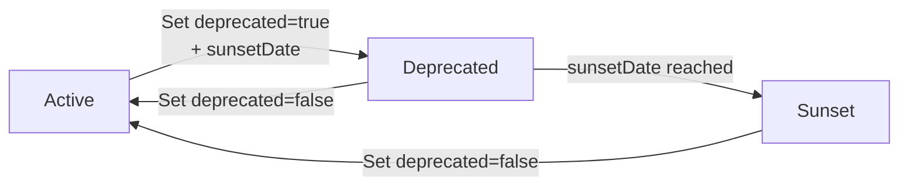
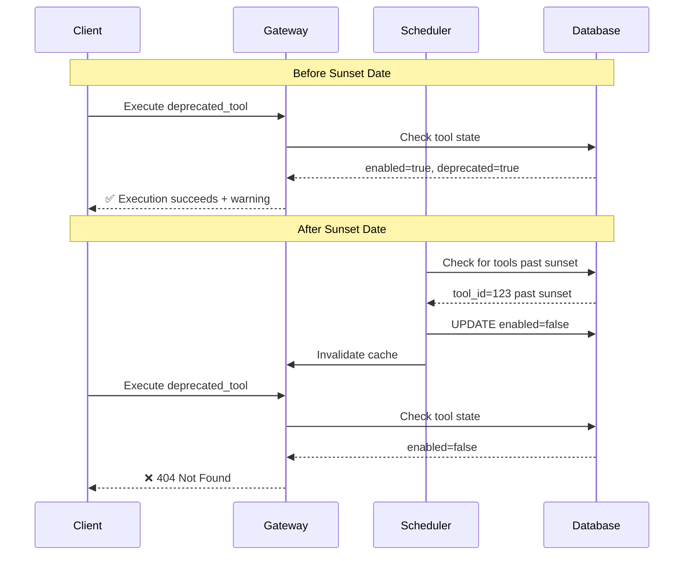

# Tool Lifecycle Management

## Overview

Tool lifecycle management provides a structured workflow for retiring tools through three distinct states: **Active → Deprecated → Sunset**. This feature ensures deprecation is time-bound and predictable, giving users sufficient preparation time before tools become unavailable.

## Lifecycle States

| State | Description | Executable | Visible | Use Case |
|-------|-------------|------------|---------|----------|
| **Active** | Normal operation | ✅ Yes | ✅ Yes | Production-ready tools |
| **Deprecated** | Discouraged but still works | ✅ Yes | ✅ Yes | Tools being phased out, grace period |
| **Sunset** | Disabled, no longer executable | ❌ No | ✅ Admin only | Retired tools |

### State Transitions



## Deprecating a Tool

When you deprecate a tool, you **must** provide a `sunsetDate` indicating when the tool will be automatically disabled.

### API Example

```bash
curl -X PUT http://localhost:4444/tools/{tool_id} \
  -H "Authorization: Bearer $TOKEN" \
  -H "Content-Type: application/json" \
  -d '{
    "deprecated": true,
    "sunsetDate": "2026-12-31T23:59:59Z"
  }'
```

### Validation Rules

- **`sunsetDate` is required** when setting `deprecated=true`
- **`sunsetDate` must be a future date** (UTC timezone)
- **Setting `deprecated=false` automatically clears** the `sunsetDate`

### Best Practices

1. **30-Day Notice Period**: Set `sunsetDate` at least 30 days in the future to give users time to migrate
2. **Communicate Early**: Notify users through release notes, emails, or system announcements
3. **Monitor Usage**: Use observability metrics to track deprecated tool usage during the grace period
4. **Provide Alternatives**: Document recommended replacement tools in the deprecation message

### Example: 90-Day Deprecation Timeline

```bash
# Day 0: Mark tool as deprecated with 90-day sunset
curl -X PUT http://localhost:4444/tools/123 \
  -H "Authorization: Bearer $TOKEN" \
  -H "Content-Type: application/json" \
  -d '{
    "deprecated": true,
    "sunsetDate": "2026-09-30T23:59:59Z",
    "description": "DEPRECATED: This tool will be sunset on 2026-09-30. Use new_tool_v2 instead."
  }'

# Day 0-89: Tool remains executable, users see deprecation warnings
# Day 90: Scheduler automatically disables tool (enabled=false)
# Day 90+: Tool invocation attempts raise ToolInvocationError with sunset message
```

## Viewing Lifecycle State

The API returns computed fields for all tools:

```json
{
  "id": 123,
  "name": "legacy_tool",
  "deprecated": true,
  "sunsetDate": "2026-12-31T23:59:59Z",
  "enabled": true,
  "lifecycleState": "deprecated",
  "daysUntilSunset": 45,
  "isExecutable": true
}
```

### Computed Fields

| Field | Type | Description |
|-------|------|-------------|
| `lifecycleState` | string | One of: `active`, `deprecated`, `sunset` |
| `daysUntilSunset` | integer | Days remaining until sunset (null for active tools) |
| `isExecutable` | boolean | Whether tool can be invoked |

### Filtering by Lifecycle State

```bash
# List all tools (excludes sunset tools by default)
curl http://localhost:4444/tools \
  -H "Authorization: Bearer $TOKEN"

# Include sunset tools (admin view)
curl http://localhost:4444/tools?include_inactive=true \
  -H "Authorization: Bearer $TOKEN"

# Filter to only deprecated tools
curl http://localhost:4444/tools \
  -H "Authorization: Bearer $TOKEN" | \
  jq '.tools[] | select(.lifecycleState == "deprecated")'
```

## Automated Sunset

The sunset scheduler runs automatically as a background service.

### How It Works

1. **Scheduler runs every 60 minutes** (configurable via `SUNSET_SCHEDULER_INTERVAL_MINUTES`)
2. **Queries for tools past their sunset date**: `WHERE deprecated=true AND sunset_date <= now() AND enabled=true`
3. **Atomically disables matching tools**: `UPDATE tools SET enabled=false`
4. **Invalidates tool cache** to ensure consistent behavior across gateway instances
5. **Logs audit trail** for compliance and debugging

### Configuration

Set the scheduler interval via environment variable:

```bash
# .env or environment
SUNSET_SCHEDULER_INTERVAL_MINUTES=60  # Default: 60 minutes
```

**Recommendation:** For production deployments, use the default 60-minute interval. Shorter intervals (e.g., 5 minutes) increase database load without significant benefit since sunset dates are typically set days or weeks in advance.

### Scheduler Behavior

- **Idempotent**: Safe to run concurrently across multiple gateway instances
- **Atomic updates**: Uses database-level locking to prevent race conditions
- **Cache invalidation**: Ensures all gateway instances reflect the sunset state immediately
- **Audit logging**: Each sunset transition is logged with structured metadata

### Monitoring

Check scheduler activity in logs:

```bash
# View sunset transitions
grep "Processing.*tools for sunset" /var/log/mcpgateway.log

# Example log entry
INFO: Processing 2 tools for sunset: ['legacy_tool', 'old_api']
```

Audit trail entries are also created for each sunset transition:

```json
{
  "user_id": "sunset_scheduler",
  "action": "tool_sunset",
  "resource_type": "tool",
  "resource_id": "123",
  "resource_name": "legacy_tool",
  "details": {
    "sunset_date": "2026-06-26T00:00:00Z",
    "automated": true,
    "timestamp": "2026-06-26T14:30:00Z"
  }
}
```

## Resurrecting a Tool

You can "resurrect" a sunset tool by clearing the deprecation flag.

### API Example

```bash
curl -X PUT http://localhost:4444/tools/{tool_id} \
  -H "Authorization: Bearer $TOKEN" \
  -H "Content-Type: application/json" \
  -d '{
    "deprecated": false
  }'
```

### What Happens

1. **`deprecated` set to `false`**
2. **`sunsetDate` automatically cleared**
3. **`enabled` set to `true`** (tool becomes executable again)
4. **`lifecycleState` returns to `active`**

### Use Cases

- **False positive**: Tool was incorrectly deprecated
- **Rollback**: Replacement tool had critical issues, need to revert
- **Temporary retirement**: Tool needed to be disabled during maintenance

## Execution Behavior

### Active Tools

- ✅ **Executable**: Tool invocation works normally
- ✅ **Visible**: Appears in tool listings
- ℹ️ **No warnings**: No lifecycle-related messages

### Deprecated Tools

- ✅ **Executable**: Tool still works during grace period
- ✅ **Visible**: Appears in tool listings
- ⚠️ **Warning**: `daysUntilSunset` field shows remaining time
- ⚠️ **Client responsibility**: MCP clients should display deprecation warnings to users

### Sunset Tools

- ❌ **Not executable**: Tool invocation raises `ToolInvocationError`
- 👁️ **Admin-only visibility**: Only visible with `include_inactive=true`
- 🔒 **Error message**: `"Tool '{name}' has been sunset and can no longer be executed. Sunset date: {date}. Please update your agent to use an alternative tool."`

### Execution Flow



## Migration Guide

### For New Deployments

1. Run database migration: `alembic upgrade head`
2. All tools start in `active` state
3. Deprecate tools using the API with required `sunsetDate`

### For Existing Deployments

**Backwards Compatibility:**

- **Existing tools**: `sunset_date=NULL` (no automatic sunset)
- **Existing deprecated tools**: Continue working indefinitely until you add a `sunsetDate`
- **Lifecycle state**: Old deprecated tools show `lifecycleState="deprecated"` (not "active")

**Migration Steps:**

```bash
# 1. Run database migration
cd mcpgateway
alembic upgrade head

# 2. Review existing deprecated tools
curl http://localhost:4444/tools \
  -H "Authorization: Bearer $TOKEN" | \
  jq '.tools[] | select(.deprecated == true and .sunsetDate == null)'

# 3. Add sunset dates to existing deprecated tools (optional)
curl -X PUT http://localhost:4444/tools/123 \
  -H "Authorization: Bearer $TOKEN" \
  -H "Content-Type: application/json" \
  -d '{
    "deprecated": true,
    "sunsetDate": "2026-12-31T23:59:59Z"
  }'
```

**No breaking changes:** Existing deprecated tools without sunset dates remain executable indefinitely.

## API Reference

### Tool Fields

| Field | Type | Required | Description |
|-------|------|----------|-------------|
| `deprecated` | boolean | No | Whether tool is deprecated (default: false) |
| `sunsetDate` | string (ISO 8601) | Conditional | Required when `deprecated=true`, must be future date |
| `enabled` | boolean | No | Whether tool is enabled (set by scheduler) |
| `lifecycleState` | string | Read-only | Computed: `active`, `deprecated`, or `sunset` |
| `daysUntilSunset` | integer | Read-only | Days until sunset (null for active tools) |
| `isExecutable` | boolean | Read-only | Whether tool can be invoked |

### Validation Errors

```json
// Missing sunsetDate
{
  "detail": "sunsetDate is required when deprecated=True"
}

// Past sunsetDate
{
  "detail": "sunsetDate must be in the future"
}

// Invalid date format
{
  "detail": "Invalid datetime format. Use ISO 8601 format (e.g., 2026-12-31T23:59:59Z)"
}
```

## Troubleshooting

### Tool Still Executable After Sunset Date

**Possible causes:**

1. **Scheduler hasn't run yet**: Wait up to 60 minutes for next scheduler cycle
2. **Scheduler disabled**: Check `SUNSET_SCHEDULER_INTERVAL_MINUTES` is set
3. **Database clock skew**: Verify database server time matches gateway time
4. **Cache not invalidated**: Restart gateway to force cache refresh

**Solution:**

```bash
# Force immediate check (restart gateway to trigger scheduler)
docker restart mcpgateway

# Or wait for next scheduler cycle (max 60 minutes)
```

### Cannot Manually Enable Sunset Tool

**Expected behavior:** You cannot set `enabled=true` while `deprecated=true` and `sunsetDate` is in the past.

**Solution:** Clear deprecation flag first:

```bash
curl -X PUT http://localhost:4444/tools/123 \
  -H "Authorization: Bearer $TOKEN" \
  -H "Content-Type: application/json" \
  -d '{"deprecated": false}'
```

### Sunset Tool Still Visible in Listings

**Expected behavior:** Sunset tools are hidden by default but visible with `include_inactive=true`.

**Check:**

```bash
# Should NOT include sunset tools
curl http://localhost:4444/tools -H "Authorization: Bearer $TOKEN"

# Should include sunset tools
curl http://localhost:4444/tools?include_inactive=true -H "Authorization: Bearer $TOKEN"
```

## Security Considerations

### RBAC Enforcement

- **Deprecation**: Requires `tools.write` permission
- **Viewing sunset tools**: Requires `tools.read` permission + `include_inactive=true`
- **Resurrection**: Requires `tools.write` permission

### Audit Trail

All lifecycle transitions are logged with:

- Tool ID and name
- User who triggered the change
- Timestamp (UTC)
- Lifecycle state transition

**Example:**

```json
{
  "timestamp": "2026-06-26T14:30:00Z",
  "level": "INFO",
  "event": "tool_lifecycle_change",
  "tool_id": 123,
  "tool_name": "legacy_tool",
  "user_email": "admin@example.com",
  "old_state": "deprecated",
  "new_state": "sunset",
  "trigger": "scheduler"
}
```

## Related Documentation

- [API Usage](./api-usage.md) - API examples with lifecycle fields
- [Configuration](./configuration.md) - Environment variables for scheduler
- [RBAC](./rbac.md) - Permission requirements for tool management
- [Upgrade Guide](./upgrade.md) - Migration notes for existing deployments
