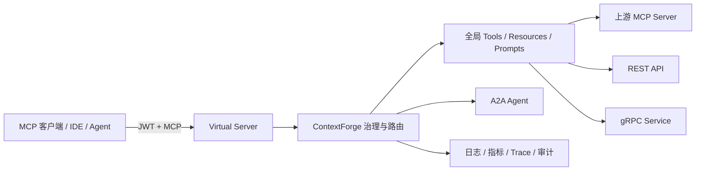

# ContextForge 产品使用手册

本文档面向平台管理员、团队管理员、集成开发者、MCP 客户端使用者和运维人员，说明如何从零部署
ContextForge，完成第一个 MCP 服务接入，并在生产环境中安全地管理工具、Agent、API、用户、权限和可观测性。

| 文档属性 | 内容 |
| --- | --- |
| 适用产品 | ContextForge |
| 适用版本 | 1.0.7（以当前仓库代码为准） |
| 文档语言 | 简体中文 |
| 更新日期 | 2026-08-17 |
| 默认直接访问地址 | `http://localhost:4444` |
| Docker Compose 默认入口 | `http://localhost:8080` |

!!! note "如何使用本手册"
    如果你第一次使用 ContextForge，请依次阅读“产品概览”“部署前规划”“安装与启动”“首次登录”和
    “第一个端到端工作流”。已有环境的管理员可以直接跳到“日常管理”“安全与权限”或“运维与排障”。

## 1. 产品概览

ContextForge 是一个面向 AI 工具与 Agent 的统一注册表、代理和治理控制面。它可以接入 MCP、A2A、REST
和 gRPC 服务，将分散的工具、资源、提示词和 Agent 组合成按项目或团队划分的 MCP 端点，再提供统一的
认证、权限、限流、审计、可观测性和插件扩展能力。

典型使用场景包括：

- 将多个第三方或自建 MCP 服务汇聚到一个入口；
- 把 REST API、gRPC 方法或本地 `stdio` 程序转换为 MCP 工具；
- 为不同团队发布不同的工具集合，避免客户端接触整个全局目录；
- 统一管理上游认证信息、OAuth、mTLS、重试和限流；
- 让 Claude Desktop、IDE 插件、MCP Inspector、Agent 框架或自研客户端使用同一套端点；
- 通过日志、指标、追踪和审计记录定位调用失败与性能问题；
- 通过 A2A 路由外部 Agent，或通过 OpenAI 兼容接口统一访问 LLM 提供商。

### 1.1 核心数据流



客户端通常连接某个 **Virtual Server**，而不是直接使用全局目录。Virtual Server 只发布管理员选中的
Tools、Resources、Prompts 和 A2A Agents，因此是项目隔离、最小权限和版本治理的主要边界。

### 1.2 关键术语

| 产品术语 | Admin UI 名称 | API/含义 |
| --- | --- | --- |
| 上游 MCP 服务 | **MCP Servers** | API 中历史名称为 Gateway，使用 `/v1/gateways` 管理 |
| 虚拟服务器 | **Virtual Servers** | 使用 `/v1/servers` 管理；向客户端发布组合后的 MCP 端点 |
| Tool | **Tools** | 可被模型或客户端调用的有类型函数，可来自 MCP、REST、gRPC、A2A 或 SQL |
| Resource | **Resources** | 通过 URI 读取的文本或二进制内容 |
| Prompt | **Prompts** | 带参数的可复用提示词模板 |
| Root | **Roots** | 文件类资源允许使用的根 URI；属于平台级安全配置 |
| Agent | **Agents (A2A)** | 符合 A2A 协议或可通过 A2A 路由调用的外部 Agent |
| Team | **Teams** | 用户、角色和实体可见性的组织边界 |
| API Token | **API Tokens** | 面向客户端或自动化的可撤销、可限权令牌 |

!!! warning "容易混淆的命名"
    UI 中的 **MCP Servers** 是被 ContextForge 接入的上游；**Virtual Servers** 是 ContextForge
    对下游客户端发布的逻辑服务。API 路径 `/v1/gateways` 对应前者，`/v1/servers` 对应后者。

## 2. 用户、角色与访问入口

### 2.1 典型角色

| 角色 | 适合人员 | 典型能力 |
| --- | --- | --- |
| `platform_admin` | 平台所有者、SRE | 全局配置、用户、团队、插件、审计及所有平台操作 |
| `team_admin` | 项目或业务团队管理员 | 管理本团队成员和团队范围内的 MCP 实体 |
| `developer` | 集成开发者 | 创建和维护团队内的上游、虚拟服务器、工具、资源与提示词 |
| `viewer` | 工具使用者 | 查看并使用已授权实体，不负责修改配置 |
| `platform_viewer` | 普通平台用户 | 查看全局可见目录；个人团队内的能力由团队角色补充 |

角色只决定“可以执行什么操作”。实体是否可见还取决于令牌的团队范围和实体的可见性，详见
第 10 章“安全与权限”。

### 2.2 常用入口

| 部署方式 | Admin UI | API/MCP 基础地址 |
| --- | --- | --- |
| `uvx`、pip、单容器、`make serve` | `http://localhost:4444/admin` | `http://localhost:4444` |
| Docker Compose（经 Nginx） | `http://localhost:8080/admin` | `http://localhost:8080` |
| 开发服务器 `make dev` | `http://localhost:8000/admin` | `http://localhost:8000` |

生产环境应替换为正式域名并使用 HTTPS。反向代理部署还应正确传递主机、客户端地址和
`X-Forwarded-Proto`，并限制对管理入口的网络访问。

## 3. 部署前规划

### 3.1 选择部署方式

| 方式 | 适用场景 | 数据库 | 主要特点 |
| --- | --- | --- | --- |
| PyPI / `uvx` | 个人体验、开发、单机试用 | 默认 SQLite | 启动快，依赖少 |
| 单容器 | 小型部署、集成测试 | SQLite 或外部 PostgreSQL | 易于自动化，需自行规划持久卷 |
| Docker Compose | 团队试用、单机完整栈 | PostgreSQL | 包含 Gateway、Redis、数据库和反向代理 |
| Helm / Kubernetes | 生产、高可用、弹性扩缩 | PostgreSQL | 支持独立迁移任务、探针、扩缩容与外部密钥管理 |

SQLite 适合单进程或低并发体验环境。生产、多副本或持续写入环境应使用 PostgreSQL；多 worker 的
LLM Chat、分布式缓存和会话协调通常还需要 Redis。

### 3.2 前置检查

部署前确认：

- Python 安装方式要求 Python 3.11 或更高、低于 3.14；
- 从源码构建 Admin UI 还需要 Node.js 与 npm；`make install-dev` 会执行 UI 构建，缺少 npm 时会失败；
- 容器方式已安装 Docker/Podman，Compose 场景使用 Compose v2；
- Gateway 运行节点能够访问所有上游 MCP、REST、gRPC、OAuth 和 LLM 地址；
- 客户端能够访问 ContextForge 的对外 MCP 端点；
- 生产环境已有 DNS、HTTPS 证书、数据库备份和密钥管理方案；
- 已确定团队划分、默认可见性、API Token 有效期和最小权限；
- Kubernetes 场景已准备 StorageClass、Ingress 和 Secret 管理方式。

### 3.3 必需密钥

每个环境必须使用独立的高强度密钥：

- `JWT_SECRET_KEY`：签发和验证 ContextForge JWT；
- `AUTH_ENCRYPTION_SECRET`：加密数据库中保存的上游凭据、API Key 等敏感值；
- `BASIC_AUTH_PASSWORD`：Basic Auth 被启用时使用的密码；即使默认关闭也不应保留弱值；
- `PLATFORM_ADMIN_PASSWORD`：引导管理员的初始密码。

先生成只允许当前用户读取的 `.env.secrets`：

```bash
cp .env.example .env
python3 -m mcpgateway.scripts.init_secrets
```

把 `.env.secrets` 中生成的 `JWT_SECRET_KEY`、`AUTH_ENCRYPTION_SECRET`、`BASIC_AUTH_PASSWORD` 和
`PLATFORM_ADMIN_PASSWORD` 分别复制到 `.env` 或正式的密钥管理系统，然后至少确认以下配置：

```dotenv
MCPGATEWAY_UI_ENABLED=true
MCPGATEWAY_ADMIN_API_ENABLED=true
EMAIL_AUTH_ENABLED=true
AUTH_REQUIRED=true
PLATFORM_ADMIN_EMAIL=admin@example.com
PLATFORM_ADMIN_PASSWORD=<使用密码管理器生成的强密码>
```

`--patch-env .env` 只会替换弱的 `JWT_SECRET_KEY` 和 `BASIC_AUTH_PASSWORD`，不会写入
`AUTH_ENCRYPTION_SECRET` 或 `PLATFORM_ADMIN_PASSWORD`，因此不能单独依赖该选项完成首次安全配置。
导入密钥管理系统后，应限制或安全移除临时 `.env.secrets` 文件。

!!! danger "不要使用占位密钥"
    `__REPLACE_ME__`、`changeme` 或示例短密钥不适合任何实际环境。不要把 `.env`、令牌、私钥或
    数据库备份提交到版本库。

### 3.4 HTTP 与 Cookie 配置

首次登录前要让浏览器协议和 Cookie 设置保持一致：

| 环境 | 推荐配置 |
| --- | --- |
| 本地 HTTP | `ENVIRONMENT=development`、`SECURE_COOKIES=false` |
| 生产 HTTPS | `ENVIRONMENT=production`、`SECURE_COOKIES=true` |

生产模式会强制使用 Secure Cookie，不应通过关闭安全选项来支持生产 HTTP。若本地 HTTP 错误地启用
Secure Cookie，首次强制改密后会因为浏览器不回传 `jwt_token` 而跳回
`/admin/login?error=session_expired`。

## 4. 安装与启动

### 4.1 PyPI 安装

```bash
mkdir mcpgateway
cd mcpgateway
python3 -m venv .venv
source .venv/bin/activate
python3 -m pip install --upgrade pip
pip install mcp-contextforge-gateway==1.0.7

curl -O https://raw.githubusercontent.com/IBM/mcp-context-forge/v1.0.7/.env.example
cp .env.example .env
python3 -m mcpgateway.scripts.init_secrets
```

若主数据库使用 PostgreSQL，把安装命令替换为：

```bash
pip install "mcp-contextforge-gateway[postgres]==1.0.7"
```

把生成的四项密钥复制到 `.env` 或密钥管理系统，编辑管理员、UI、数据库和协议设置，然后启动：

```bash
mcpgateway --host 0.0.0.0 --port 4444
```

终端需要保持运行。生产环境应使用服务管理器、容器编排或仓库提供的 Gunicorn 启动方式，不要依赖
交互式 shell。

### 4.2 从源码运行

```bash
cp .env.example .env
make install-dev
.venv/bin/python -m mcpgateway.scripts.init_secrets
```

`make install-dev` 会构建 Admin UI，因此需要 npm。只有明确不使用 UI 时才可设置 `SKIP_UI_BUILD=1`；
此时 Admin UI 不会正常加载。源码环境若连接 PostgreSQL，还需执行 `make install-db`。

把 `.env.secrets` 中生成的四项密钥配置到 `.env`，再执行生产配置校验：

```bash
chmod 600 .env .env.secrets
.venv/bin/mcpgateway --validate-config .env
.venv/bin/python -m mcpgateway.scripts.validate_env .env
make serve
```

开发时可使用自动重载服务器：

```bash
make dev
```

`make serve` 默认监听 `4444`，`make dev` 默认监听 `8000`。

### 4.3 Docker Compose 完整栈

```bash
git clone --branch v1.0.7 --depth 1 https://github.com/IBM/mcp-context-forge.git
cd mcp-context-forge
cp .env.example .env
python3 -m mcpgateway.scripts.init_secrets
```

把 `.env.secrets` 中生成的四项密钥复制到 `.env` 或外部 Secret，把 `IMAGE_LOCAL` 设置为
`ghcr.io/ibm/mcp-context-forge:v1.0.7`，并确认数据库连接和 Cookie 设置。

当前 `docker-compose.yml` 在 Gateway 服务中把引导管理员固定为 `admin@example.com` / `changeme`，迁移服务
也没有传入 `PLATFORM_ADMIN_PASSWORD`。因此，只修改 `.env` 中的管理员密码不会让首次引导使用该值。
真实环境应在第一次启动、数据库尚未初始化前创建不提交到版本库的 `docker-compose.override.yml`，同时覆盖
Gateway 和迁移服务：

```yaml
services:
  gateway:
    environment:
      PLATFORM_ADMIN_EMAIL: ${PLATFORM_ADMIN_EMAIL}
      PLATFORM_ADMIN_PASSWORD: ${PLATFORM_ADMIN_PASSWORD}
  migration:
    environment:
      PLATFORM_ADMIN_EMAIL: ${PLATFORM_ADMIN_EMAIL}
      PLATFORM_ADMIN_PASSWORD: ${PLATFORM_ADMIN_PASSWORD}
```

先用 `docker compose config --quiet` 校验合并配置，再启动：

```bash
docker pull ghcr.io/ibm/mcp-context-forge:v1.0.7
docker compose build nginx
docker compose up -d
```

如果数据库卷已经完成引导，后续修改这些环境变量不会重置数据库中的管理员密码；应通过登录后的密码修改、
管理员重置或正式恢复流程处理，不要为了改密码删除数据库卷。仅用于隔离的本地体验且未提供 override 时，
首次使用默认 `admin@example.com` / `changeme` 登录，并立即按强制流程改密。

启动后检查：

```bash
docker compose ps
docker compose logs --tail=100 gateway
curl -fsS http://localhost:8080/health | jq -e '.status == "healthy"' >/dev/null
curl -fsS http://localhost:8080/ready >/dev/null
```

需要持续观察日志时，在另一个终端运行 `docker compose logs -f gateway`。

!!! warning "默认 Compose 不是公网生产模板"
    当前 Compose 文件更适合本地或受信网络试用。PostgreSQL 服务与 Gateway、PgBouncer、迁移任务的
    凭据必须通过受控 override/Secret 一致配置，不能假设只改一个 `.env` 值就会同步所有服务。默认
    配置还会把 PostgreSQL `5433`、PgBouncer `6432` 和无认证明文 Redis `6379` 发布到宿主机所有接口；
    真实环境应移除这些 `ports`、绑定 `127.0.0.1` 或通过防火墙隔离。`docker compose down` 通常保留
    命名卷，而 `down -v` 或仓库的清理目标会删除数据库卷；执行前必须完成可恢复备份。

完整说明参见 [Docker Compose 部署](../deployment/compose.md)。

### 4.4 单容器与 Kubernetes

单容器部署必须挂载持久化数据目录或连接外部 PostgreSQL，并通过环境变量或 Secret 注入密钥。发布镜像
默认由 Gunicorn 自动选择多个 worker；若使用 SQLite，必须同时设置：

```dotenv
GUNICORN_WORKERS=1
DATABASE_URL=sqlite:////data/mcp.db
```

把 `/data` 挂载到持久卷，并确保镜像运行用户 UID/GID `10001:10001` 对该目录可写；不要把 SQLite
数据库只留在容器可写层中。详见 [容器部署](../deployment/container.md)。

Kubernetes 生产部署建议使用仓库 Helm Chart，并重点确认：

- PostgreSQL、Redis 和持久卷的生产配置；
- Ingress TLS 与对外域名；
- Gateway Pod 是否跳过迁移，以及独立迁移 Job 是否启用；
- Readiness/Liveness Probe；
- Secret、NetworkPolicy、PodDisruptionBudget 和备份策略；
- 默认 HPA 依赖 metrics-server；未安装时设置 `mcpContextForge.hpa.enabled=false`；
- 默认 PostgreSQL PVC 使用 `ReadWriteOncePod`；CSI/StorageClass 不支持时设置
  `postgres.persistence.useReadWriteOncePod=false`；
- 默认 Ingress TLS 需要预先创建证书 Secret 并设置 `mcpContextForge.ingress.tls.secretName`，或配置能
  签发该 Secret 的 cert-manager；Chart 不会自动生成默认 Ingress 证书；
- 卸载后的数据保留由 StorageClass/PV reclaim policy 和外部快照决定；不要依赖 values 中未被 PVC
  模板消费的 `postgres.persistence.reclaimPolicy`；
- 升级前数据库备份与回滚版本。

Chart 示例值中的 JWT、加密密钥、管理员密码和数据库密码不能用于生产。先通过外部 Secret 管理系统创建
包含应用密钥的 Kubernetes Secret，再在受保护的 values 中引用：

```yaml
mcpContextForge:
  extraEnvFrom:
    - secretRef:
        name: contextforge-prod-secrets
```

`extraEnvFrom` 同时应用于 Gateway 与迁移 Job，并在运行时覆盖同名的 Chart Secret 键。但是 Chart 当前仍会
根据 `mcpContextForge.secret` 渲染 `<release>-mcp-stack-gateway-secret`，没有 Gateway `existingSecret`
开关。生产环境应通过受保护的 values 交付机制同时把该映射中的所有示例弱值替换掉，并审查 `helm
template` 结果；仅用 `extraEnvFrom` 会让未使用的弱默认值仍留在集群 Secret 对象中。不要把明文生产秘密
提交到版本库。

数据库和 Redis 凭据不由 Gateway 的 `extraEnvFrom` 替代。内置 PostgreSQL 应另行创建包含
`POSTGRES_USER`、`POSTGRES_PASSWORD`、`POSTGRES_DB` 的 Secret；内置 Redis 应创建包含
`REDIS_PASSWORD` 的 Secret，然后设置：

```yaml
postgres:
  existingSecret: contextforge-postgres
redis:
  auth:
    existingSecret: contextforge-redis
    passwordKey: REDIS_PASSWORD
```

外部 PostgreSQL 使用 `postgres.external.existingSecret`，并按实际 Secret 设置 `hostKey`、`portKey`、
`databaseKey`、`userKey` 和 `passwordKey`；外部 Redis 使用 `redis.external.existingSecret` 提供
`REDIS_URL`。

Chart 默认同时启用 Metrics 和 ServiceMonitor，但默认没有配置抓取 Bearer Secret。集群没有 Prometheus
Operator/CRD，或不准备抓取指标时，应在安装前同时关闭：

```yaml
mcpContextForge:
  metrics:
    enabled: false
    serviceMonitor:
      enabled: false
```

需要抓取时，先在禁用 ServiceMonitor 的状态完成引导，通过受信身份签发显式含 `admin.metrics` scope 的
有限期专用 Token，并用密钥管理流程创建只含原始 Token 值的 Kubernetes Secret。随后升级为：

```yaml
mcpContextForge:
  metrics:
    enabled: true
    serviceMonitor:
      enabled: true
    metricsToken:
      secretName: contextforge-metrics-token
      key: token
```

否则 ServiceMonitor 不会发送 Authorization Header，抓取会返回 `401`。Token 轮换时应先更新 Secret，
验证抓取成功，再撤销旧 Token。

详见 [Helm 部署](../deployment/helm.md) 和 [Kubernetes 部署](../deployment/kubernetes.md)。

### 4.5 启动验证

```bash
export BASE_URL="http://localhost:4444"

curl -fsS "$BASE_URL/health" | jq -e '.status == "healthy"' >/dev/null
curl -fsS "$BASE_URL/ready" >/dev/null
```

正常情况下分别返回健康和就绪状态。`/health` 用于存活检查，`/ready` 用于判断数据库等依赖是否已
准备好。不要只判断 `/health` 的 HTTP 状态码，还要解析响应中的 `status`；负载均衡和发布门禁应以
会在关键依赖不可用时返回 `503` 的 `/ready` 为准。上面的 `/health` 命令需要 `jq`；没有 `jq` 时应人工
确认响应中的 `status`。`/v1/version` 包含更详细的版本与诊断信息，仅平台管理员可访问。

!!! tip "基础地址只选一个"
    后续命令统一使用 `BASE_URL`。若使用 Compose，请设置为 `http://localhost:8080`；若使用
    `make dev`，请设置为 `http://localhost:8000`。

## 5. 首次登录与界面导航

### 5.1 首次登录

1. 打开 `${BASE_URL}/admin`。
2. 使用 `PLATFORM_ADMIN_EMAIL` 和 `PLATFORM_ADMIN_PASSWORD` 登录。
3. 如果系统要求修改初始密码，按当前密码策略设置新密码。
4. 登录后确认右上角用户身份和当前团队上下文。
5. 进入 **Version Info**，确认应用版本、数据库、Redis 和运行环境状态。

默认密码策略区分普通、特权和服务账户，管理员密码要求更严格。连续登录失败会触发账户锁定；忘记
密码、管理员重置和应急恢复流程参见 [密码管理](../manage/password-management.md)。

### 5.2 Admin UI 导航

实际可见菜单由功能开关和用户权限共同决定。

| 导航分组 | 页面 | 用途 |
| --- | --- | --- |
| Overview | Overview | 查看实体数量、状态和总体运行情况 |
| MCP | MCP Servers、Virtual Servers、Tools、ToolOps（按开关）、Prompts、Resources、Roots、MCP Registry | 接入上游并发布 MCP 能力 |
| Agents | Agents (A2A)、gRPC Services | 管理 Agent 和实验性 gRPC 转换 |
| API Operations | SQL Data、API Debugger | 管理外部 SQL 数据源并调试多协议调用；默认关闭 |
| LLM | LLM Chat、LLM Settings | 配置 LLM 提供商并用虚拟服务器工具进行对话 |
| Monitoring | Metrics、Performance、Observability、API Metrics | 查看调用、性能、追踪和 API 指标 |
| Extensions | Plugins、A2A Plugin Bindings | 管理扩展和 Agent 插件绑定 |
| Organization | Teams、Users、API Tokens | 管理组织、成员、角色和程序化凭据 |
| Admin | Export/Import、System Logs、Version Info、Maintenance | 配置迁移、日志、诊断和维护 |

页面顶栏还提供跨 Server、Gateway、Tool、Resource、Prompt、Agent 和 Root 的全局搜索，以及
“All Teams”或指定团队的上下文选择器。团队选择器用于缩小当前管理视图，不会替代服务端 Token
Scoping 和 RBAC 检查。

## 6. 第一个端到端工作流

本节以“将本地 `stdio` MCP 服务接入 ContextForge，再通过 Virtual Server 发布”为例。建议先在
直接安装的本地开发环境完成此流程。

### 6.1 启动示例上游

安装 `uv` 后，把一个 `stdio` MCP 服务桥接为 SSE：

```bash
python3 -m mcpgateway.translate \
  --stdio "uvx mcp-server-git" \
  --expose-sse \
  --host 127.0.0.1 \
  --port 9000
```

如果 ContextForge 使用严格应用默认值，本地测试还需在 `.env` 中显式允许 loopback，然后重启：

```dotenv
SSRF_ALLOW_LOCALHOST=true
```

!!! warning "容器网络"
    ContextForge 在容器内运行时，`127.0.0.1:9000` 指向 Gateway 容器本身。应把示例服务放到同一
    Compose 网络并使用服务名，或使用经过明确配置的宿主机地址。生产环境不要为了方便而无范围地放开
    SSRF 策略。

### 6.2 通过 Admin UI 注册上游

1. 打开 **MCP Servers**。
2. 选择新增服务器。
3. 填写名称，例如 `local_git`。
4. URL 填写 `http://127.0.0.1:9000/sse`。
5. Transport 选择 `SSE`；生产上游可优先使用 `STREAMABLEHTTP`。
6. 根据实际情况配置 Bearer、Basic、自定义 Header、OAuth 或 mTLS；示例无需上游认证。
7. 选择团队和可见性。
8. 保存并等待能力发现完成。

注册成功后，ContextForge 会发现上游的 Tools，并在对应全局目录中保存关联关系。若启用了异步
Gateway 生命周期，创建请求可能先返回 `202 Accepted` 和 `pending` 状态，稍后再变为可用。

“Test Gateway Connectivity”只检查基础 HTTP 可达性，不执行 MCP 握手，也不代表 Tools 已经成功发现。
应继续在 **Tools** 中确认导入结果，并测试具体 Tool。

### 6.3 通过 API 注册上游（可选）

先在 **API Tokens** 中创建一个有 `gateways.create`、`gateways.read`、`tools.read`、
`servers.create` 和 `servers.read` 权限的短期团队令牌。令牌值只在创建时显示一次。

```bash
export BASE_URL="http://localhost:4444"
export TOKEN="<从 Admin UI 复制的 API Token>"

curl -s -X POST "$BASE_URL/v1/gateways" \
  -H "Authorization: Bearer $TOKEN" \
  -H "Content-Type: application/json" \
  -d '{
    "name": "local_git",
    "url": "http://127.0.0.1:9000/sse",
    "transport": "SSE",
    "description": "Local Git MCP server",
    "team_id": "<TEAM_ID>",
    "visibility": "team"
  }'
```

查看发现的工具并记录所需 Tool ID：

```bash
curl -s -H "Authorization: Bearer $TOKEN" \
  "$BASE_URL/v1/tools?limit=0"
```

### 6.4 创建 Virtual Server

在 Admin UI 中：

1. 打开 **Virtual Servers** 并选择新增。
2. 设置名称、描述、团队和可见性。
3. 选择刚导入的一个或多个 Tools；当前 Admin UI 表单还可组合 Resources 和 Prompts。
4. 保存并保持服务器为 Active。
5. 打开详情，复制生成的服务器 ID。

Virtual Server Schema/API 也支持 `associated_a2a_agents`，但当前新建/编辑 UI 表单没有 A2A 选择器；需要
该关联时通过 `/v1/servers` API 配置，再在详情页核对结果。

API 等价示例：

```bash
curl -s -X POST "$BASE_URL/v1/servers" \
  -H "Authorization: Bearer $TOKEN" \
  -H "Content-Type: application/json" \
  -d '{
    "server": {
      "name": "git_demo",
      "description": "Git tools for the demo team",
      "associated_tools": ["<TOOL_ID>"]
    },
    "team_id": "<TEAM_ID>",
    "visibility": "team"
  }'
```

当前 API 的 `POST /v1/servers` 请求体中，`server` 是嵌套对象；不要把 `name` 和 `associated_tools`
直接放到最外层。

### 6.5 创建客户端令牌

1. 打开 **API Tokens**。
2. 新建令牌并选择与 Virtual Server 相同的团队。
3. 设置明确的有效期。
4. 至少授予实际工作流所需的 `servers.use`、`tools.read` 和 `tools.execute`；如需读取资源或提示词，
   再增加相应权限。
5. 可按需要设置服务器限制、IP 范围、使用限制和标签。
6. 保存后立即把令牌放入密码管理器；关闭对话框后不能再次查看明文。

### 6.6 连接客户端

虚拟服务器的推荐 Streamable HTTP 端点为：

```text
${BASE_URL}/servers/<SERVER_ID>/mcp
```

仍需使用 SSE 时，规范端点为：

```text
${BASE_URL}/v1/servers/<SERVER_ID>/sse
```

未带 `/v1` 的 `/servers/<SERVER_ID>/sse` 是当前仍可用的 legacy 兼容地址，会返回弃用/Sunset
响应头；新客户端不要再依赖它。

使用 MCP Inspector：

```bash
npx @modelcontextprotocol/inspector \
  --url "$BASE_URL/servers/<SERVER_ID>/mcp/" \
  --header "Authorization: Bearer $CLIENT_TOKEN"
```

需要 `stdio` 的桌面应用或 IDE 可以使用包装器：

```bash
export MCP_SERVER_URL="$BASE_URL/servers/<SERVER_ID>/mcp"
export MCP_AUTH="Bearer $CLIENT_TOKEN"
python3 -m mcpgateway.wrapper
```

`MCP_AUTH` 必须是完整的 Authorization Header 值，包含 `Bearer ` 前缀；`MCP_SERVER_URL` 只接受一个
服务器 URL。

更多客户端示例参见 [MCP 客户端](clients/index.md)、[MCP Inspector](clients/mcp-inspector.md) 和
[mcpgateway-wrapper](mcpgateway-wrapper.md)。

### 6.7 验收标准

完成以下检查即表示首个工作流已打通：

- **MCP Servers** 中上游状态正常；
- **Tools** 中出现由该上游发现的工具；
- Tool 的 **Test** 操作能够返回预期结果；
- Virtual Server 处于 Active，且只关联预期实体；
- MCP Inspector 能完成初始化和 `tools/list`；
- 客户端令牌无法看到其他团队或其他用户的私有实体；
- **Metrics** 或 **System Logs** 中能看到本次调用。

## 7. MCP 能力管理

### 7.1 管理 MCP Servers（上游）

创建或编辑上游时重点关注：

- **URL 和 Transport**：常规上游支持 `SSE` 或 `STREAMABLEHTTP`；
- **Authentication**：按上游要求使用 Bearer、Basic、自定义认证 Header、OAuth 或 mTLS；
- **Team / Visibility**：决定哪些用户能看到导入的能力；
- **Cache / Direct Proxy**：默认缓存模式保存发现结果；Direct Proxy 为显式启用的高级模式；
- **Refresh Interval**：控制能力同步周期，也可手动 Refresh；
- **CA Certificate**：私有 CA 场景应配置可信 CA，不要在生产中全局跳过证书验证；
- **Passthrough Headers / Identity Propagation**：仅转发业务确实需要且已审查的身份或追踪信息。

常见操作：

- **Activate/Deactivate**：临时停止使用而保留配置和关联；
- **Refresh Tools**：重新发现上游 Tools，可选择同时刷新 Resources 和 Prompts；
- **Test Connectivity**：只做网络层 HTTP 检查；
- **View Metrics**：查看调用量、成功率和延迟；
- **Delete**：永久删除上游及其关联，操作前先评估 Virtual Server 依赖。

### 7.2 管理 Tools

Tool 可由上游自动发现，也可直接登记 REST、gRPC、A2A 或 SQL 能力。主要字段包括：

- 唯一名称、展示名称、标题和描述；
- Integration Type 与请求类型；
- URL、路径、超时、请求 Header 和上游认证；
- 输入 JSON Schema，以及可选的输出 Schema；
- 标签、团队、可见性和弃用状态；
- `readOnlyHint`、`destructiveHint`、`idempotentHint`、`openWorldHint` 等注解；
- REST Passthrough 的允许主机、查询/Header 映射和插件链。

建议操作流程：

1. 先验证 URL、认证和最小输入 Schema；
2. 使用 **Test** 以最小参数执行；
3. 确认错误信息中没有泄露认证信息；
4. 添加准确描述和安全注解，帮助客户端做出正确调用选择；
5. 关联到测试 Virtual Server；
6. 通过团队令牌完成正向和拒绝路径测试；
7. 再发布到生产 Virtual Server。

`deprecated=true` 的 Tool 仍可被看到，但不可执行，适合先通知客户端迁移再最终删除。批量登记 REST
工具可使用 Admin UI 的 Bulk Import，详见 [批量导入](../manage/bulk-import.md)。

### 7.3 管理 Resources

Resource 用 URI 暴露只读内容。创建时设置：

- 唯一 URI，例如 `file:///docs/policy.md` 或业务自定义 URI；
- 名称、描述和 MIME Type；
- 文本或二进制内容；
- 可选 URI Template；
- 标签、团队、可见性和上游关联。

不要把 **Roots** 页面中的动态注册项当成 Resource 文件沙箱；当前动态 Roots 与 Resource 没有自动关联或
依赖校验。ResourceService 只在 `EXPERIMENTAL_VALIDATE_IO=true` 时调用独立路径校验；`ALLOWED_ROOTS`
只约束路径形式的值，而被识别为 URI Scheme 的值会跳过这一步。因此该机制也不是完整的文件隔离边界。
需要文件类 Resource 时，应配置最小 `ALLOWED_ROOTS`，同时依赖上游服务沙箱、容器挂载和运行用户文件
权限实施真正隔离，并避免暴露密钥目录、宿主机敏感路径或不受控的符号链接目标。

### 7.4 管理 Prompts

Prompt 是可复用模板，包含名称、描述、模板正文和参数定义。每个参数可设置名称、说明和是否必填。
建议：

- 让参数名稳定且语义明确；
- 在预览中覆盖必填、缺省、特殊字符和超长输入；
- 不在模板中嵌入生产凭据或个人数据；
- 通过标签和 Virtual Server 控制版本发布；
- 修改前保留导出快照，避免客户端在无通知情况下收到破坏性变化。

### 7.5 管理 Virtual Servers

Virtual Server 是客户端使用的主要发布单元。一个服务器可以关联 Tools、Resources、Prompts 和 A2A
Agents，并拥有独立名称、描述、团队、可见性、状态和 OAuth 保护配置。

推荐一个 Virtual Server 对应一个清晰业务上下文，例如：

- `finance-readonly`：只读财务查询；
- `support-agent`：工单查询、知识库和回复模板；
- `release-automation`：仅 CI/CD 使用的发布工具；
- `developer-sandbox`：团队内部测试能力。

避免创建包含所有全局 Tool 的“超级服务器”。工具越多，模型选择错误、权限扩大、上下文占用和变更
影响就越大。

### 7.6 Roots 与 MCP Registry

**Roots** 是平台级安全配置，只有具备 `admin.system_config` 的未受限平台管理员才能维护。删除 Root
前应检查依赖它的 Resource。

**MCP Registry** 用于浏览和筛选预配置目录中的 MCP 服务。Registry 条目不等同于已连接的上游；注册
或导入后仍需配置网络、认证、团队范围并验证 MCP 能力。

## 8. Agent、gRPC、SQL 与 LLM 功能

### 8.1 A2A Agents

当 `MCPGATEWAY_A2A_ENABLED=true` 时，管理员可以登记外部 Agent、查看 Agent Card、设置调用地址、
认证、团队和可见性，并将 Agent 关联到 Virtual Server。当前没有每个 Agent 的超时或重试字段；超时使用
全局 `MCPGATEWAY_A2A_DEFAULT_TIMEOUT`，修改前应评估对所有 Agent 的影响。调用前应：

- 确认注册 Agent 后自动投影的 `integration_type=A2A` Tool 已生成；
- 注意 Agent 的启停状态会与其投影 Tool 联动；
- 确认远端 Agent 的域名在跨 Gateway 允许列表中；
- 使用共享信任的 JWT 发行方或正式的身份联邦；
- 不向不受信任 Agent 转发客户端原始敏感 Header；
- 为跨 Gateway 场景验证远端 `401/403` 拒绝路径；
- 通过 A2A Metrics 和 Trace 观察多跳调用。

设计与安全细节参见 [A2A Agent 架构](../architecture/a2a-agents.md)。

### 8.2 gRPC Services（实验性）

启用 `MCPGATEWAY_GRPC_ENABLED=true` 后，可通过 Server Reflection 发现服务和方法，并生成对应 MCP
Tools。基本流程是：

1. 确保安装 gRPC 可选依赖；
2. 在 **gRPC Services** 中登记 `host:port`；
3. 在 UI 中配置 TLS、超时和反射；如需 Metadata Header，通过 API 的 `grpc_metadata` 配置并审查敏感值；
4. 执行 Reflect 并检查发现的方法；
5. 测试生成的 Tool，再关联到 Virtual Server；
6. 使用 Health 和 Metrics 观察连接状态。

没有 Reflection 的服务可导入受信任的描述文件。Proto 目录扫描和文件路径默认失败关闭，必须配置允许
根目录。详见 [gRPC Services](grpc-services.md)。

### 8.3 SQL Data 与 API Debugger

这两个功能默认关闭：

```dotenv
MCPGATEWAY_SQL_API_ENABLED=true
MCPGATEWAY_API_DEBUG_ENABLED=true
```

SQL Data 用于登记加密保存的外部数据源、发现表和生成受控数据 Tool；应设置查询行数、响应大小、关联
数量和超时上限。外部 SQLite 文件必须位于显式允许的根目录。

API Debugger 可统一测试 REST、MCP、gRPC 和 SQL 调用，并保存按用户隔离且经过脱敏的调试历史。生产
环境只应向确有需要的角色开放。

### 8.4 LLM Settings 与 LLM Chat

`LLMCHAT_ENABLED=true` 时，可在 **LLM Settings** 中登记 LLM 提供商和模型。API Key 加密保存，管理员
可同步模型、启停模型并执行健康检查。

使用 **LLM Chat** 的顺序：

1. 配置并启用 Provider；
2. 配置并启用至少一个 Model；
3. 选择可访问的 Virtual Server；
4. 选择模型和生成参数；
5. Connect 后发送消息；
6. 观察工具调用、结果、流式输出和会话状态；
7. 完成后 Disconnect。

多 worker 环境应使用 Redis 保存会话协调与聊天历史。详细步骤参见
[LLM Provider Settings](../manage/llm-settings.md) 和 [LLM Chat](clients/llm-chat.md)。

### 8.5 Plugins 与 ToolOps

插件框架可在认证、授权、请求、响应和生命周期等挂载点扩展行为。启用前应审查插件来源、配置、运行时
依赖、可读取的敏感数据和失败策略。不要允许不受信任插件覆盖认证 Header 或 RBAC 决策。

ToolOps 默认关闭，用于 Tool 丰富、测试生成、验证和成本治理。启用后仍应把自动生成的 Schema、测试和
成本配置视为需要人工复核的发布物。

## 9. 用户、团队与 API Token

### 9.1 用户管理

在 **Users** 中，平台管理员可以创建、编辑、停用、解锁用户并重置密码。建议：

- 使用真实且唯一的邮箱作为身份标识；
- 普通用户不授予平台管理员权限；
- 新账户设置强制首次改密；
- 离职或职责变化时先停用账户并撤销 Token；
- 至少保留两个受控的活动平台管理员账户，避免单点锁死；
- 生产环境优先通过受信任的 OIDC/SSO 和组映射管理身份。

### 9.2 团队管理

团队用于同时承载成员、团队角色和实体所有权。常见结构：

- 按业务域：`payments`、`support`、`analytics`；
- 按环境：`payments-dev`、`payments-prod`；
- 按自动化用途：`ci-automation`、`monitoring`；
- 个人团队：系统可在用户创建时自动生成。

团队管理员可邀请成员、处理加入请求、调整成员角色和维护团队实体。团队名称应使用稳定、可审计且不含
敏感数据的命名规则。SSO 场景可把外部 Group 映射到 ContextForge Team。

### 9.3 可见性

| 可见性 | 可见对象 | 推荐用途 |
| --- | --- | --- |
| `public` | 默认是所有已认证且具备相应操作权限的用户；显式匿名 MCP 模式是例外 | 组织内公共、低风险能力 |
| `team` | 对应团队成员，以及满足旁路条件的管理员 | 大多数业务工具和项目服务器 |
| `private` | 仅实体所有者 | 个人草稿、实验和未发布配置 |

平台管理员旁路不代表能读取其他用户的私有实体；私有资源严格按 owner 隔离。内部业务能力通常应默认使用
`team`，而不是为了方便设置为 `public`。

如果显式关闭 `AUTH_REQUIRED` / `MCP_REQUIRE_AUTH`，匿名 MCP 请求只能进入 public-only 范围；这不会让
`public` 变成互联网匿名发布建议，生产环境仍应保持认证。启用 OAuth 保护的 Virtual Server 无论全局设置
如何都会拒绝匿名请求。

### 9.4 API Token 生命周期

API Token 用于客户端和自动化，不应用网页登录 Session Cookie 代替。创建时应设置：

- 清晰的用途名称和负责人；
- 明确的 Team；单团队调用者未填写时会自动继承其唯一团队，多团队或无团队的非管理员通常会落到
  public-only，而未受限平台管理员未填写时会生成管理员旁路令牌；为避免歧义和权限过宽，应始终显式选择；
- 精确权限，而不是无必要的 `*`；
- 最短可行的有效期；
- 可选 Server、IP、时间窗口和使用量限制；
- 环境、系统和轮换日期标签。

Token 明文只在创建时返回。到期、泄露、负责人变更或工作流下线时立即撤销。修改令牌的权限记录不会
重新签名已经流通的 JWT；需要重新签发令牌才能让新范围生效。

Token 管理接口拒绝匿名身份和现有 API Token，因此 API Token 不能继续创建另一个 API Token，防止
Token Chaining。邮箱登录 Session、受信代理身份或被信任用于 API 认证的外部 IdP 身份可以在满足对应
`tokens.create`、`tokens.read`、`tokens.update` 或 `tokens.revoke` RBAC 权限的前提下管理 Token。自动化
令牌应由这类受信身份通过 Admin UI 或 `/v1/tokens` 管理面签发。

Token 的空权限列表表示“运行时继承用户 RBAC”，不是 deny-all。要缩小权限，应显式填写精确的
`resource.action` 权限；Token API 不接受 `tools.*` 这类分类通配符，只接受精确权限或全局 `*`。

!!! warning "CLI 令牌生成器仅用于开发"
    `python3 -m mcpgateway.utils.create_jwt_token` 直接使用 `JWT_SECRET_KEY`，能构造任意声明并绕过
    正常的 Token 创建控制。生产环境应通过 **API Tokens** 页面或 `/v1/tokens` API 签发和撤销令牌。

## 10. 安全与权限

### 10.1 两层授权模型

每次请求都需要通过两层检查：

1. **Token Scoping**：决定调用者能看到哪些 public、team 或 private 实体；
2. **RBAC**：决定调用者能对已看到的实体执行 read、create、update、delete、execute 等哪些操作。

因此，拥有 `tools.execute` 并不代表可以执行所有 Tool；调用者还必须通过实体可见性检查。反之，能在
目录里看到 Tool 也不代表有执行权限。

API/旧式令牌的 `teams` 语义：

| `teams` 声明 | 结果 |
| --- | --- |
| 缺失 | public-only |
| `[]` | public-only |
| `["team-id"]` | 该团队 + public |
| `null` 且 `is_admin=true` | 管理员可见性旁路，但仍不包含他人 private 实体 |

Session Token 以数据库中的用户与团队关系为权威来源：

| Session 状态 | 可见团队结果 |
| --- | --- |
| 数据库用户是管理员 | 管理员旁路；JWT `teams` 不缩窄 |
| 非管理员，JWT `teams` 缺失、为 `null` 或 `[]` | 完整继承数据库中的团队成员关系；`[]` **不是** public-only |
| 非管理员，JWT `teams` 为非空列表 | 与数据库团队求交集，只能缩小 |
| 非管理员，非空列表与数据库团队没有交集 | `[]`，即 public-only |

因此不要尝试用 Session 的 `teams:[]` 限权；应使用非空团队列表或 API Token 范围。JWT 团队声明不能扩大
数据库权限。完整规则参见 [RBAC 配置](../manage/rbac.md)。

### 10.2 生产安全基线

- 保持 `AUTH_REQUIRED=true`，并让 `MCP_REQUIRE_AUTH` 继承或显式设为 `true`；
- 使用 HTTPS、`ENVIRONMENT=production` 和 Secure Cookie；
- 保持 Token 过期与 JTI 撤销检查开启；
- 使用独立密钥管理系统保存 JWT、加密密钥、数据库密码和上游凭据；
- 仅向最小团队发布实体，默认使用 `team` 或 `private`；
- 保持 SSRF 主开关、DNS fail-closed、云元数据和危险网络阻断；
- 当前 `.env.example`、发布容器、Compose 与 Helm 面向内网场景，默认允许 localhost 和 RFC 1918 私网；
  需要严格出站控制的部署必须显式设置 `SSRF_ALLOW_LOCALHOST=false`、
  `SSRF_ALLOW_PRIVATE_NETWORKS=false`，再通过 `SSRF_ALLOWED_NETWORKS` 只放行业务所需的最窄 CIDR；
- `SSRF_ALLOW_PRIVATE_NETWORKS=true` 时，CIDR 允许列表不会收窄全部私网访问，不能把它误当作 deny override；
- 不接受客户端通过 URL Query Parameter 传入认证令牌；
- 保持 `SKIP_SSL_VERIFY=false`，私有 CA 应使用显式 CA 配置；
- 对管理 UI、Admin API、数据库管理工具和指标端点设置额外网络边界；
- 启用必要的安全事件、审计、集中日志和告警；
- 定期验证未认证、错误团队、权限不足、功能关闭和过期令牌等拒绝路径；
- 仅安装经过审查的插件，并限制插件覆盖认证与授权的能力。

!!! warning "关闭认证不会自动产生管理员"
    当前实现中，`AUTH_REQUIRED=false` 的匿名请求是非管理员、public-only 范围。只有再显式启用危险的
    `ALLOW_UNAUTHENTICATED_ADMIN=true` 才会恢复匿名管理员行为。即使全局允许匿名访问，启用了 OAuth
    保护的 Virtual Server 仍会拒绝匿名 MCP 请求。生产环境不要使用这些匿名模式。

### 10.3 上游认证与 OAuth

上游凭据由 `AUTH_ENCRYPTION_SECRET` 加密保存。配置或变更时：

- 优先使用短期 OAuth Token、mTLS 或可轮换的服务凭据；
- 不在 Tool 描述、Prompt、普通 Header、日志或标签中保存秘密；
- OAuth Authorization Code 流使用 PKCE，并正确配置回调地址和外部域名；
- Token Exchange 场景只把交换后的 Token 发往下游，不转发用户原始 JWT；
- `token_url` 是 SSRF 和凭据出站边界，只有特权角色才能配置；
- Query Parameter 上游认证仅作为明确允许主机上的兼容方案，默认保持关闭。

OAuth 相关问题参见 [OAuth 管理](../manage/oauth.md) 和
[OAuth 排障](../manage/oauth-troubleshooting.md)。

### 10.4 SSO 与外部身份提供商

ContextForge 支持 GitHub、Google、IBM Security Verify、Okta、Keycloak、Microsoft Entra ID、ADFS
和通用 OIDC。典型生产配置包括：

```dotenv
SSO_ENABLED=true
SSO_AUTO_CREATE_USERS=true
SSO_TRUSTED_DOMAINS=["example.com"]
SSO_PRESERVE_ADMIN_AUTH=true
```

还需按具体 Provider 配置 Client ID、Client Secret、回调地址、Issuer 和 Scope。登录回调会校验 state
与 PKCE，创建或匹配本地用户，签发本地 Session JWT，设置 HttpOnly Cookie 后重定向到 Admin UI。

如果要直接使用外部 IdP Access Token 调用 API，必须同时启用 `SSO_API_TOKEN_AUTH_ENABLED=true`，并在
对应 Provider 上设置 `trusted_for_api_auth=true` 和精确 Audience。外部 Token 的管理员标志和团队声明
不会覆盖本地数据库；本地用户、管理员状态、团队成员关系和角色仍是最终权威。不要把 ID Token 当作
API Access Token 使用。完整配置参见 [SSO](../manage/sso.md)。

## 11. API 与协议使用

### 11.1 REST API 基本约定

新集成必须使用规范的 `/v1/...` 业务 API。当前默认仍可通过 `LEGACY_API_ENABLED=true` 使用未带版本号
的 `/tools`、`/gateways`、`/servers` 等兼容别名，但这些响应带有 `Deprecation`、`Sunset` 和迁移链接；
默认 Sunset 时间为 2026-09-26。不要让新客户端依赖兼容别名。

以下协议或基础设施路径有意保持在根路径，不添加 `/v1`：

- `/health`、`/ready` 和 `/health/security`；
- `/mcp` 与 `/servers/{id}/mcp`；
- `/oauth/**` 与 `/.well-known/**`；
- Admin UI、静态资源和内部受信任桥接路径；
- SQL Data 自有的 `/api/v1/data` 契约。

除 `/health`、`/ready` 等公开状态端点外，大部分 API 都要求 Bearer Token：

```bash
curl -s "$BASE_URL/v1/tools" \
  -H "Authorization: Bearer $TOKEN"
```

写操作还需设置 JSON Content Type：

```bash
-H "Content-Type: application/json"
```

Swagger UI 位于 `/docs`，OpenAPI JSON 位于 `/openapi.json`；默认也需要认证。完整 curl 示例参见
[API Usage Guide](../manage/api-usage.md)。

### 11.2 常用端点

| 方法与路径 | 用途 |
| --- | --- |
| `GET /health` | 进程健康检查 |
| `GET /ready` | 依赖就绪检查 |
| `GET /v1/version` | 平台管理员专用的版本、构建与诊断信息 |
| `GET/POST /v1/gateways` | 列出或登记上游 MCP Server |
| `GET/POST /v1/tools` | 列出或登记 Tool |
| `GET/POST /v1/resources` | 列出或登记 Resource |
| `GET/POST /v1/prompts` | 列出或登记 Prompt |
| `GET/POST /v1/servers` | 列出或创建 Virtual Server |
| `POST /rpc` | 发送经过认证的 JSON-RPC 请求；该 Utility 路由固定在根路径 |
| `/servers/{id}/mcp` | 指定 Virtual Server 的 Streamable HTTP MCP 端点 |
| `/v1/servers/{id}/sse` | 指定 Virtual Server 的 SSE 端点 |
| `GET/POST /v1/tokens` | 管理调用者自己的 API Token |

### 11.3 分页

主列表 API 为兼容旧客户端，默认返回数组。需要游标元数据时添加：

```bash
curl -s -H "Authorization: Bearer $TOKEN" \
  "$BASE_URL/v1/tools?include_pagination=true&limit=50"
```

响应中的 `nextCursor` 用于下一页。`limit=0` 表示请求全部可见实体，应谨慎用于大目录。Admin API 使用
`page` 和 `per_page` 的页码分页。

### 11.4 JSON-RPC 快速检查

列出当前令牌可见的工具：

```bash
curl -s -X POST "$BASE_URL/rpc" \
  -H "Authorization: Bearer $TOKEN" \
  -H "Content-Type: application/json" \
  -d '{"jsonrpc":"2.0","id":1,"method":"tools/list","params":{}}'
```

调用工具：

```bash
curl -s -X POST "$BASE_URL/rpc" \
  -H "Authorization: Bearer $TOKEN" \
  -H "Content-Type: application/json" \
  -d '{
    "jsonrpc": "2.0",
    "id": 2,
    "method": "tools/call",
    "params": {
      "name": "<TOOL_NAME>",
      "arguments": {}
    }
  }'
```

通过具体 Virtual Server 验证 MCP 初始化、会话和目录过滤时，优先使用 MCP Inspector 或正式 SDK，
不要把普通 HTTP 可达测试当作协议验收。

### 11.5 常见状态码

| 状态码 | 含义与检查方向 |
| --- | --- |
| `400` | 请求语义、上游配置或操作状态不合法 |
| `401` | 缺少、过期、签名错误或不符合发行方/受众要求的 Token |
| `403` | Token 范围、团队可见性或 RBAC 权限不足 |
| `404` | 实体不存在、不可见，或对应功能开关未启用 |
| `409` | 名称冲突、重复实体或并发刷新冲突 |
| `422` | JSON 结构或字段校验失败 |
| `429` | 触发限流；遵循 `Retry-After` |
| `502` | ContextForge 无法正常连接或调用上游 |
| `503` | Gateway 或依赖尚未就绪 |

## 12. 监控、日志与审计

### 12.1 Metrics

**Metrics** 和实体详情用于查看 Tool、Resource、Prompt、Server 的调用量、成功/失败、延迟和热点。
**API Metrics** 用于观察 HTTP API 维度。指标适合趋势与告警，不应替代请求级 Trace。

核心应用配置默认关闭 Prometheus 端点；当前 Docker Compose 和 Helm 发布配置默认开启。直接安装时可用
以下配置启用：

```dotenv
ENABLE_METRICS=true
```

```bash
curl -H "Authorization: Bearer $METRICS_TOKEN" \
  "$BASE_URL/metrics/prometheus"
```

当前 `/metrics/prometheus` 的处理器只使用 `require_auth`：`AUTH_REQUIRED=true` 时接受受支持的认证身份，
但不再执行用户 `admin.metrics` RBAC 检查；关闭全局认证时它也可匿名访问。与此同时，
`TokenScopingMiddleware` 把 `GET /metrics/**` 映射到 `admin.metrics`，所以显式非空权限的 API Token 必须
包含精确的 `admin.metrics`（或全局 `*`），而空权限列表会按“继承、此层不限制”处理。

生产抓取应保持 `AUTH_REQUIRED=true`，使用独立低权限服务账户和显式 `admin.metrics` scope 的有限期
Token，并在 Ingress、反向代理或 NetworkPolicy 上限制抓取来源。这里的 scope 检查不等于端点又执行了
用户 RBAC。设置轮换计划和来源 IP 限制；默认 `REQUIRE_TOKEN_EXPIRATION=true`，不要使用 `--exp 0` 或
为了抓取方便关闭过期校验。

### 12.2 内部 Observability 与 OpenTelemetry

内部追踪：

```dotenv
OBSERVABILITY_ENABLED=true
```

重启后，平台管理员可在 **Observability** 中查看 Trace、Span、事件和性能分析。生产环境应设置合理的
采样率、保留天数和最大 Trace 数量。

外部 APM 可通过 OpenTelemetry 导出到 Phoenix、Jaeger、Zipkin 或其他 OTLP 后端。内部追踪、OTLP
和 Prometheus 可同时使用，分别承担请求诊断、集中 APM 和指标告警。详见
[Observability](../manage/observability.md)。

### 12.3 System Logs

容器环境优先把结构化日志写到 stdout/stderr，由平台统一采集：

```bash
docker compose logs -f gateway
```

在 **System Logs** 中可以筛选、实时流式查看和导出内存日志。数据库日志持久化会增加写入压力，只在需要
检索历史结构化日志时启用。排障时记录时间范围、用户、实体 ID、请求 ID/Correlation ID 和错误码，避免
复制 Token 或上游秘密。

### 12.4 审计与元数据

实体详情中的 Metadata 记录创建者、修改者、来源 IP、客户端、版本和时间等信息。审计功能用于回答：

- 谁创建、修改、启停或删除了实体；
- 哪个团队和令牌执行了操作；
- 变更前后的时间线；
- 安全事件是否与配置变更或失败调用相关。

审计、日志和业务数据使用不同事务与保留策略；不要假设一次失败请求一定没有留下 Trace 或审计上下文。

### 12.5 支持包

**Version Info** 提供支持包生成入口。提交问题前生成支持包并人工检查脱敏结果；任何情况下都不要上传
`.env`、JWT、数据库密码、私钥、OAuth Client Secret 或未脱敏的客户数据。

源码或 PyPI 安装也可使用 CLI：

```bash
mcpgateway --support-bundle --output-dir ./support --log-lines 1000
```

## 13. 导出、备份、恢复与升级

### 13.1 配置导出与数据备份的区别

| 机制 | 适合用途 | 是否替代数据库备份 |
| --- | --- | --- |
| Export/Import | 环境迁移、选择性复制、配置版本化、冲突处理 | 否 |
| 数据库备份 | 灾难恢复、完整状态恢复 | 是 |
| `.env`/Secret 备份 | 恢复密钥、连接和运行参数 | 必需的配套项 |

### 13.2 Export/Import

在 **Export/Import** 中可以选择实体类型和过滤条件进行导出；导入时先使用 Dry Run，再选择冲突策略：

- `skip`：保留目标环境现有实体；
- `update`：更新同一实体；
- `rename`：保留两者并重命名导入项；
- `fail`：遇到冲突立即失败。

跨环境迁移包含加密认证配置时，需要执行密钥轮换/Re-key 流程。导出文件可能包含敏感配置，应加密保存、
限制访问并设置保留期。详见 [Export & Import](../manage/export-import.md)。

### 13.3 数据库备份

SQLite 在备份前应停止写入或使用 SQLite 的一致性备份机制，再复制数据库文件。PostgreSQL 示例：

```bash
mkdir -p backups
export PGHOST="db.example.com"
export PGUSER="contextforge"
export PGDATABASE="contextforge"
pg_dump -F c \
  -f "backups/contextforge-$(date -u +%Y%m%dT%H%M%SZ).pgdump"
```

通过受控的 `.pgpass`、短期数据库身份或密钥管理集成提供密码，不要把密码写进命令历史。

同时备份：

- `.env` 或密钥管理系统中的等价配置；
- TLS/CA 证书和挂载的业务文件；
- 自定义插件配置与允许列表；
- 必须保留的 Redis 会话数据；
- 当前镜像、Chart 和配置版本标识。

恢复演练至少要验证登录、实体目录、一个 Tool 调用、一个团队拒绝路径和审计/日志。详见
[Backups](../manage/backup.md)。

### 13.4 升级流程

1. 阅读目标版本 Changelog、Release Notes 和版本专用升级说明。
2. 在预生产环境复现生产拓扑并完成升级演练。
3. 备份数据库、Secret、证书、插件配置和导出快照。
4. 确认数据库迁移执行者：应用进程、独立 Job 或 Helm Hook 只能有一个明确责任方。
5. 固定目标镜像/Chart 版本，不在生产变更窗口使用不可追溯的浮动版本。
6. 执行滚动升级或维护窗口升级，并观察迁移日志。
7. 检查 `/health`、`/ready`、管理员专用 `/v1/version`、登录、目录和关键 Tool。
8. 验证拒绝路径、指标、Trace 和审计。
9. 观察一个完整业务周期后再清理旧版本和临时备份。

不要在未确认数据库向后兼容性的情况下只回滚应用镜像。详见 [升级指南](../manage/upgrade.md)。

## 14. 日常运维

### 14.1 每日检查

- `/health` 和 `/ready` 持续正常；
- 上游 MCP、A2A、gRPC 和 LLM Provider 没有持续健康失败；
- `401/403/429/5xx` 比例和 P95/P99 延迟无异常；
- 数据库连接池、磁盘、Redis、CPU 和内存没有逼近阈值；
- Token、证书和 OAuth Secret 没有即将过期；
- 日志中没有 QueuePool、数据库锁、反复刷新或认证失败风暴；
- 备份任务成功且最近恢复演练仍有效。

### 14.2 变更建议

- 先在团队测试 Virtual Server 中验证，再更新生产 Server 关联；
- 需要快速回退时优先 Deactivate，而不是立即 Delete；
- 大批量变更前做 Export 和数据库备份；
- 变更 Tool Schema、名称或 Prompt 参数时通知客户端负责人；
- 轮换 Token 时保留短暂双令牌窗口，并监控旧 Token 使用量；
- 修改 JWT 或加密密钥前制定专门轮换与回滚方案；
- 对插件、SSO、OAuth、SSRF 和代理 Header 变更执行安全复核。

### 14.3 容量与高可用

高并发部署应重点关注：

- Gateway worker 数与 CPU/内存；
- 数据库连接池总量，包含追踪和审计产生的独立短会话；
- PgBouncer、PostgreSQL `max_connections` 与连接超时；
- Redis 容量、过期策略和多 worker 会话一致性；
- 长连接的负载均衡超时、连接排空和会话亲和性；
- Metrics/Trace 采样、保留和清理频率；
- 上游并发限制、超时、重试和熔断式降级。

详见 [Scaling](../manage/scale.md) 和 [Performance Tuning](../manage/tuning.md)。

## 15. 故障排查

### 15.1 推荐排查顺序

1. 记录准确时间、入口 URL、用户、团队、实体 ID、请求方法和状态码。
2. 检查 `/health`、`/ready`，并由平台管理员检查 `/v1/version`。
3. 检查 Token 是否过期、是否属于正确环境、Team 和权限范围。
4. 在 Admin UI 确认实体 Active、可见性、关联和上游状态。
5. 检查 System Logs、容器日志和 Correlation ID。
6. 对上游执行网络、DNS、TLS 和认证验证。
7. 检查 SSRF、代理 Header、OAuth 回调和功能开关。
8. 查看 Trace、Metrics、数据库和 Redis。
9. 在最小复现中分别验证“直接调用上游”和“经 ContextForge 调用”。

### 15.2 常见问题速查

| 现象 | 常见原因 | 处理方向 |
| --- | --- | --- |
| Gateway 启动后立即退出 | `.env` 缺失、占位密钥、数据库 URL 或配置组合非法 | 查看启动日志，生成真实密钥并校验配置 |
| 首次改密后跳回 `session_expired` | HTTP 环境使用了 Secure Cookie | 本地设为 development + `SECURE_COOKIES=false`；生产改用 HTTPS |
| API 返回 `401` | Token 缺失、过期、密钥/发行方/受众/JTI 不匹配 | 重新签发 Token，检查环境与 JWT 配置 |
| API 返回 `403` | Team 范围、实体可见性、Token scope 或 RBAC 不足 | 按“两层授权”分别检查可见性和操作权限 |
| 管理员 API Token 只能看到 public | `teams` 缺失或为 `[]` | 使用正确的团队令牌；真正旁路需要受控的 admin + `teams:null` |
| 上游注册返回 `502` | 地址不可达、认证失败、TLS、SSRF 或协议地址错误 | 从 Gateway 运行环境测试 DNS/网络，检查上游日志与配置 |
| 本地上游被拒绝 | 直接安装的严格应用默认值阻断 loopback/private；Compose、Helm 等发布层默认显式允许 | 本地按部署层确认覆盖值；生产改用经过审查的窄 CIDR 允许列表 |
| Connectivity Test 成功但无 Tools | 测试只验证 HTTP，可用地址并非 MCP 端点或握手失败 | 检查 Transport/URL，手动 Refresh，并使用 Inspector 做协议测试 |
| Tool Test 失败 | 输入 Schema、上游认证、超时或 Header 错误 | 用最小参数直接调用上游，对比脱敏日志 |
| Tool 目录没有最新能力 | 上游未刷新、刷新冲突或缓存尚未更新 | 触发 Refresh，检查状态和同步日志 |
| `422` | 请求体嵌套、字段名称或 JSON Schema 不符合当前 OpenAPI | 查看 `/docs`；注意 `POST /v1/servers` 的 `server` 嵌套对象 |
| PostgreSQL 报驱动缺失 | 使用了错误 SQLAlchemy dialect，或未安装 PostgreSQL extra | 改用 `postgresql+psycopg://...`，PyPI 安装 `[postgres]` extra；源码执行 `make install-db` |
| SQLite `database locked` | 多 worker 或长事务不适合当前负载 | 临时降为单 worker，生产迁移到 PostgreSQL |
| 端口已占用 | 已有进程或容器监听 | 检查 `4444`/`8080` 监听和容器状态 |
| gRPC 未发现方法 | Reflection 关闭、TLS/元数据错误或服务不可达 | 启用 Reflection 或导入 Schema，检查 Health/Reflect 结果 |
| LLM Chat 无模型 | Provider/Model 未创建、未启用或健康检查失败 | 在 LLM Settings 配置、同步并启用模型 |
| 忘记密码但未收到邮件 | 默认 `SMTP_ENABLED=false` | 由管理员在 Users 重置，或先正确配置 SMTP |
| 多副本会话不稳定 | 未使用共享 Redis、负载均衡超时或会话配置不当 | 配置 Redis、连接排空和长连接策略 |

更多平台差异和数据库问题参见 [Troubleshooting](../manage/troubleshooting.md)。

### 15.3 提交问题所需信息

提交支持请求时提供：

- ContextForge 版本和部署方式；
- 操作系统、容器运行时或 Kubernetes 版本；
- 已脱敏的相关配置项；
- UTC/带时区的错误时间范围；
- HTTP 状态码、错误正文和 Correlation ID；
- 最小复现步骤与预期/实际结果；
- 已脱敏的相关日志和支持包；
- 问题是否能在直接调用上游时复现。

不得附带 JWT、Cookie、`.env`、私钥、数据库密码、OAuth Secret 或客户敏感数据。

## 16. 生产上线检查表

### 16.1 安全

- [ ] `JWT_SECRET_KEY` 和 `AUTH_ENCRYPTION_SECRET` 为每个环境独立生成并受控保存。
- [ ] 管理员初始密码已更改，至少有两个受控的活动管理员账户。
- [ ] `AUTH_REQUIRED=true`，生产入口只提供 HTTPS。
- [ ] API Token 均有负责人、Team、最小权限、有效期和轮换计划。
- [ ] public/team/private 可见性经过数据所有者确认。
- [ ] SSRF、DNS fail-closed、危险地址阻断和出站允许列表已验证。
- [ ] 严格出站环境已覆盖发布层的 localhost/private-network 内网默认，再配置最窄 CIDR。
- [ ] Basic Auth、Query Parameter Auth、跳过 TLS 校验等非必要兼容选项保持关闭。
- [ ] SSO/OAuth 回调、组映射、退出和账户禁用流程经过测试。
- [ ] 插件来源、权限、配置和失败模式已审查。

### 16.2 可靠性

- [ ] 使用 PostgreSQL 和共享 Redis（适用于多副本/多 worker 场景）。
- [ ] `/health`、`/ready`、长连接和关键 Tool 纳入监控。
- [ ] 数据库连接池、负载均衡超时和资源限制经过容量验证。
- [ ] 日志、指标、Trace、审计的采样和保留策略已配置。
- [ ] 数据库、Secret、证书和业务挂载均有备份。
- [ ] 已完成一次隔离环境恢复演练。
- [ ] 升级、数据库迁移和回滚责任方明确。

### 16.3 业务验收

- [ ] 每个生产 Virtual Server 只包含经过批准的实体。
- [ ] 使用真实客户端完成 MCP 初始化、发现和调用。
- [ ] 未认证、错误 Team、权限不足、过期 Token 和功能关闭路径均按预期拒绝。
- [ ] 上游不可用、超时、限流和凭据过期时有可理解的告警与降级行为。
- [ ] 变更、撤销、紧急停用和联系人流程已记录并演练。

## 17. 快速参考

### 17.1 核心配置

| 配置 | 作用 | 生产建议 |
| --- | --- | --- |
| `DATABASE_URL` | 主数据库连接 | 使用 `postgresql+psycopg://...` |
| `REDIS_URL` / `CACHE_TYPE` | 缓存、会话和分布式协调 | 多 worker 使用 Redis |
| `JWT_SECRET_KEY` | JWT 签名 | 独立强密钥，受控轮换 |
| `AUTH_ENCRYPTION_SECRET` | 静态敏感配置加密 | 独立强密钥，轮换前规划 Re-key |
| `AUTH_REQUIRED` | 全局认证要求 | `true` |
| `MCP_REQUIRE_AUTH` | `/mcp` 认证要求 | 继承全局或设为 `true` |
| `MCPGATEWAY_UI_ENABLED` | Admin UI | 按运维需求开启并限制网络访问 |
| `MCPGATEWAY_ADMIN_API_ENABLED` | Admin API | 按需开启并严格授权 |
| `EMAIL_AUTH_ENABLED` | 邮箱登录和用户管理 | 使用本地账户或与 SSO 策略一致 |
| `ENVIRONMENT` | 环境安全行为 | 生产设为 `production` |
| `SECURE_COOKIES` | Cookie 仅 HTTPS | 生产 `true` |
| `MCPGATEWAY_A2A_ENABLED` | A2A 功能 | 按需 |
| `MCPGATEWAY_GRPC_ENABLED` | 实验性 gRPC 转换 | 按需并完成安全评审 |
| `PLUGINS_ENABLED` | 插件子系统 | 只加载受信任插件 |
| `OBSERVABILITY_ENABLED` | 内部追踪 | 按容量设置采样和保留 |
| `ENABLE_METRICS` | Prometheus 端点 | 按需并保护抓取 Token |
| `SSRF_PROTECTION_ENABLED` | SSRF 主防护 | `true` |
| `SSRF_ALLOW_LOCALHOST` / `SSRF_ALLOW_PRIVATE_NETWORKS` | 整类本地/私网访问 | 发布层默认允许；严格部署设为 `false` |
| `SSRF_ALLOWED_NETWORKS` | 在整类私网关闭后的精确例外 | 使用最窄 CIDR |

所有可用环境变量及默认值参见 [Configuration Reference](../manage/configuration.md)。

### 17.2 常用命令

```bash
# 健康与就绪
curl -fsS "$BASE_URL/health" | jq -e '.status == "healthy"' >/dev/null
curl -fsS "$BASE_URL/ready" >/dev/null

# 平台管理员专用版本信息
curl -fsS -H "Authorization: Bearer $ADMIN_TOKEN" "$BASE_URL/v1/version"

# 目录
curl -s -H "Authorization: Bearer $TOKEN" "$BASE_URL/v1/gateways?limit=0"
curl -s -H "Authorization: Bearer $TOKEN" "$BASE_URL/v1/tools?limit=0"
curl -s -H "Authorization: Bearer $TOKEN" "$BASE_URL/v1/servers?limit=0"

# Compose 状态与日志
docker compose ps
docker compose logs -f gateway
```

## 18. 延伸阅读

- [快速开始](../overview/quick_start.md)
- [Admin UI](../overview/ui.md)
- [Admin Console Concepts](../overview/ui-concepts.md)
- [API Usage Guide](../manage/api-usage.md)
- [RBAC](../manage/rbac.md)
- [多租户架构](../architecture/multitenancy.md)
- [配置参考](../manage/configuration.md)
- [安全加固](../manage/securing.md)
- [日志](../manage/logging.md)
- [Observability](../manage/observability.md)
- [部署指南](../deployment/index.md)
- [常见问题](../faq/index.md)
