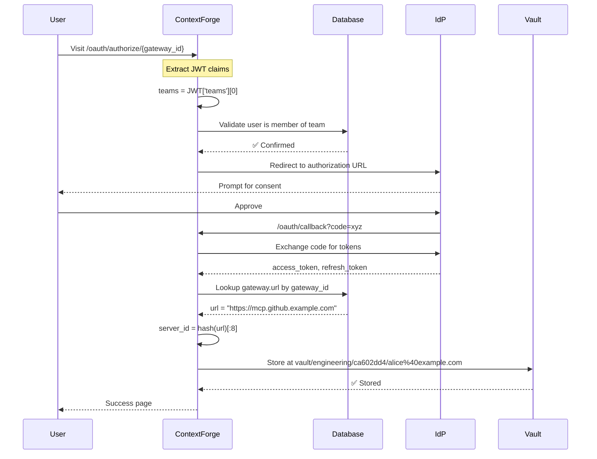
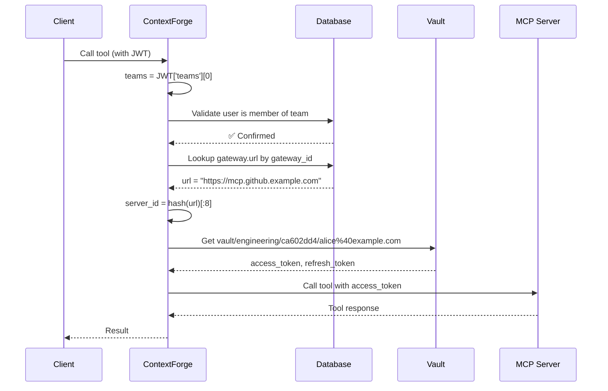

# OAuth + Vault: Team-Isolated Token Storage

## Overview

ContextForge stores OAuth tokens in Vault using a **team-isolated** storage model where multiple teams can independently register the same MCP server URL with different credentials and access policies.

## Storage Model

### Key Principle
**Tokens are stored per (team, server_url, user), not per (gateway_id, user)**

This enables:
- Multiple teams to register the same MCP server URL
- Each team maintains independent OAuth credentials
- Team-specific visibility and access controls
- Credential isolation across organizational boundaries

### Vault Path Structure

```
{mount}/data/{prefix}/{team_id}/{server_id}/{email}
```

Where:
- **mount**: KV v2 secrets engine mount point (default: `secret`)
- **prefix**: Configurable prefix (default: `contextforge/oauth`)
- **team_id**: Team identifier from user's JWT (e.g., `engineering`, `sales`)
- **server_id**: First 8 chars of SHA-256 hash of gateway.url (e.g., `ca602dd4`)
- **email**: URL-encoded user email (e.g., `alice%40example.com`)

### Example Paths

```
secret/data/contextforge/oauth/
├─ engineering/
│  ├─ ca602dd4/  (https://mcp.github.example.com)
│  │  ├─ alice%40example.com
│  │  └─ bob%40example.com
│  └─ f3e8a1b2/  (https://mcp.gitlab.example.com)
│     └─ alice%40example.com
└─ sales/
   └─ ca602dd4/  (https://mcp.github.example.com - same URL, different team!)
      └─ charlie%40example.com
```

In this example:
- Engineering and Sales teams both use the same GitHub MCP server URL
- Each team has independent OAuth credentials
- Alice (engineering) and Charlie (sales) access the same server but with different tokens

## Token Storage Flow

### 1. OAuth Authorization (Store Tokens)



**Key Steps:**
1. Extract `team_id` from JWT `teams` claim (first team)
2. Validate user is an active member of `team_id` in database
3. Resolve `gateway_id` → `gateway.url`
4. Hash `gateway.url` to `server_id`
5. Store tokens at `vault/{team_id}/{server_id}/{email}`

### 2. Token Retrieval (Fetch Tools)



**Key Steps:**
1. Extract `team_id` from JWT `teams` claim (first team)
2. Validate user is an active member of `team_id` in database
3. Resolve `gateway_id` → `gateway.url`
4. Hash `gateway.url` to `server_id`
5. Fetch tokens from `vault/{team_id}/{server_id}/{email}`
6. Use token to authenticate with MCP server

## Security Model

### JWT Authority
The JWT `teams` claim is **authoritative** for determining which team's credentials to use. This prevents:
- Users from accessing other teams' credentials
- Cross-team credential leakage
- Unauthorized credential sharing

### Database Validation
Every token operation **validates** that the user is an active member of the team from JWT:

```python
# From token_storage_service.py
def _is_member_of_team(team_id: str) -> bool:
    """Check if user is active member of team."""
    member = db.query(EmailTeamMember).filter(
        EmailTeamMember.user_email == app_user_email,
        EmailTeamMember.team_id == team_id,
        EmailTeamMember.is_active == True
    ).first()
    return member is not None
```

If validation fails:
1. **During storage**: Falls back to querying user's actual teams from DB
2. **During retrieval**: Returns `None` (no token found), forcing re-authorization

### Gateway team_id vs. Token team_id

**Important distinction:**
- **Gateway `team_id`**: Used for RBAC and visibility control (who can *see* the gateway)
- **Token `team_id`**: Used for credential lookup (which team's *credentials* to use)

These are **independent**:
- A gateway with `team_id=engineering` and `visibility=public` can be seen by everyone
- But only users with JWT `teams=["engineering"]` can use engineering's OAuth tokens for that gateway
- Sales team members see the gateway (public) but must authorize separately with their own team credentials

## Multi-Team Same-URL Scenario

### Setup
```sql
-- Engineering team registers GitHub MCP server
INSERT INTO gateways (id, name, url, team_id, visibility, oauth_config)
VALUES (
  'eng-github-gw',
  'GitHub (Engineering)',
  'https://mcp.github.example.com',
  'engineering',
  'team',
  '{"grant_type": "authorization_code", ...}'
);

-- Sales team registers the SAME GitHub MCP server
INSERT INTO gateways (id, name, url, team_id, visibility, oauth_config)
VALUES (
  'sales-github-gw',
  'GitHub (Sales)',
  'https://mcp.github.example.com',  -- Same URL!
  'sales',
  'team',
  '{"grant_type": "authorization_code", ...}'
);
```

### Token Storage
```
vault/
├─ engineering/
│  └─ ca602dd4/  (hash of https://mcp.github.example.com)
│     ├─ alice%40example.com   (engineering team tokens)
│     └─ bob%40example.com     (engineering team tokens)
└─ sales/
   └─ ca602dd4/  (same hash, different team!)
      └─ charlie%40example.com  (sales team tokens)
```

### Access Control

**Alice (engineering team):**
- JWT: `{"teams": ["engineering"], "email": "alice@example.com"}`
- Uses gateway: `eng-github-gw`
- Token path: `vault/engineering/ca602dd4/alice%40example.com`
- ✅ Can access engineering's GitHub repos

**Charlie (sales team):**
- JWT: `{"teams": ["sales"], "email": "charlie@example.com"}`
- Uses gateway: `sales-github-gw`
- Token path: `vault/sales/ca602dd4/charlie%40example.com`
- ✅ Can access sales' GitHub repos (different OAuth app or scope)

**What if Charlie tries to use engineering gateway?**
- Charlie visits `/oauth/authorize/eng-github-gw`
- ContextForge extracts `team_id=sales` from Charlie's JWT
- ContextForge checks if Charlie is member of `engineering` team: ❌ No
- Either:
  - Token stored at: `vault/sales/ca602dd4/charlie%40example.com` (Charlie's own team)
  - Or RBAC blocks access to engineering's gateway (if `visibility=team`)

## Troubleshooting

### Issue: "No OAuth tokens found"

**Symptoms:**
- OAuth authorization succeeds
- Tokens visible in Vault
- But "Fetch Tools" fails with "No OAuth tokens found"

**Root Causes:**
1. **JWT missing `teams` claim**: Token lookup uses wrong team_id
2. **User not member of team**: Validation fails, falls back to different team
3. **Wrong `user_context` during callback**: Empty context → wrong team_id extraction

**Debug Steps:**

```bash
# 1. Check JWT structure
python3 -m mcpgateway.utils.create_jwt_token \
  --username alice@example.com \
  --teams '["engineering"]' \
  --secret your-secret \
  --decode

# 2. Check user's team memberships
sqlite3 mcp.db << EOF
SELECT team_id, is_active
FROM email_team_members
WHERE user_email = 'alice@example.com';
EOF

# 3. Check actual Vault structure
python3 scripts/check-vault-structure.py

# 4. Expected vs actual
# Expected: vault/engineering/ca602dd4/alice%40example.com
# Actual:   vault/default/ca602dd4/alice%40example.com  (wrong team!)
```

**Fix:**
- Ensure JWT includes `teams` claim
- Ensure user has active team membership in database
- Restart OAuth flow after fixing

### Issue: Wrong Team Credentials Used

**Symptom:** Alice (engineering) gets sales team's tokens

**Cause:** JWT `teams` claim has wrong value

**Debug:**
```bash
# Decode JWT to check teams
python3 << 'EOF'
import jwt
token = "eyJhbGc..."  # Your JWT
decoded = jwt.decode(token, options={"verify_signature": False})
print("teams:", decoded.get("teams"))
EOF
```

**Fix:** Regenerate JWT with correct teams:
```bash
export TOKEN=$(python3 -m mcpgateway.utils.create_jwt_token \
  --username alice@example.com \
  --teams '["engineering"]' \
  --secret your-secret)
```

## Configuration

### Environment Variables

```bash
# Vault Connection
VAULT_ADDR=http://localhost:8200
VAULT_TOKEN=your-vault-token
VAULT_NAMESPACE=  # Optional for Vault Enterprise

# Path Configuration
VAULT_KV_MOUNT=secret
VAULT_KV_PATH_PREFIX=contextforge/oauth

# Cache (optional)
VAULT_TOKEN_CACHE_ENABLED=true
VAULT_TOKEN_CACHE_TTL=300
VAULT_TOKEN_CACHE_MAX_SIZE=10000

# Backend Selection
OAUTH_TOKEN_BACKEND=vault  # or 'database'
```

### Vault Policy

Minimal required Vault policy for ContextForge:

```hcl
# Allow list/read/write/delete under team-specific paths
path "secret/data/contextforge/oauth/*" {
  capabilities = ["create", "read", "update", "delete", "list"]
}

path "secret/metadata/contextforge/oauth/*" {
  capabilities = ["list", "read", "delete"]
}
```

For tighter security (team-isolated policies):

```hcl
# Engineering team can only access engineering/ path
path "secret/data/contextforge/oauth/engineering/*" {
  capabilities = ["create", "read", "update", "delete", "list"]
}

path "secret/metadata/contextforge/oauth/engineering/*" {
  capabilities = ["list", "read", "delete"]
}
```

## Testing

### Integration Test

```bash
# 1. Start Vault
docker-compose -f docker-compose.vault-test.yml up -d

# 2. Setup environment
export OAUTH_TOKEN_BACKEND=vault
export VAULT_ADDR=http://localhost:8200
export VAULT_TOKEN=test-root-token

# 3. Add test user to team
sqlite3 mcp.db << EOF
INSERT INTO email_team_members (team_id, user_email, is_active)
VALUES ('engineering', 'alice@example.com', 1);
EOF

# 4. Run integration tests
pytest tests/integration/test_vault_integration.py -v

# 5. Test OAuth flow
./scripts/test-oauth-vault.sh setup
./scripts/test-oauth-vault.sh create-gateway
# Visit OAuth URL, complete authorization
./scripts/test-oauth-vault.sh list-tokens
./scripts/test-oauth-vault.sh get-token
```

### Expected Vault Structure

```bash
$ python3 scripts/check-vault-structure.py

📂 secret/data/contextforge/oauth/
  📁 engineering/
    📁 ca602dd4/
      📄 alice%40example.com
        Keys: ['email', 'team_id', 'mcp_url', 'token', ...]
        email: alice@example.com
        team_id: engineering
        mcp_url: https://mcp.github.example.com
```

## References

- [OAuth Design Document](./architecture/oauth-design.md)
- [Testing Guide](./testing-oauth-vault.md)
- [Troubleshooting Guide](../TROUBLESHOOTING_OAUTH_VAULT.md)
- [Token Storage Facade](../mcpgateway/services/token_storage_service.py)
- [Vault Backend](../mcpgateway/services/token_backends/vault_backend.py)
