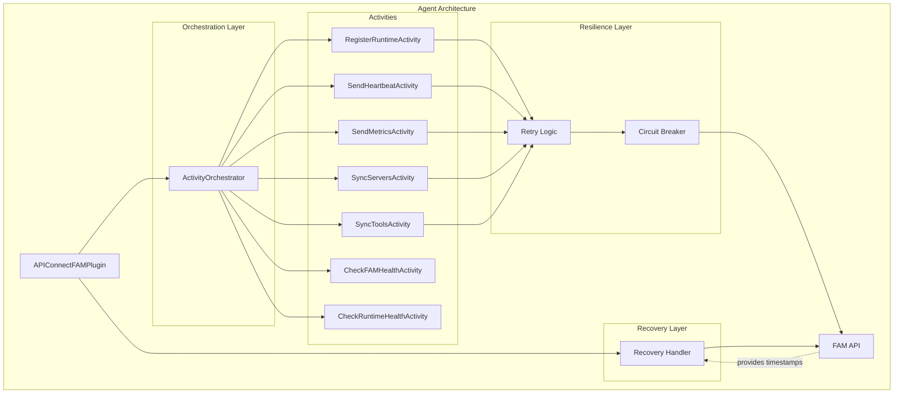
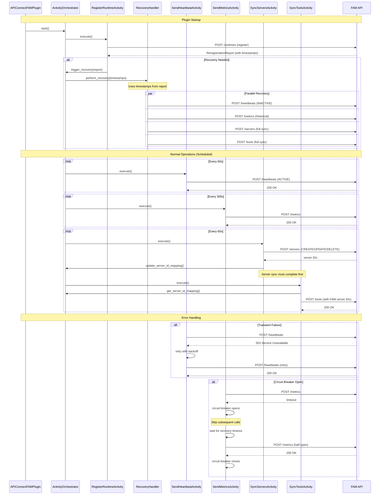
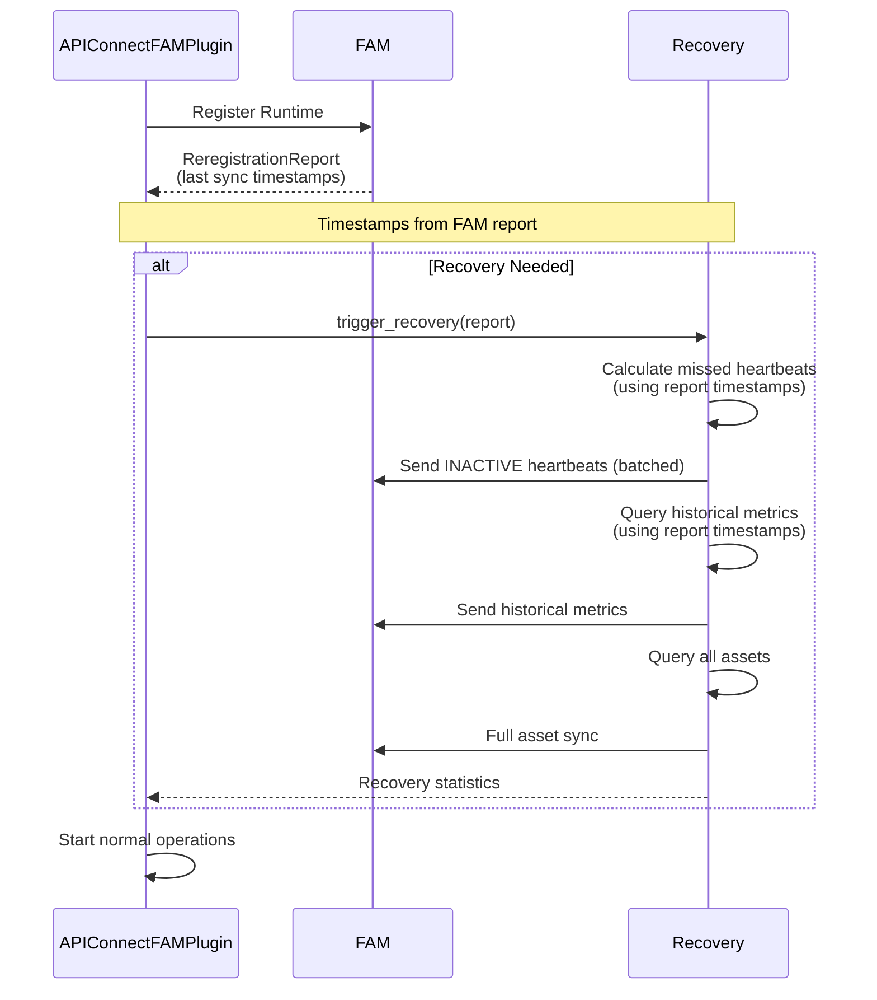
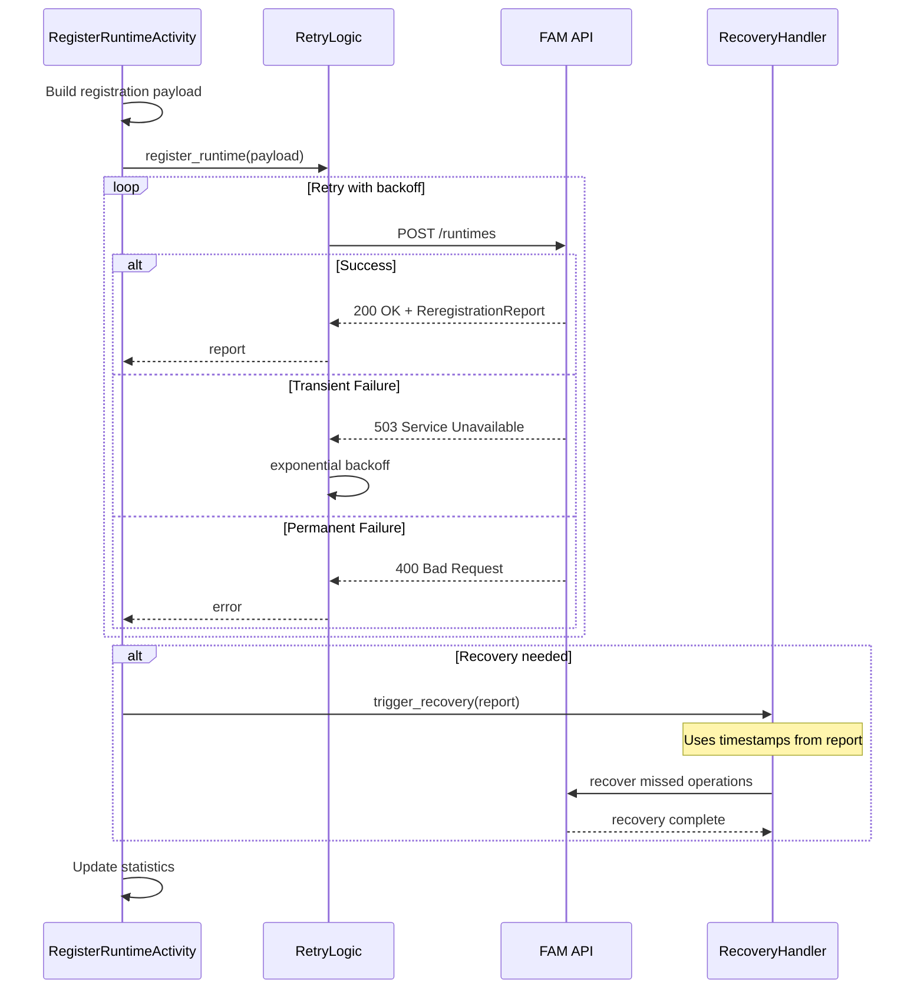
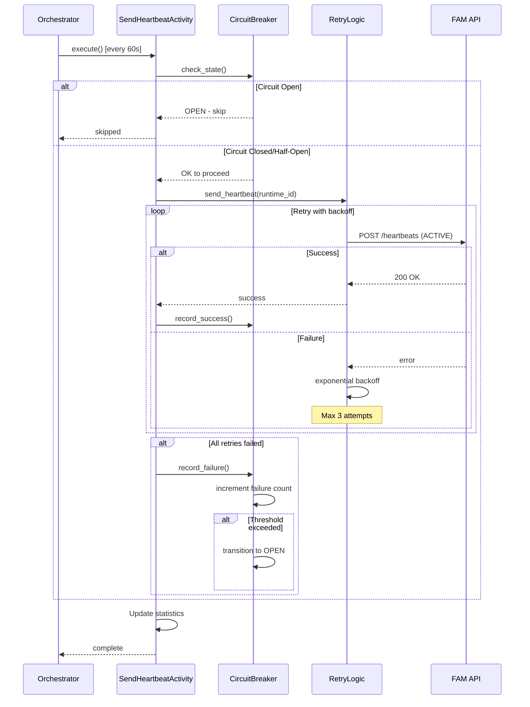
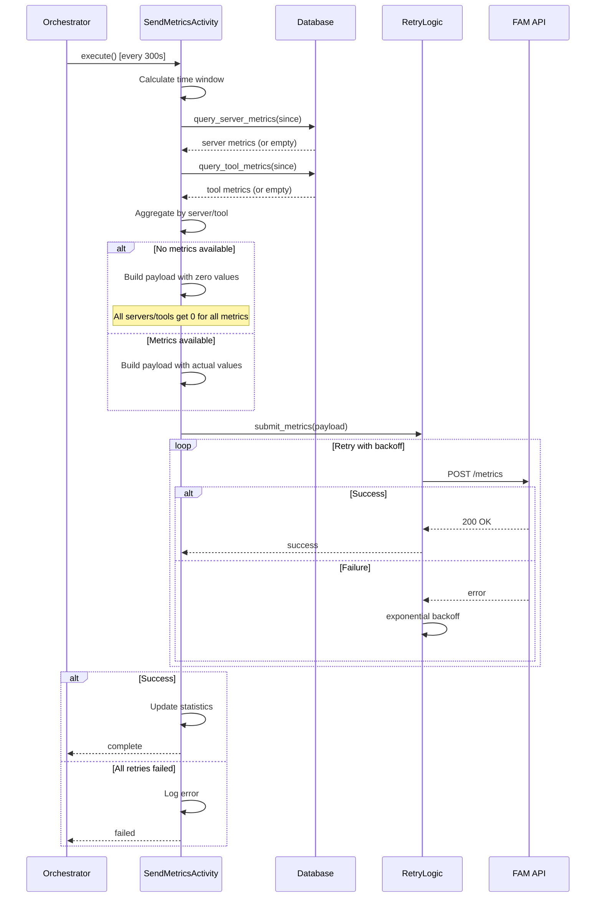
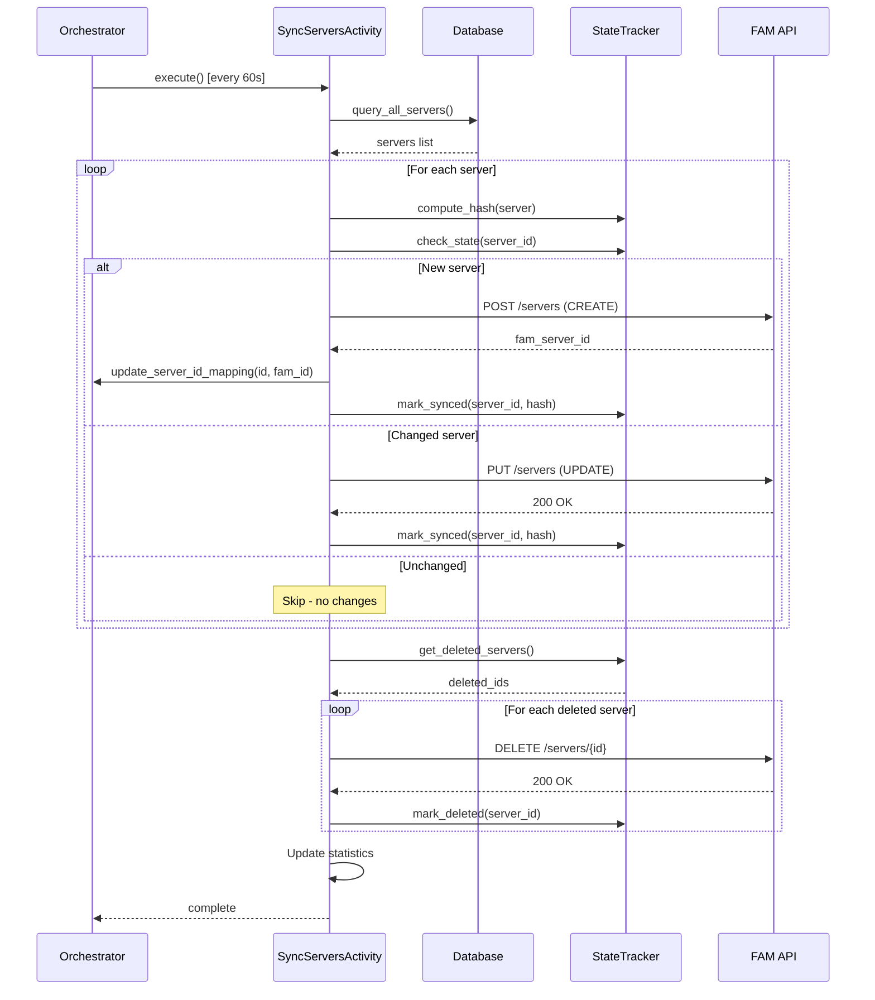
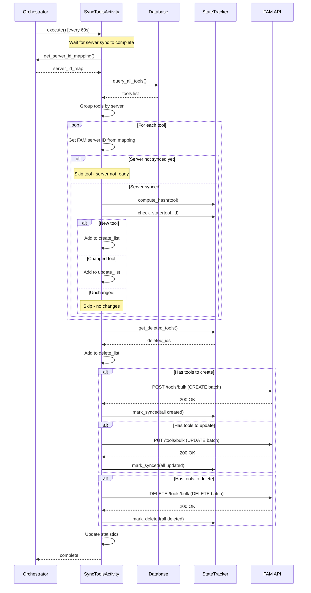
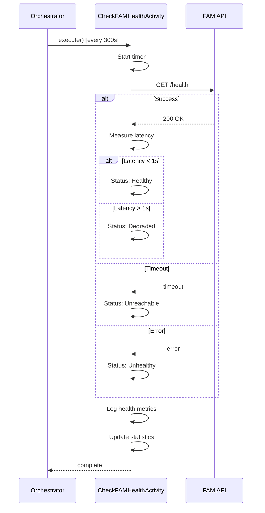
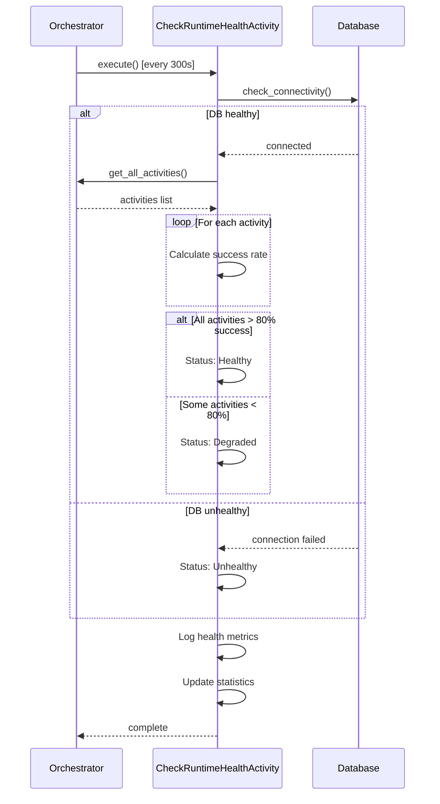

# API Connect FAM Plugin - High Level Design
## Production-Grade MCP ContextForge Agent Architecture

**Document Version:** 2.0
**Date:** 2026-05-05
**Audience:** Core Software Architecture Team
**Purpose:** Architectural design for enterprise-grade agent capabilities

---

## 1. Executive Summary

### 1.1 Objective
Transform the API Connect FAM Plugin into a **production-grade MCP ContextForge Agent** following webMethods Agent SDK patterns, adding enterprise-level resilience, automatic recovery, and comprehensive observability.

### 1.2 Key Capabilities to Implement
- **Automatic Recovery**: Zero data loss through persistent state and recovery mechanisms
- **Resilience Patterns**: Retry logic with exponential backoff and circuit breaker
- **Activity Architecture**: Modular, testable activities with clear responsibilities
- **Enhanced Observability**: Per-activity statistics and health monitoring
- **Runtime Auto-Registration**: Simplified deployment with automatic FAM registration

### 1.3 Business Value
- **Zero Data Loss**: Automatic recovery ensures no missed synchronization
- **Reduced MTTR**: 90% reduction through automatic retry and recovery
- **Operational Excellence**: Production-ready error handling and monitoring
- **Simplified Deployment**: Auto-registration reduces configuration overhead
- **Future Proof**: Extensible architecture for new capabilities

---

## 2. Target Architecture

### 2.1 System Architecture



**Component Descriptions:**

**Core Components:**

1. **APIConnectFAMPlugin**
   - Entry point and lifecycle manager for the agent
   - Initializes all components and manages plugin lifecycle
   - Handles configuration loading and validation
   - Coordinates startup, shutdown, and error handling

2. **ActivityOrchestrator**
   - Central coordinator for all activities
   - Manages independent scheduling for each activity
   - Aggregates statistics from all activities
   - Triggers recovery operations on startup
   - Maintains server ID mapping for tool sync dependency

**Activity Components:**

3. **RegisterRuntimeActivity**
   - Registers the runtime with FAM on plugin startup
   - Receives re-registration report with last sync timestamps
   - Triggers recovery if gaps detected in synchronization
   - Executes once during initialization

4. **SendHeartbeatActivity**
   - Sends periodic ACTIVE heartbeat signals to FAM
   - Maintains runtime liveness status
   - Executes every 60 seconds (configurable)

5. **SendMetricsActivity**
   - Collects and aggregates runtime metrics from database
   - Sends performance and usage data to FAM
   - Handles empty data by sending zero values
   - Executes every 300 seconds (configurable)

6. **SyncServersActivity**
   - Synchronizes MCP server assets to FAM
   - Detects CREATE/UPDATE/DELETE operations via hash comparison
   - Updates server ID mapping for tool sync dependency
   - Executes every 60 seconds (configurable)

7. **SyncToolsActivity**
   - Synchronizes MCP tool assets to FAM
   - Uses bulk CREATE/UPDATE/DELETE operations per FAM spec
   - Depends on server sync completion (needs FAM server IDs)
   - Executes every 60 seconds (configurable)

8. **CheckFAMHealthActivity**
   - Monitors FAM API connectivity and latency
   - Determines health status (Healthy/Degraded/Unhealthy/Unreachable)
   - Executes every 300 seconds (configurable)
   - Provides early warning of FAM issues

9. **CheckRuntimeHealthActivity**
   - Monitors ContextForge runtime health
   - Checks database connectivity
   - Validates activity success rates (>80% threshold)
   - Executes every 300 seconds (configurable)

**Resilience Components:**

10. **Retry Logic**
    - Implements exponential backoff with jitter
    - Configurable max attempts, delays, and backoff multiplier
    - Handles transient failures gracefully
    - Prevents overwhelming FAM during outages

11. **Circuit Breaker**
    - Fault tolerance pattern with three states (CLOSED/OPEN/HALF_OPEN)
    - Opens after threshold failures (default: 5)
    - Prevents cascading failures
    - Auto-recovery after timeout (default: 60s)

**Recovery Components:**

12. **Recovery Handler**
    - Orchestrates automatic recovery of missed operations
    - Receives last sync timestamps from FAM registration response
    - Sends INACTIVE heartbeats for downtime periods
    - Replays historical metrics
    - Performs full asset synchronization
    - Executes in parallel for efficiency

**External Components:**

13. **FAM API**
    - Federated API Management system
    - Receives runtime registration, heartbeats, metrics, and assets
    - Provides re-registration reports with last sync timestamps
    - Supports bulk operations for tools
    - Acts as single source of truth for recovery state

**Component Interactions:**

- **Plugin → Orchestrator**: Lifecycle management and coordination
- **Orchestrator → Activities**: Scheduled execution and statistics collection
- **Activities → Retry Logic**: Fault-tolerant API calls
- **Retry Logic → Circuit Breaker**: Cascading failure prevention
- **Circuit Breaker → FAM API**: Protected external communication
- **FAM API → Recovery Handler**: Re-registration report provides recovery timestamps
- **Recovery Handler → FAM API**: Missed operation replay

### 2.2 Activities Flow Diagram



### 2.3 Component Layers

**Layer 1: Plugin Core**
- Lifecycle management
- Configuration validation
- Component initialization

**Layer 2: Orchestration**
- Activity scheduling
- Statistics aggregation
- Health monitoring

**Layer 3: Activities**
- Modular, independent operations
- Per-activity statistics
- Scheduled execution

**Layer 4: Resilience**
- Retry with exponential backoff
- Circuit breaker pattern
- Error handling

**Layer 5: Recovery**
- Automatic recovery orchestration
- Historical data replay
- Recovery state from FAM registration

---

## 3. Component Specifications

### 3.1 ActivityOrchestrator

**Responsibility:** Coordinate all activities with scheduling and statistics

**Key Features:**
- Schedule activities with independent intervals
- Track per-activity statistics
- Aggregate health metrics
- Trigger recovery on startup

**Interface:**
```python
class ActivityOrchestrator:
    async def start(self) -> None:
        """Start orchestrator and all activities"""
        
    async def stop(self) -> None:
        """Stop orchestrator and cancel activities"""
        
    async def trigger_recovery(self) -> dict:
        """Trigger recovery of missed operations"""
        
    def get_statistics(self) -> SyncStatistics:
        """Get comprehensive statistics"""
```

**Activities Managed:**
- RegisterRuntimeActivity (on startup)
- SendHeartbeatActivity (every 60s)
- SendMetricsActivity (every 300s)
- SyncServersActivity (every 60s)
- SyncToolsActivity (every 60s)
- CheckFAMHealthActivity (every 300s)
- CheckRuntimeHealthActivity (every 300s)

### 3.2 RecoveryHandler

**Responsibility:** Recover missed operations after downtime

**Recovery Operations:**

**1. Heartbeat Recovery:**
```python
async def recover_heartbeats(
    last_heartbeat_time: int,
    heartbeat_interval: int
) -> int:
    """
    Generate and send INACTIVE heartbeats for missed intervals.
    
    Algorithm:
    1. Calculate missed intervals between last_heartbeat and now
    2. Generate InactiveHeartbeat for each interval
    3. Send in batches of 100
    4. Return count of recovered heartbeats
    """
```

**2. Metrics Recovery:**
```python
async def recover_metrics(
    last_metrics_time: int,
    metrics_interval: int
) -> int:
    """
    Query and send historical metrics data.
    
    Algorithm:
    1. Query database for metrics since last_metrics_time
    2. Aggregate by server and tool
    3. Send to FAM
    4. Return count of metric records
    """
```

**3. Asset Recovery:**
```python
async def recover_assets(
    last_asset_sync_time: int
) -> dict:
    """
    Perform full asset synchronization.
    
    Algorithm:
    1. Query all servers and tools from database
    2. Sync to FAM (create/update as needed)
    3. Return recovery statistics
    """
```

**Recovery Flow:**


### 3.4 Activity Base Classes

**AbstractActivity:**
```python
class AbstractActivity(ABC):
    """Base class for all activities."""
    
    def __init__(self, context: ActivityContext):
        self.context = context
        self.stats = ActivityStatistics(activity_name=self.__class__.__name__)
    
    @abstractmethod
    async def perform(self) -> None:
        """Execute the activity logic."""
        pass
    
    async def execute(self) -> None:
        """Execute with automatic statistics tracking."""
        start_time = time.time()
        try:
            await self.perform()
            duration = (time.time() - start_time) * 1000
            self.stats.record_execution(success=True, duration_ms=duration)
        except Exception as e:
            duration = (time.time() - start_time) * 1000
            self.stats.record_execution(success=False, duration_ms=duration, error=str(e))
            raise
```

**AbstractScheduledActivity:**
```python
class AbstractScheduledActivity(AbstractActivity):
    """Base class for scheduled activities."""
    
    @abstractmethod
    def get_interval_seconds(self) -> int:
        """Get the scheduling interval."""
        pass
    
    def should_execute(self) -> bool:
        """Check if activity should execute now."""
        if self.last_execution is None:
            return True
        elapsed = (datetime.now(timezone.utc) - self.last_execution).total_seconds()
        return elapsed >= self.get_interval_seconds()
```

### 3.5 Resilience Components

**Retry Logic:**
```python
class RetryConfig(BaseModel):
    max_attempts: int = 3
    initial_delay: float = 1.0      # seconds
    max_delay: float = 60.0         # seconds
    exponential_base: float = 2.0
    jitter: float = 0.1             # 10% randomness

async def with_retry(
    func: Callable,
    retry_config: RetryConfig,
    operation_name: str
) -> Any:
    """
    Execute function with retry logic.
    
    Backoff calculation:
    delay = min(initial_delay * (base ^ attempt), max_delay)
    delay += random.uniform(-jitter * delay, jitter * delay)
    """
```

**Circuit Breaker:**
```python
class CircuitBreaker:
    """
    Circuit breaker pattern for fault tolerance.
    
    States:
    - CLOSED: Normal operation (requests pass through)
    - OPEN: Failures exceeded threshold (requests blocked)
    - HALF_OPEN: Testing if service recovered
    
    Transitions:
    CLOSED --[5 failures]--> OPEN
    OPEN --[60s timeout]--> HALF_OPEN
    HALF_OPEN --[2 successes]--> CLOSED
    HALF_OPEN --[1 failure]--> OPEN
    """
    
    def __init__(
        self,
        failure_threshold: int = 5,
        recovery_timeout: float = 60.0,
        success_threshold: int = 2
    ):
        pass
    
    async def call(self, func: Callable, *args, **kwargs) -> Any:
        """Execute function with circuit breaker protection."""
```

---

## 4. Data Models

### 4.1 Core Models

**ReregistrationReport:**
```python
class ReregistrationReport(BaseModel):
    """Report from FAM on runtime registration."""
    runtime_id: str
    last_registration_time: Optional[int] = None
    last_heartbeat_time: Optional[int] = None
    last_metrics_time: Optional[int] = None
    last_asset_sync_time: Optional[int] = None
```

**ActivityContext:**
```python
class ActivityContext(BaseModel):
    """Shared context for all activities."""
    runtime_id: str
    fam_base_url: str
    fam_auth_token: str
    config: Dict[str, Any] = Field(default_factory=dict)
```

**ActivityStatistics:**
```python
class ActivityStatistics(BaseModel):
    """Statistics for an activity execution."""
    activity_name: str
    status: ActivityStatus = ActivityStatus.PENDING
    total_executions: int = 0
    successful_executions: int = 0
    failed_executions: int = 0
    last_execution_time: Optional[datetime] = None
    last_success_time: Optional[datetime] = None
    last_failure_time: Optional[datetime] = None
    last_error: Optional[str] = None
    average_duration_ms: float = 0.0
    
    def record_execution(self, success: bool, duration_ms: float, error: Optional[str] = None):
        """Record execution and update statistics."""
        
    def get_success_rate(self) -> float:
        """Calculate success rate as percentage."""
```

**SyncStatistics:**
```python
class SyncStatistics(BaseModel):
    """Overall synchronization statistics."""
    runtime_id: str
    uptime_seconds: int = 0
    activities: Dict[str, ActivityStatistics] = Field(default_factory=dict)
    total_servers_synced: int = 0
    total_tools_synced: int = 0
    total_metrics_sent: int = 0
    total_heartbeats_sent: int = 0
```

### 4.2 Enums

```python
class ActivityStatus(str, Enum):
    PENDING = "pending"
    RUNNING = "running"
    SUCCESS = "success"
    FAILED = "failed"
    SKIPPED = "skipped"

class HeartbeatStatus(str, Enum):
    ACTIVE = "active"
    INACTIVE = "inactive"
    UNKNOWN = "unknown"
```

---

## 5. Activity Implementations

### 5.1 RegisterRuntimeActivity

**Purpose:** Register runtime with FAM on startup

**Execution:** Once on plugin initialization

**Logic:**
```python
async def perform(self) -> None:
    # Build registration payload
    payload = {
        "name": self.config["fam_runtime_name"],
        "type": self.config["fam_runtime_type"],
        "deployment_type": self.config["fam_runtime_deployment_type"],
        # ... other fields
    }
    
    # Register with retry
    report = await with_retry(
        self.fam_client.register_runtime,
        **payload,
        retry_config=self.retry_config
    )
    
    # Pass report to recovery handler (contains timestamps)
    # No storage needed - timestamps come from FAM
    
    return report
```

**Sequence Diagram:**


### 5.2 SendHeartbeatActivity

**Purpose:** Send periodic heartbeat to FAM

**Execution:** Every 60 seconds (configurable)

**Logic:**
```python
async def perform(self) -> None:
    # Send heartbeat with retry
    success = await with_retry(
        self.fam_client.send_heartbeat,
        self.runtime_id,
        retry_config=self.retry_config
    )
    # No timestamp storage needed - scheduled execution only
```

**Sequence Diagram:**


### 5.3 SendMetricsActivity

**Purpose:** Aggregate and send metrics to FAM

**Execution:** Every 300 seconds (configurable)

**Logic:**
```python
async def perform(self) -> None:
    # Query metrics from database
    time_window_start = datetime.now(timezone.utc) - timedelta(minutes=self.time_window)
    server_metrics = query_server_metrics(since=time_window_start)
    tool_metrics = query_tool_metrics(since=time_window_start)
    
    # Build metrics payload (empty data with zeros if no metrics)
    payload = FAMMetricsPayload.build_payload(
        timestamp=datetime.now(timezone.utc),
        server_metrics_map=server_metrics or {},  # Empty dict if no data
        tool_metrics_by_server=tool_metrics or {}  # Empty dict if no data
    )
    # Payload will contain all servers/tools with zero values if no metrics
    
    # Always send metrics (even if empty/zero values)
    success = await with_retry(
        self.fam_client.submit_metrics,
        payload,
        retry_config=self.retry_config
    )
    
    # No timestamp storage needed - scheduled execution only
```

**Sequence Diagram:**


### 5.4 SyncServersActivity

**Purpose:** Synchronize server assets to FAM

**Execution:** Every 60 seconds (configurable)

**Logic:**
```python
async def perform(self) -> None:
    # Query servers from database
    servers = query_all_servers()
    
    # Detect changes using state tracker
    for server in servers:
        server_id = str(server.id)
        current_hash = self.state_tracker.compute_hash(server)
        
        if self.state_tracker.is_new_server(server_id):
            # Create in FAM
            await with_retry(
                self.fam_client.create_server,
                server,
                retry_config=self.retry_config
            )
            self.state_tracker.mark_synced(server_id, current_hash)
            
        elif self.state_tracker.has_changed(server_id, current_hash):
            # Update in FAM
            await with_retry(
                self.fam_client.update_server,
                server,
                retry_config=self.retry_config
            )
            self.state_tracker.mark_synced(server_id, current_hash)
    
    # Detect and delete removed servers
    deleted_ids = self.state_tracker.get_deleted_servers(current_server_ids)
    for server_id in deleted_ids:
        await with_retry(
            self.fam_client.delete_server,
            server_id,
            retry_config=self.retry_config
        )
        self.state_tracker.mark_deleted(server_id)
```

**Sequence Diagram:**


### 5.5 SyncToolsActivity

**Purpose:** Synchronize tool assets to FAM

**Execution:** Every 60 seconds (configurable)

**Logic:**
```python
async def perform(self) -> None:
    # Wait for server sync to complete
    server_id_map = self.orchestrator.get_server_id_mapping()
    
    # Query all tools from database
    tools = query_all_tools()
    
    # Group tools by operation type and server
    tools_to_create = []
    tools_to_update = []
    tools_to_delete = []
    
    for tool in tools:
        # Get FAM server ID from mapping
        fam_server_id = server_id_map.get(tool.server_id)
        if not fam_server_id:
            continue  # Skip if server not synced yet
        
        tool_id = str(tool.id)
        current_hash = self.state_tracker.compute_hash(tool)
        
        if self.state_tracker.is_new_tool(tool_id):
            tools_to_create.append((tool, fam_server_id))
        elif self.state_tracker.has_changed(tool_id, current_hash):
            tools_to_update.append((tool, fam_server_id))
    
    # Detect deleted tools
    deleted_ids = self.state_tracker.get_deleted_tools(current_tool_ids)
    tools_to_delete.extend(deleted_ids)
    
    # Bulk operations (per server)
    if tools_to_create:
        await with_retry(
            self.fam_client.bulk_create_tools,
            tools_to_create,
            retry_config=self.retry_config
        )
    
    if tools_to_update:
        await with_retry(
            self.fam_client.bulk_update_tools,
            tools_to_update,
            retry_config=self.retry_config
        )
    
    if tools_to_delete:
        await with_retry(
            self.fam_client.bulk_delete_tools,
            tools_to_delete,
            retry_config=self.retry_config
        )
```

**Sequence Diagram:**


### 5.6 CheckFAMHealthActivity

**Purpose:** Monitor FAM API connectivity

**Execution:** Every 300 seconds

**Logic:**
```python
async def perform(self) -> None:
    try:
        # Simple health check (e.g., GET /health)
        response = await self.fam_client.health_check()
        self.health_status = "healthy" if response.ok else "unhealthy"
    except Exception as e:
        self.health_status = "unreachable"
        logger.warning(f"FAM health check failed: {e}")
```

**Sequence Diagram:**


### 5.7 CheckRuntimeHealthActivity

**Purpose:** Monitor ContextForge runtime health

**Execution:** Every 300 seconds

**Logic:**
```python
async def perform(self) -> None:
    # Check database connectivity
    db_healthy = await check_database_health()
    
    # Check activity success rates
    activities_healthy = all(
        activity.stats.get_success_rate() > 80.0
        for activity in self.orchestrator.activities
    )
    
    self.health_status = "healthy" if (db_healthy and activities_healthy) else "degraded"
```

**Sequence Diagram:**


---

## 6. Configuration

### 6.1 Configuration Schema

```yaml
# Core Configuration
interval_seconds: 60
log_details: true
fam_enabled: true
fam_base_url: "https://fam.example.com"
fam_auth_token: "${FAM_AUTH_TOKEN}"  # From environment
fam_timeout: 30

# Runtime Auto-Registration
fam_auto_register: true
fam_runtime_id: null  # Auto-assigned if auto_register=true
fam_runtime_name: "ContextForge Gateway"
fam_runtime_description: "ContextForge MCP Gateway Runtime"
fam_runtime_type: "MCP_CONTEXT_FORGE"
fam_runtime_deployment_type: "ON_PREMISE"
fam_runtime_region: "us-east-1"
fam_runtime_location: "US East"
fam_runtime_host: "gateway-01"
fam_runtime_tags: ["contextforge", "mcp", "production"]
fam_runtime_capacity_value: "100"
fam_runtime_capacity_unit: "per minute"
fam_runtime_heartbeat_interval: 60000  # milliseconds

# Heartbeat Configuration
fam_heartbeat_enabled: true
fam_heartbeat_interval_seconds: 60

# Metrics Configuration
metrics_sync_enabled: true
metrics_sync_interval: 300  # 5 minutes
metrics_time_window: 60     # 60 minutes

# Retry Configuration (Future)
retry_max_attempts: 3
retry_initial_delay: 1.0
retry_max_delay: 60.0
retry_exponential_base: 2.0
retry_jitter: 0.1

# Circuit Breaker Configuration (Future)
circuit_breaker_enabled: true
circuit_breaker_failure_threshold: 5
circuit_breaker_recovery_timeout: 60.0
circuit_breaker_success_threshold: 2

# Recovery Configuration (Future)
recovery_enabled: true
recovery_heartbeat_batch_size: 100

# Health Check Configuration (Future)
health_check_enabled: true
health_check_interval: 300
```

### 6.2 Configuration Validation

**Required Fields:**
- `fam_base_url` (if fam_enabled=true)
- `fam_auth_token` (if fam_enabled=true)

**Optional Fields:**
- `fam_runtime_id` (auto-assigned if auto_register=true)
- All other fields have sensible defaults

**Validation Rules:**
- `interval_seconds` >= 10
- `fam_timeout` >= 5
- `retry_max_attempts` between 1 and 10
- `circuit_breaker_failure_threshold` >= 1

---

## 7. Error Handling

### 7.1 Exception Hierarchy

```python
class AgentError(Exception):
    """Base exception for all agent errors."""
    pass

class RegistrationError(AgentError):
    """Error during runtime registration."""
    pass

class RecoveryError(AgentError):
    """Error during recovery operations."""
    pass

class SyncError(AgentError):
    """Error during sync operations."""
    pass

class FAMClientError(AgentError):
    """Error in FAM API client operations."""
    pass

class ValidationError(AgentError):
    """Error in configuration or data validation."""
    pass

class RetryExhaustedError(AgentError):
    """Error when retry attempts are exhausted."""
    def __init__(self, message: str, attempts: int, last_error: Exception):
        super().__init__(message, last_error)
        self.attempts = attempts
        self.last_error = last_error
```

### 7.2 Error Handling Strategy

**Transient Errors (Retry):**
- Network timeouts
- 5xx server errors
- Connection refused
- Rate limiting (429)

**Permanent Errors (Log and Continue):**
- 401 Unauthorized (invalid token)
- 403 Forbidden (insufficient permissions)
- 400 Bad Request (invalid payload)

**Fatal Errors (Fail Fast):**
- Configuration validation errors
- Missing required dependencies
- Database connection failures (on startup)

### 7.3 Circuit Breaker Triggers

**Open Circuit:**
- 5 consecutive failures
- Blocks all requests for 60 seconds

**Half-Open State:**
- After 60 second timeout
- Allows 1 request to test recovery

**Close Circuit:**
- 2 consecutive successes in half-open state
- Resume normal operation

---

## 8. Observability

### 8.1 Metrics to Track

**Per-Activity Metrics:**
- Total executions
- Successful executions
- Failed executions
- Success rate (percentage)
- Average duration (milliseconds)
- Last execution time
- Last error message

**Aggregated Metrics:**
- Total servers synced
- Total tools synced
- Total metrics sent
- Total heartbeats sent
- Agent uptime

**Health Metrics:**
- FAM connectivity status
- Database connectivity status
- Circuit breaker state
- Activity success rates

### 8.2 Logging Strategy

**Log Levels:**
- `DEBUG`: Activity execution details, state changes
- `INFO`: Successful operations, statistics
- `WARNING`: Retries, circuit breaker state changes
- `ERROR`: Failed operations, exhausted retries
- `CRITICAL`: Fatal errors, plugin shutdown

**Structured Logging:**
```python
logger.info(
    "Activity executed successfully",
    extra={
        "activity": "SendHeartbeat",
        "runtime_id": "runtime-001",
        "duration_ms": 150.5,
        "success": True
    }
)
```

### 8.3 Statistics API

**Endpoint:** `GET /plugins/apiconnect-fam/statistics`

**Response:**
```json
{
  "runtime_id": "runtime-001",
  "uptime_seconds": 3600,
  "activities": {
    "SendHeartbeat": {
      "status": "SUCCESS",
      "total_executions": 60,
      "successful_executions": 59,
      "failed_executions": 1,
      "success_rate": 98.33,
      "average_duration_ms": 150.5,
      "last_execution_time": "2026-04-30T05:00:00Z",
      "last_error": "Connection timeout"
    }
  },
  "totals": {
    "servers_synced": 100,
    "tools_synced": 500,
    "metrics_sent": 12,
    "heartbeats_sent": 59
  }
}
```

---

## 9. Design Decisions & Trade-offs

### 9.1 Activity-Based Architecture

**Decision:** Adopt activity-based pattern from webMethods Agent SDK

**Rationale:**
- Proven pattern in enterprise agent systems
- Clear separation of concerns
- Independent scheduling and lifecycle management
- Easy to test and maintain

**Trade-offs:**
- More code structure vs. simpler monolithic approach
- Learning curve for team vs. familiar patterns
- Overhead of orchestration vs. direct execution

### 9.2 State Management

**Decision:** Stateless design with FAM as source of truth

**Rationale:**
- No persistent storage needed - timestamps come from FAM registration
- Simpler architecture with fewer failure modes
- FAM ReregistrationReport provides recovery state on startup
- Scheduled activities don't require timestamp tracking

**Trade-offs:**
- File I/O overhead vs. in-memory state
- Single-runtime limitation vs. distributed state
- Manual file management vs. database automation

### 9.3 Recovery Strategy

**Decision:** Automatic recovery on startup using re-registration reports

**Rationale:**
- Zero data loss guarantee
- No manual intervention required
- Leverages FAM's state tracking
- Aligns with agent SDK patterns

**Trade-offs:**
- Startup latency vs. immediate availability
- Batch processing overhead vs. real-time sync
- Complexity vs. simplicity

### 9.4 Resilience Patterns

**Decision:** Retry with exponential backoff + circuit breaker

**Rationale:**
- Industry-standard fault tolerance
- Prevents cascading failures
- Graceful degradation
- Configurable behavior

**Trade-offs:**
- Delayed failure detection vs. immediate failure
- Resource consumption vs. reliability
- Configuration complexity vs. simplicity

---

## 10. Architectural Principles

### 10.1 Core Principles

1. **Fail-Safe**: System degrades gracefully, never loses data
2. **Observable**: All operations tracked with detailed metrics
3. **Recoverable**: Automatic recovery from any failure state
4. **Extensible**: Easy to add new activities and capabilities
5. **Testable**: Clear interfaces and dependency injection

### 10.2 Design Patterns

- **Strategy Pattern**: Activity base classes with polymorphic execution
- **Template Method**: Scheduled activity lifecycle hooks
- **Circuit Breaker**: Fault tolerance for external dependencies
- **Retry Pattern**: Transient failure handling
- **Observer Pattern**: Statistics tracking and reporting

### 10.3 Quality Attributes

| Attribute | Target | Approach |
|-----------|--------|----------|
| Reliability | 99.9% uptime | Retry + circuit breaker + recovery |
| Performance | <1% overhead | Async operations, batch processing |
| Maintainability | High | Clear separation, comprehensive logging |
| Scalability | Single runtime | Designed for future multi-runtime support |
| Security | Enterprise-grade | Token-based auth, secure credential handling |

---

## 11. Integration Points

### 11.1 ContextForge Integration

- **Database**: Read-only access to servers, tools, metrics
- **Plugin Framework**: Standard plugin lifecycle hooks
- **Configuration**: YAML-based configuration with validation
- **Logging**: Structured logging with correlation IDs

### 11.2 FAM Integration

- **Registration API**: Runtime registration and re-registration
- **Heartbeat API**: Periodic health signals
- **Metrics API**: Performance and usage data
- **Asset Catalog API**: Server and tool synchronization

### 11.3 External Dependencies

- **Python 3.11+**: Async/await, type hints
- **Pydantic**: Data validation and serialization
- **httpx**: Async HTTP client
- **SQLAlchemy**: Database ORM (read-only)

---

## 12. Operational Considerations

### 12.1 Configuration

All configuration via YAML with sensible defaults:
- Sync intervals (heartbeat, metrics, assets)
- Retry parameters (attempts, delays, backoff)
- Circuit breaker thresholds
- Recovery behavior
- Health check intervals

### 12.2 Monitoring

Key metrics exposed:
- Activity execution statistics (success rate, duration, errors)
- Recovery operations (heartbeats recovered, metrics recovered)
- Circuit breaker state transitions
- FAM API health and latency
- Runtime health status

### 12.3 Troubleshooting

Comprehensive logging:
- Activity lifecycle events
- Recovery operations with details
- Retry attempts and outcomes
- Circuit breaker state changes
- Error stack traces with context

---

**Document Purpose:** Architectural design for core software team review
**Focus:** Design decisions, patterns, and integration approach
**Audience:** Software architects and senior engineers
